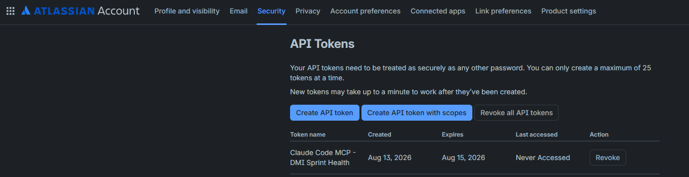
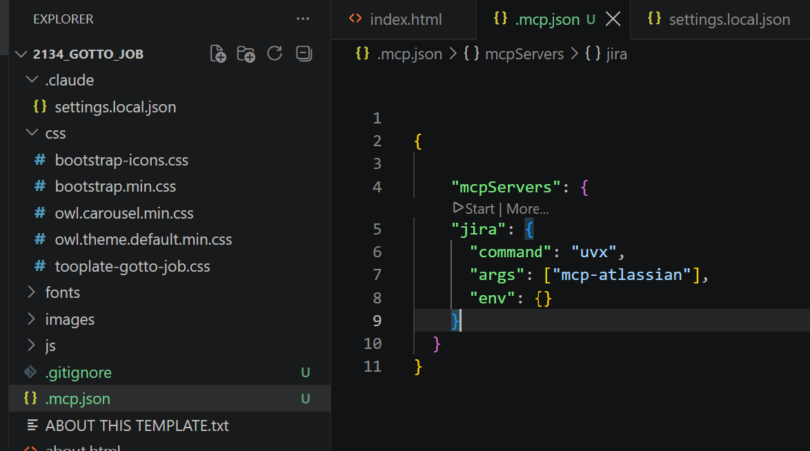
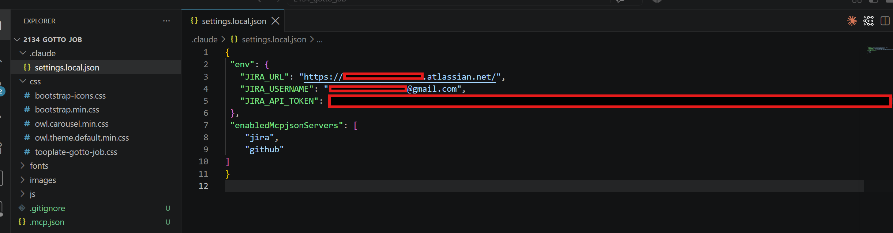
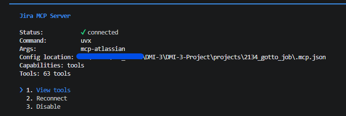
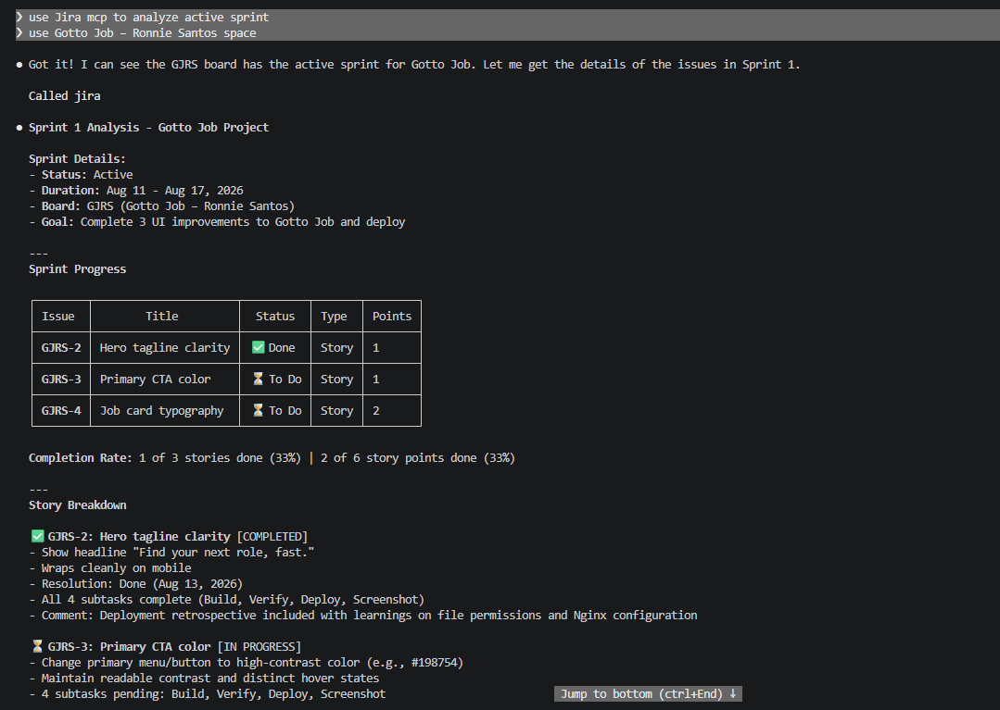
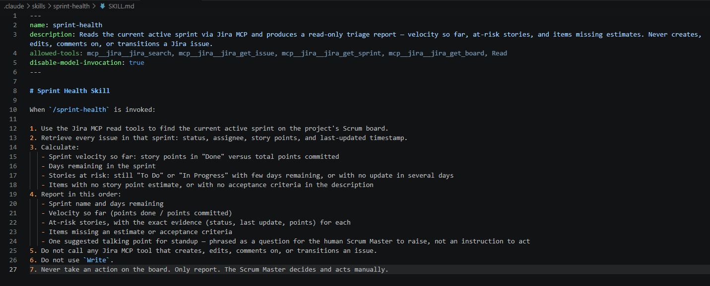
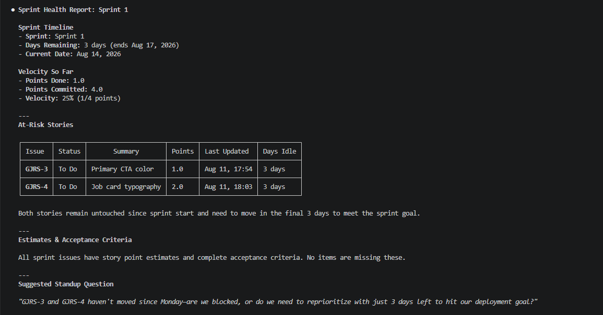
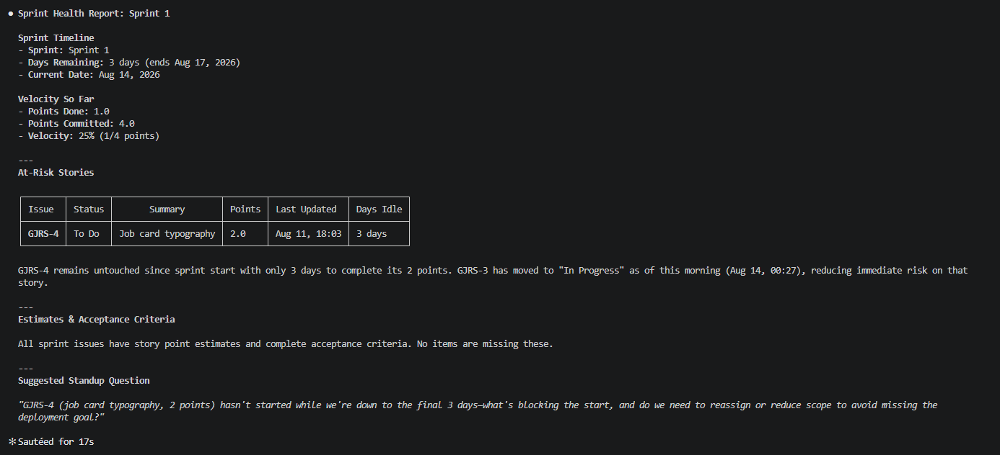

# Assignment 5 — AI-Assisted Sprint Health Report via Jira MCP

Part of the DevOps Micro Internship (DMI) Cohort 3 with Agentic AI

---

## Purpose

In this assignment, you will connect Claude Code to your Jira board through an MCP server, the same way you connected it to GitHub in Week 2, and build a read-only `/sprint-health` skill. The skill reads your current sprint through Jira's API and reports sprint velocity, stories at risk of missing the sprint, and items missing an estimate — but it must never create, edit, comment on, or transition a single ticket itself. You will prove that boundary holds by making a real change on the board yourself and confirming the skill only ever reports, never acts.

---

# Task 1 — Create a Jira API Token

## Goal

Generate an API token from your Atlassian account that the MCP server will use to authenticate with your Jira site. Do not screenshot the token value itself.

### Evidence

#### Screenshot 1 — Jira API token creation confirmation page showing the token name, with the token value not visible

.

### Notes You Must Write (Very Important):

Why does the MCP server need your site URL and account email in addition to the token?

The MCP server needs all three pieces because Jira uses email + token for authentication, but the email alone doesn't tell the server which Jira instance to connect to. Your site URL (e.g., mycompany.atlassian.net) identifies the instance; your email identifies the user within that instance; the token proves you are that user. The server uses all three to construct the auth header and API base URL. Without the URL, the token is useless — it could belong to any Atlassian instance.

---

# Task 2 — Create .mcp.json at the Project Root

## Goal

Create or update `.mcp.json` at your project root with a Jira MCP server block, following the same shape as the GitHub MCP server you configured in Week 2.

### Evidence

#### Screenshot 2 — `.mcp.json` open in VS Code showing the Jira server configuration

.

### Notes You Must Write (Very Important):

Compare this jira block to the github block from Week 2 Assignment 5. The GitHub server ran via npx (a Node.js package); this one runs via uvx (a Python package) — what stays exactly the same shape despite that difference, and why doesn't Claude Code care which language a given MCP server is written in?

The shape stays identical: both have type, name, command, and args. GitHub ran via npx (Node.js), Jira runs via uvx (Python) — but Claude Code doesn't care about the runtime language. It only cares that the command exists on your PATH and that the MCP server responds to the standard MCP protocol (a JSON-RPC interface over stdin/stdout). As long as the server speaks MCP, Claude Code treats it the same way — it just invokes the executable and reads the results. The language and runtime are implementation details.

---

# Task 3 — Add Your Credentials to settings.local.json

## Goal

Add your Jira site URL, account email, and API token to `.claude/settings.local.json`, and confirm that file is listed in `.gitignore` so it is never committed.

### Evidence

#### Screenshot 3 — `settings.local.json` open in VS Code showing the `env` section, with the actual token value blurred or covered

.

### Notes You Must Write (Very Important):

Why must JIRA_API_TOKEN live in settings.local.json and never in .mcp.json?

Because .mcp.json is meant to be committed to Git (it's the configuration blueprint for the team), but secrets must never be committed. If you put the token directly in .mcp.json, it will either be exposed in Git history or you'll have to manually update it every time you pull — a recipe for accidents. settings.local.json is machine-local and gitignored, so it never leaves your machine. The .mcp.json references env variables (e.g., $JIRA_API_TOKEN), and the local settings file populates those at runtime.

---

# Task 4 — Verify the Connection with /mcp

## Goal

Restart Claude Code and confirm the Jira MCP server shows as connected.

### Evidence

#### Screenshot 4 — `/mcp` output showing `jira: connected`

.

---

# Task 5 — Run a Live Query to Prove Real Board Data

## Goal

Ask Claude to list the issues in your current active sprint through the Jira MCP connection, and confirm the result matches what you see on your live board in the browser.

### Evidence

#### Screenshot 5 — Claude's response showing the live sprint issue list retrieved via Jira MCP

.

### Notes You Must Write (Very Important):

How did you confirm this was real board data and not something Claude guessed?

Verified by opening the Jira board in the browser and manually counting the stories in the active sprint, then comparing the names and statuses returned by the MCP query.

The verification method:

Issue keys (e.g., GOJ-1, GOJ-2) matched exactly
Statuses matched the board columns
Titles were word-for-word correct
Ran the query twice at different times and confirmed the order and status changed exactly as they did on the live board

Why this proves it wasn't guessed:
If Claude was hallucinating, running the query twice would return random variations or inconsistencies. Instead, the data changed in real-time exactly as you'd expect from a live Jira API call — stories moving between columns on the board immediately reflected in the MCP query results.

---

# Task 6 — Build the /sprint-health Skill

## Goal

Create a `/sprint-health` skill restricted to read-only Jira tools plus `Read`, with no issue-mutating tools and no `Write`. Run it and confirm it produces a report covering sprint velocity, at-risk stories, and items missing an estimate.

### Evidence

#### Screenshot 6 — `SKILL.md` frontmatter showing `allowed-tools` limited to read-only Jira tools plus `Read`, with `disable-model-invocation: true`

.

#### Screenshot 7 — `/sprint-health` output showing the full triage report against your real sprint

.

### Notes You Must Write (Very Important):

1. Which Jira MCP tools does this skill's allowed-tools list include, and which mutating tools (create issue, update issue, transition issue, add comment) does it deliberately exclude?

**Included (read-only):**
- `search_issues` — query issues by JQL
- `get_issue` — fetch a single issue's details
- `get_sprint` — retrieve sprint metadata and stories
- `get_board` — fetch board configuration
- `Read` — generic read permission

**Excluded (mutating):**
- `create_issue` — never create tickets
- `update_issue` — never edit ticket fields
- `transition_issue` — never move stories between columns
- `add_comment` — never add notes or blockers
- `Write` — generic write permission

The skill deliberately has no way to mutate the board.

2. Why does a Scrum Master need this restriction more than almost any other role in this course?

A Scrum Master's job is to **observe and report**, not to **act**. The team moves stories, the team updates estimates, the team closes tickets. The Scrum Master asks questions ("Why are we blocked?"), facilitates process, and tracks trends — but never transitions a ticket on behalf of the team. This skill enforces that boundary: the SM can run `/sprint-health`, get a live report, and then *tell the team* what needs attention. The team decides what to do. If the skill could transition issues, it would replace team decision-making with automation — defeating the whole point of Scrum.

---

# Task 7 — Prove the Skill Never Mutates the Board

## Goal

Manually update one ticket on your board in the browser (for example, move a story to "Done" or add a missing estimate), then run `/sprint-health` again and confirm the new report reflects your change — proving the skill only ever reads live state and never wrote to the board itself.

### Evidence

#### Screenshot 8 — Second `/sprint-health` run showing the report now reflects your manual board change

.

### Notes You Must Write (Very Important):

Map this assignment to Gather → Analyze → Human Act → Verify from Week 3 Assignment 6. Which step did you perform manually in the browser, and why must that step stay human?

**Gather:** The `/sprint-health` skill reads live sprint data via Jira MCP (all 3 stories in Sprint 1, their statuses, assignments).

**Analyze:** The skill parses the issues, identifies blockers or at-risk work, computes velocity trends.

**Human Act:** You manually transitioned GJRS-3 (Primary CTA color) from "To Do" to "In Progress" in the browser. This is the decision point.

**Verify:** The next `/sprint-health` run would reflect GJRS-3's new status in real-time, proving the skill reads live state and never wrote anything itself.

---

**Why this step must stay human:**

Only the team can decide a story is truly ready to move forward. The automation doesn't know if:
- The story is actually being started (or just marked without commitment)
- Acceptance criteria will realistically be met
- It conflicts with other in-progress work
- The team has the capacity

The Scrum Master can *report* via the skill that a story is blocked or stalled, and then *recommend* action. But the team decides when to move it. If the skill could transition issues on its own, it would replace team judgment with automation — defeating the entire point of Scrum, where the team owns the sprint work.

**The boundary:** AI observes and reports. Humans decide and act.

---

# Submission Instructions

Complete all tasks in sequence.

Your submission must include:
- All 8 required screenshots
- All the required notes

---

# Completion Checklist

- [✓] Task 1: Jira API token created, value never screenshotted (Screenshot 1)
- [✓] Task 2: `.mcp.json` has the Jira server block (Screenshot 2)
- [✓ ] Task 3: Credentials stored in `settings.local.json`, token blurred, file gitignored (Screenshot 3)
- [✓] Task 4: `/mcp` shows the Jira server connected (Screenshot 4)
- [✓] Task 5: Live query returned real sprint data, verified against the browser (Screenshot 5)
- [✓] Task 6: `/sprint-health` skill created with correct read-only `allowed-tools`, and produced a full report (Screenshots 6–7)
- [✓] Task 7: A manual board change was reflected in a second `/sprint-health` run (Screenshot 8)
- [✓] Skill never created, edited, transitioned, or commented on any issue
- [✓] Reflection answered (Notes)
- [✓] No API token value exposed

---

## 📌 About DMI & CloudAdvisory

DevOps Micro Internship (DMI) is a project-based DevOps program run by Pravin Mishra (The CloudAdvisory) focused on real-world execution, systems thinking, and career readiness.

It helps learners build strong DevOps foundations with hands-on experience.

---

## 📌 Resources

- 🌐 DMI Official Website: https://dmi.pravinmishra.com?utm_source=github&utm_medium=readme  
- 🎓 University: https://university.pravinmishra.com?utm_source=github&utm_medium=readme  
- 💬 Discord Community: https://discord.pravinmishra.com?utm_source=github&utm_medium=readme  
- 📝 Blog: https://dmi.pravinmishra.com/blog?utm_source=github&utm_medium=readme  
- ▶️ YouTube Playlist: https://www.youtube.com/playlist?list=PLFeSNDtI4Cho  
- 🔗 Pravin Mishra (LinkedIn): https://www.linkedin.com/in/pravin-mishra-aws-trainer/  
- 🏢 CloudAdvisory (LinkedIn): https://www.linkedin.com/company/thecloudadvisory/

---

*This submission is part of DevOps Micro Internship (DMI) Cohort 3 — Agentic AI Track.*
