# Assignment 5 — Deploy a Highly Available Two-Tier Application on AWS (VPC + ALB + ASG + Multi-AZ RDS)

Part of the DevOps Micro Internship (DMI) Cohort 3 with Agentic AI

---

## Purpose

In this assignment, you will design and deploy a highly available two-tier web application on AWS: highly available networking across two Availability Zones, an Application Load Balancer, an Auto Scaling Group for the web tier, and a private Multi-AZ RDS database. You must prove high availability with real failure tests.

---

# Task 1 — Create HA Networking (VPC + 4 Subnets + IGW + NAT + Route Tables)

## Goal

Build a VPC (10.0.0.0/16) with two public and two private subnets across two Availability Zones, an Internet Gateway, a NAT Gateway, and the matching public/private route tables.

### Evidence

#### Screenshot 1 — VPC details showing CIDR 10.0.0.0/16

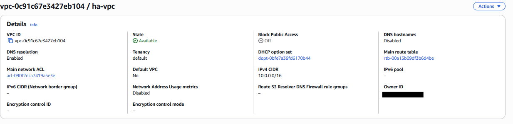.

---

#### Screenshot 2 — Subnets list showing four subnets and their Availability Zones

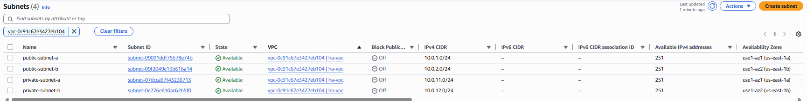.

---

#### Screenshot 3 — Public route table showing the Internet Gateway route and both public-subnet associations

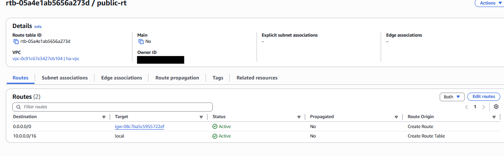.
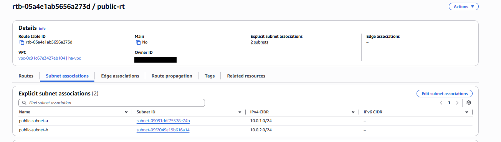.

---

#### Screenshot 4 — Private route table showing the NAT Gateway route and both private-subnet associations

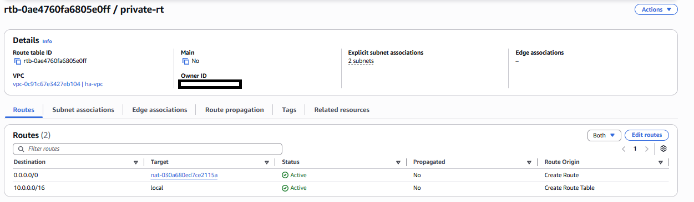.
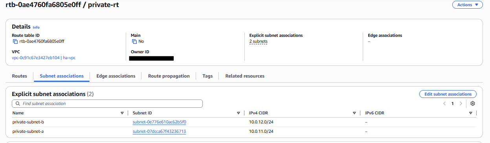.

---

#### Screenshot 5 — NAT Gateway status showing Available and the Elastic IP

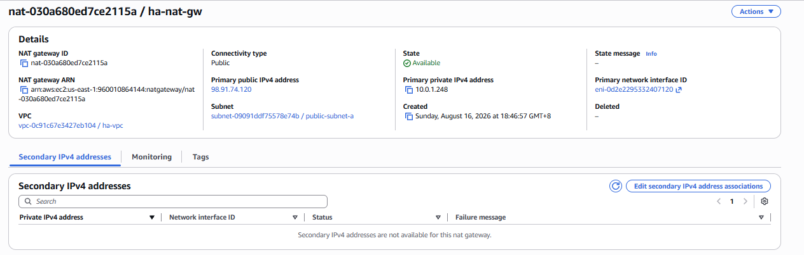.

---

# Task 2 — Create Security Groups (ALB, EC2, RDS) with Least Privilege

## Goal

Create `ha-alb-sg` (HTTP public), `ha-web-sg` (HTTP only from `ha-alb-sg`, SSH from your IP), and `ha-db-sg` (database port only from `ha-web-sg`).

### Evidence

#### Screenshot 6 — ALB Security Group inbound rules

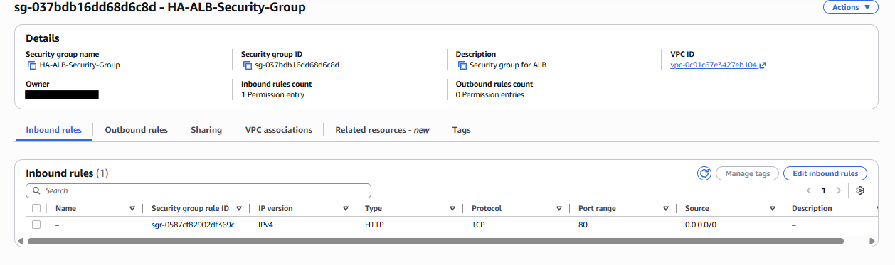.

---

#### Screenshot 7 — EC2 Security Group inbound rules showing the ALB Security Group reference and SSH from your IP

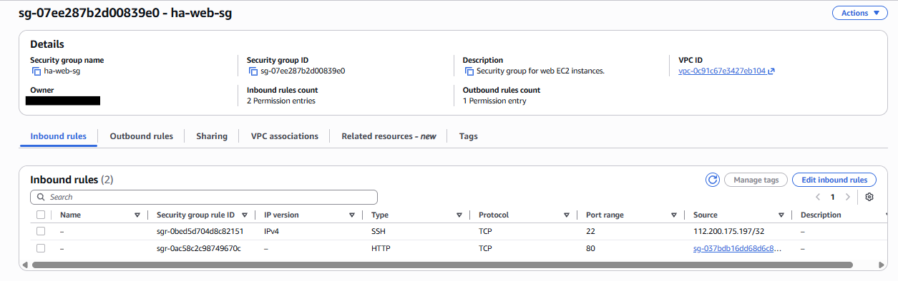.

---

#### Screenshot 8 — RDS Security Group inbound rule showing the database port allowed only from the EC2 Security Group

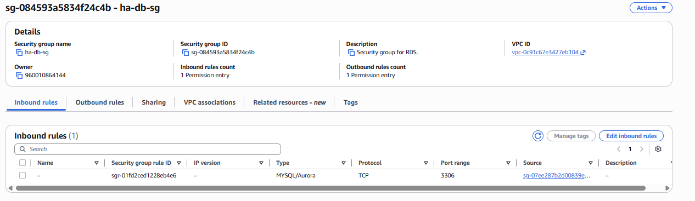.

---

# Task 3 — Deploy Database Tier (RDS Multi-AZ in Private Subnets)

## Goal

Launch a private, Multi-AZ RDS database (MySQL or PostgreSQL) using the private DB Subnet Group and `ha-db-sg`.

### Evidence

#### Screenshot 9 — RDS summary showing Multi-AZ = Yes and Publicly accessible = No

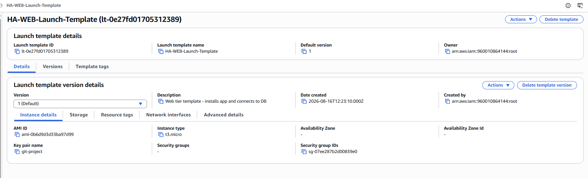.

---

#### Screenshot 10 — RDS connectivity section showing the DB Subnet Group and Security Group

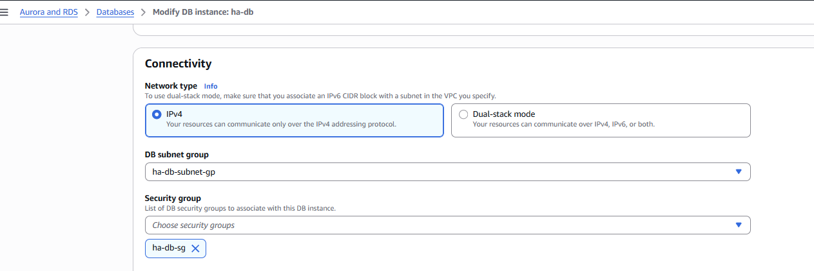.

---

# Task 4 — Build a Launch Template (User Data Installs App + Connects to DB)

## Goal

Create a Launch Template whose user data installs the web-server runtime, deploys the application, configures the database connection, and starts the required services.

### Evidence

#### Screenshot 11 — Launch Template details showing that user data exists, including a visible snippet

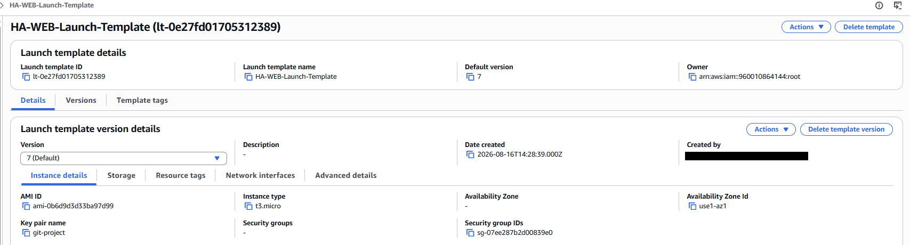.
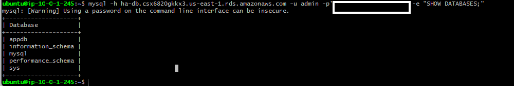.

---

#### Screenshot 12 — A running instance created from the template showing that the application responds on port 80 through a local test or browser using its public IP

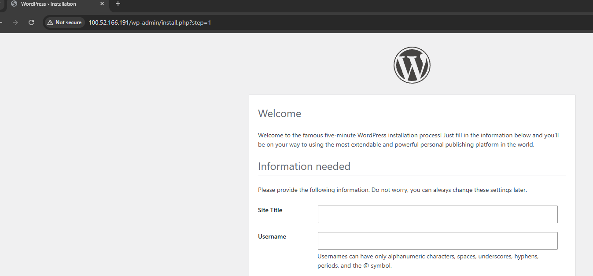.

---

# Task 5 — Create an Application Load Balancer (ALB) Across 2 Public Subnets

## Goal

Create an internet-facing ALB across both public subnets with an HTTP listener and a healthy instance target group.

### Evidence

#### Screenshot 13 — ALB details showing two public subnets in two Availability Zones

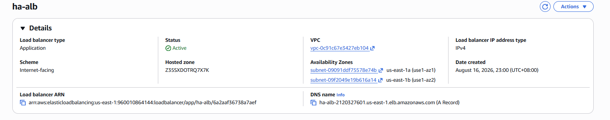.

---

#### Screenshot 14 — Target group showing at least one healthy target

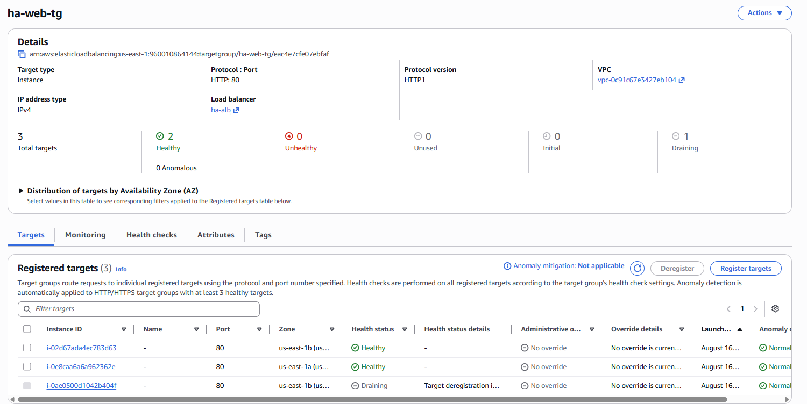.

---

# Task 6 — Create Auto Scaling Group (ASG) in 2 Public Subnets

## Goal

Create an Auto Scaling Group from the Launch Template across both public subnets, with desired capacity 2, minimum 2, and maximum 4, registered to the ALB target group.

### Evidence

#### Screenshot 15 — Auto Scaling Group showing desired, minimum, and maximum capacity and the selected subnet Availability Zones

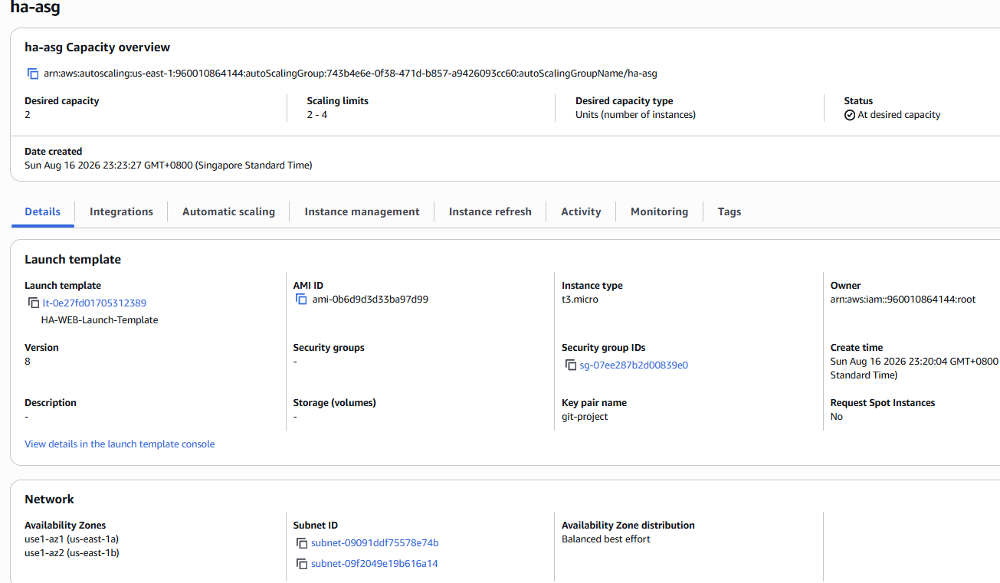.

---

#### Screenshot 16 — EC2 instances list showing two running instances in different Availability Zones

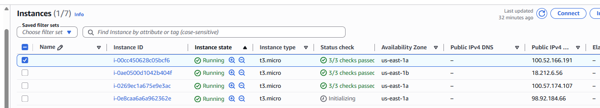.

---

# Task 7 — Configure App to Use RDS + Validate Read/Write

## Goal

Confirm the application communicates with the RDS database through the ALB DNS name with at least one read and one write operation.

### Evidence

#### Screenshot 17 — Browser showing the application loaded through the ALB DNS name with the URL visible

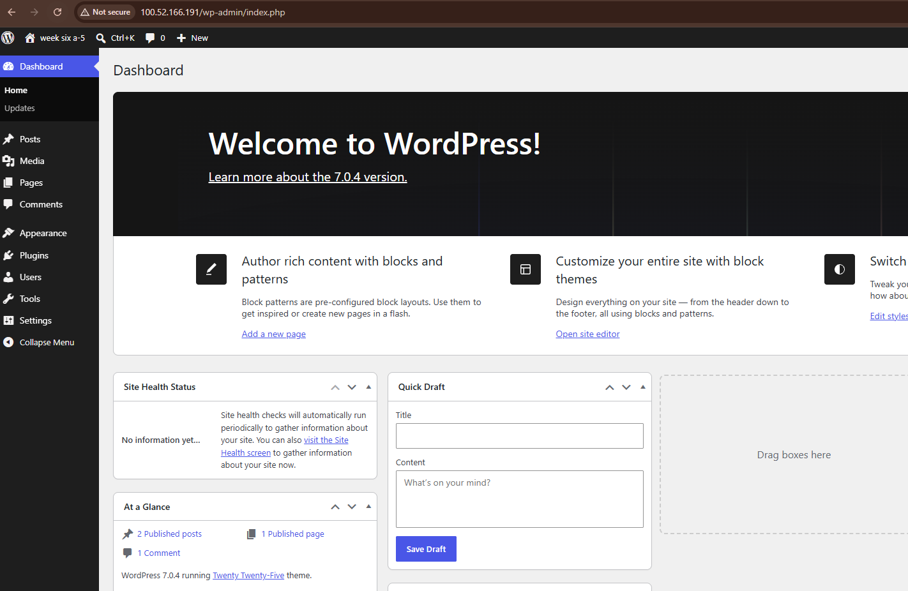.

---

#### Screenshot 18 — Proof of a database write through a UI message or database query output

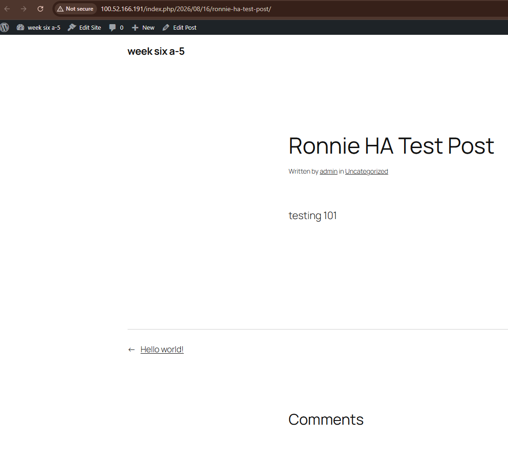.

---

# Task 8 — High Availability Tests (Must Do Both)

## Goal

Test A: terminate one web instance and confirm the Auto Scaling Group replaces it automatically without interrupting the ALB.

Test B: simulate an Availability Zone impact (stop, detach, or reduce desired capacity in one AZ) and confirm the application stays available.

### Evidence

#### Screenshot 19 — EC2 showing the terminated instance and the newly launched instance; timestamps are helpful

#### Instance i-0a5a001340b0cbe60 showing as running

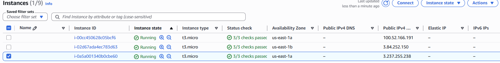.

#### Instance i-0a5a001340b0cbe60, now showing as terminated

.

#### Replaced by i-0864f4318db5cd7f7 initializing

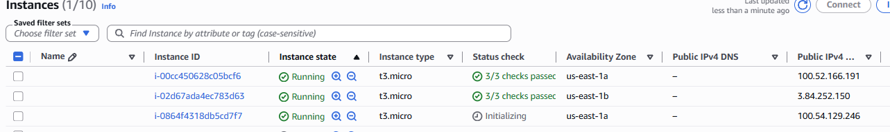.

#### Instance i-0864f4318db5cd7f7 on running state

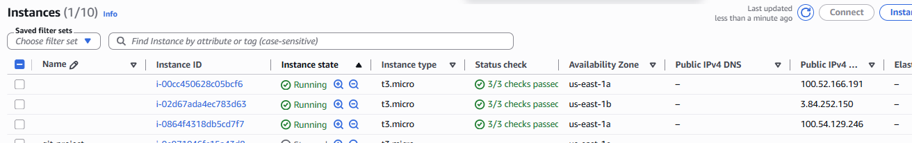.

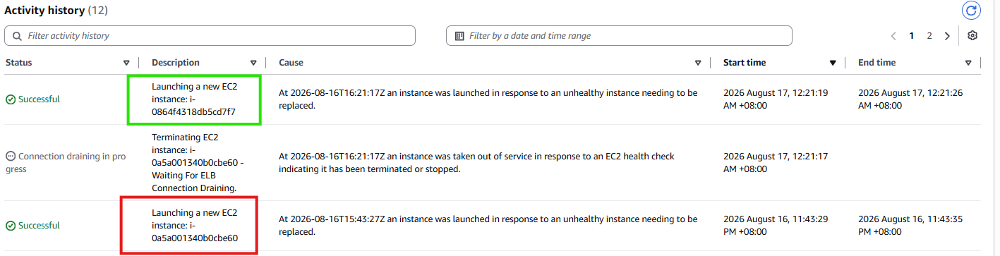.

---

#### Screenshot 20 — Target group showing healthy targets after replacement

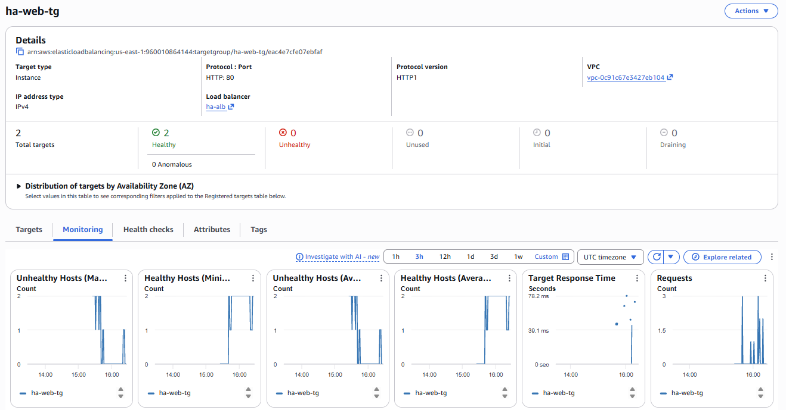.

---

#### Screenshot 21 — Evidence that an instance was removed, detached, placed in Standby, or stopped in one Availability Zone

Instance i-0a5a001340b0cbe60, now showing as terminated
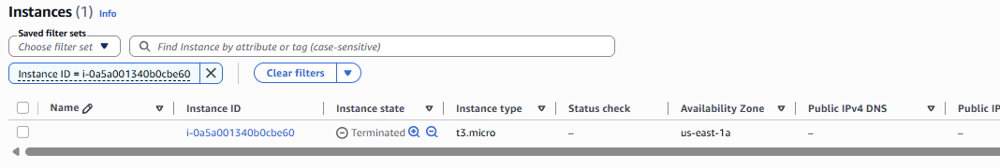.

---

#### Screenshot 22 — Browser showing that the ALB DNS endpoint still works during the change

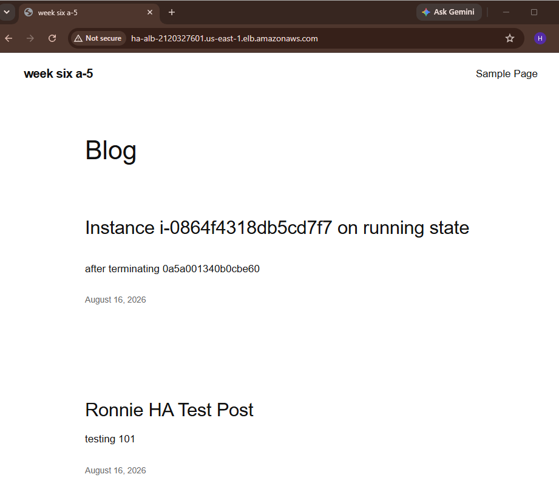.

---

# Task 9 — Architecture and Test-Results Summary

## Goal

Summarize the VPC/subnet layout, the ALB and Auto Scaling Group setup, the private Multi-AZ RDS setup, and the results of both high-availability tests.

### Evidence

#### Screenshot 23 — A simple architecture diagram, which may be hand-drawn, or an AWS console overview showing the components

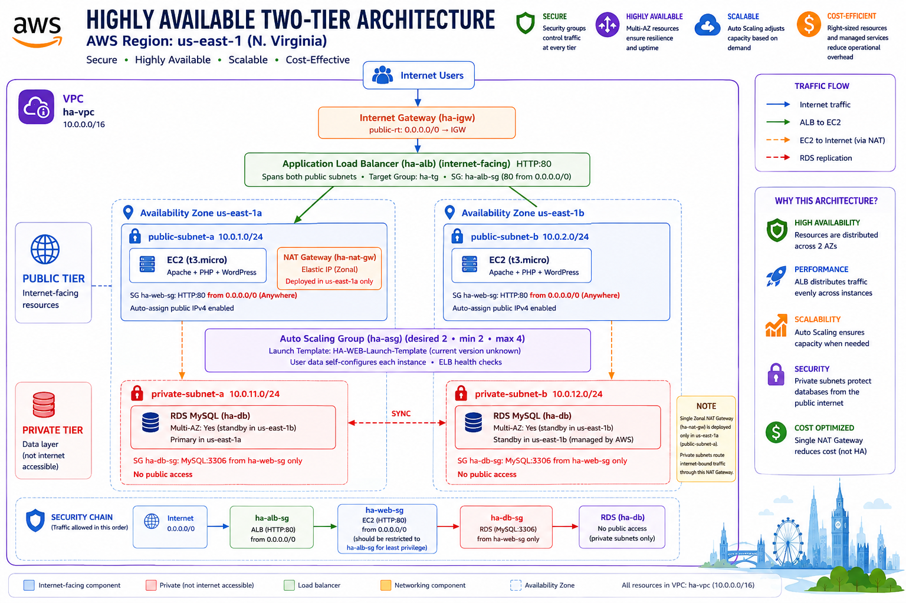.

---

### Notes

Summarize the VPC and subnets across the two Availability Zones.

ha-vpc (10.0.0.0/16) spans two Availability Zones with four subnets: two public (public-subnet-a in us-east-1a at 10.0.1.0/24, public-subnet-b in us-east-1b at 10.0.2.0/24) and two private (private-subnet-a at 10.0.11.0/24, private-subnet-b at 10.0.12.0/24). An Internet Gateway is attached to the VPC and routed to from the public route table, which is associated with both public subnets. A single NAT Gateway sits in public-subnet-a, and the private route table (associated with both private subnets) routes outbound traffic through it, giving private resources internet access without any inbound exposure.

Summarize the ALB and Auto Scaling Group setup.

ha-alb, an internet-facing Application Load Balancer, spans both public subnets with an HTTP:80 listener forwarding to the ha-web-tg target group. Web instances are launched from a Launch Template whose user data installs Apache, PHP, and WordPress, configures the database connection, and ensures the application database exists. An Auto Scaling Group built from that template spans both public subnets with a desired/minimum capacity of 2 and a maximum of 4, keeping instances registered to ha-web-tg so traffic is always spread across both Availability Zones.

Summarize the private Multi-AZ RDS setup.

ha-db is a MySQL RDS instance deployed in Multi-AZ mode (primary in one AZ, synchronously replicated standby in the other) using a DB Subnet Group that covers both private subnets. It is not publicly accessible and is secured by ha-db-sg, which allows inbound traffic on the database port only from ha-web-sg — the web tier's security group.

Summarize the results of both high-availability tests.

Test A (instance termination): a running web instance was manually terminated, and the Auto Scaling Group automatically launched a replacement to restore desired capacity; the target group returned to fully healthy shortly after, with no interruption to the ALB endpoint. Test B (Availability Zone impact): an instance in one AZ was stopped/placed in standby to simulate a zone outage; the application remained reachable through the ALB DNS name throughout, served entirely by the healthy instance in the surviving AZ, confirming the two-AZ design tolerates a full zone failure.

---

# LinkedIn Post (Required)

## Goal

Publish a LinkedIn post about the high-availability build, including the ALB URL (or a redacted screenshot), three to five lines on what you built and how you tested high availability, and one proof screenshot.

## Evidence

#### LinkedIn Post URL

Paste your LinkedIn post URL here:

`Add your URL here`

---

#### Screenshot of LinkedIn post

Add your screenshot here.

---

# Submission Instructions

- Add all required screenshots in your submission
- Do not expose passwords, connection strings, private keys, or account IDs

---

# Completion Checklist

- [ ] Task 1: VPC, four subnets, IGW, NAT Gateway, and route tables created (Screenshots 1–5)
- [ ] Task 2: Least-privilege ALB, EC2, and RDS security groups created (Screenshots 6–8)
- [ ] Task 3: Private Multi-AZ RDS created (Screenshots 9–10)
- [ ] Task 4: Self-configuring Launch Template created and tested (Screenshots 11–12)
- [ ] Task 5: ALB created across both public subnets (Screenshots 13–14)
- [ ] Task 6: Auto Scaling Group running two instances across two AZs (Screenshots 15–16)
- [ ] Task 7: Application verified through the ALB with a database read and write (Screenshots 17–18)
- [ ] Task 8: Both high-availability tests completed (Screenshots 19–22)
- [ ] Task 9: Architecture and test-results summary completed (Screenshot 23 & Notes)
- [ ] LinkedIn post published and URL submitted
- [ ] No sensitive data exposed

---

## 📌 About DMI & CloudAdvisory

DevOps Micro Internship (DMI) is a project-based DevOps program run by Pravin Mishra (The CloudAdvisory) focused on real-world execution, systems thinking, and career readiness.

It helps learners build strong DevOps foundations with hands-on experience.

---

## 📌 Resources

- 🌐 DMI Official Website: https://dmi.pravinmishra.com?utm_source=github&utm_medium=readme  
- 🎓 University: https://university.pravinmishra.com?utm_source=github&utm_medium=readme  
- 💬 Discord Community: https://discord.pravinmishra.com?utm_source=github&utm_medium=readme  
- 📝 Blog: https://dmi.pravinmishra.com/blog?utm_source=github&utm_medium=readme  
- ▶️ YouTube Playlist: https://www.youtube.com/playlist?list=PLFeSNDtI4Cho  
- 🔗 Pravin Mishra (LinkedIn): https://www.linkedin.com/in/pravin-mishra-aws-trainer/  
- 🏢 CloudAdvisory (LinkedIn): https://www.linkedin.com/company/thecloudadvisory/

---

*This submission is part of DevOps Micro Internship (DMI) Cohort 3 — Agentic AI Track.*