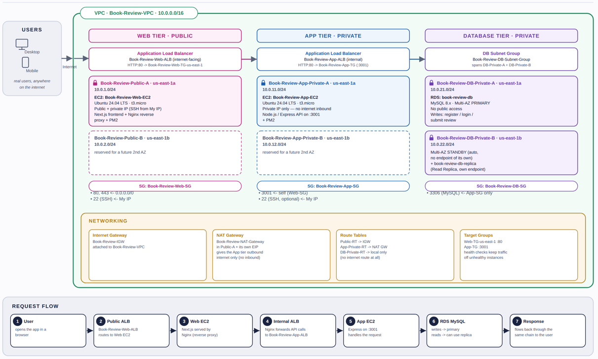
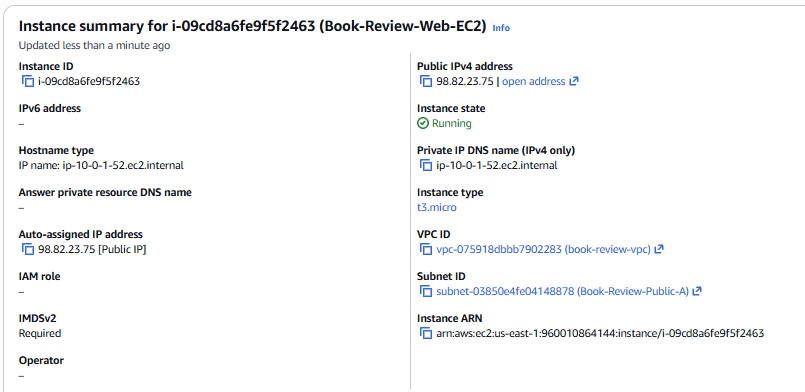
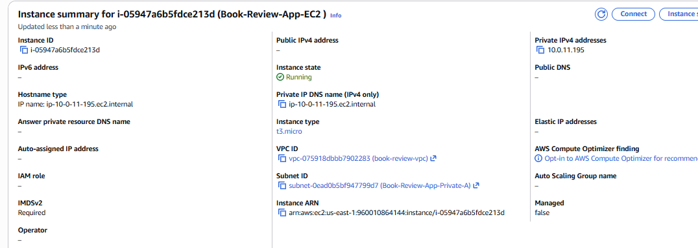
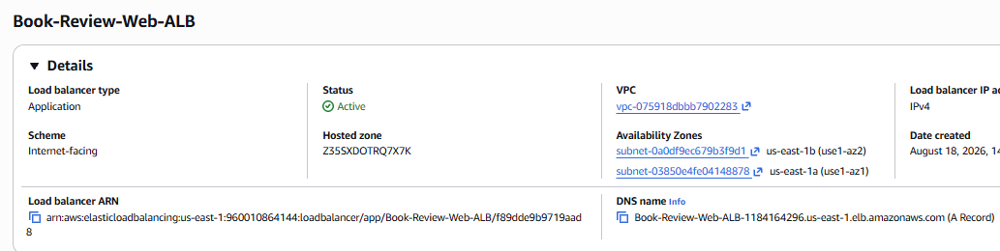
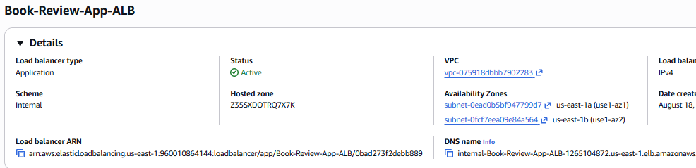
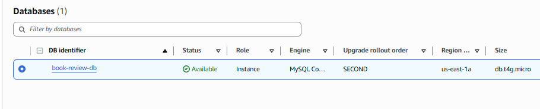
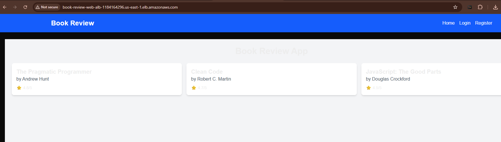
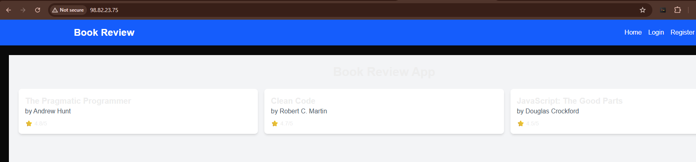
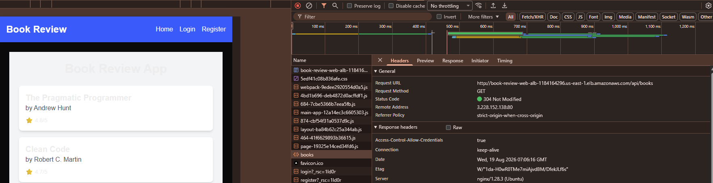

# Assignment 6 — Capstone Assignment — Deploy Book Review App (Three-Tier Architecture) on AWS

Part of the DevOps Micro Internship (DMI) Cohort 3 with Agentic AI

---

## Purpose

This is the most important assignment of the course. You will deploy the Book Review App in a fully production-style three-tier architecture on AWS: a Next.js Web Tier behind Nginx and a public ALB, a private Node.js/Express App Tier behind an internal ALB, and a private Multi-AZ MySQL RDS database with a read replica. You are expected to design, deploy, isolate, debug, and document the result independently.

---

# Task 1 — Architecture Diagram

## Goal

Create an architecture diagram showing the custom VPC (10.0.0.0/16), the six subnets across two Availability Zones (two public Web Tier, two private App Tier, two private Database Tier), the public ALB, Web Tier EC2/Nginx, internal ALB, private App Tier EC2, private Multi-AZ RDS with its read replica, and the permitted traffic flow.

### Evidence

#### Diagram image or link

.

---

# Task 2 — AWS Region & Services Used

## Goal

Record the AWS Region used and list every AWS service used across networking, compute, load balancing, security, and the database.

### Notes

**Region:**

us-east1-1

---

**Services:**

Networking: Amazon VPC, subnets (six across two Availability Zones), Internet Gateway, NAT Gateway, route tables, Elastic IP (attached to the NAT Gateway only), Security Groups.

Compute: Amazon EC2 (two t3.micro instances running Ubuntu 24.04 LTS), EC2 key pairs.
Load balancing: Elastic Load Balancing, specifically two Application Load Balancers (one internet-facing, one internal) with their target groups and listeners.

Database: Amazon RDS for MySQL with Multi-AZ enabled and a DB subnet group spanning both private database subnets. 
A read replica was evaluated but intentionally not implemented — it falls outside AWS Free Tier coverage, and the account's single-instance limit was already reached by the primary.

On the instances: Nginx as reverse proxy, Node.js, Next.js for the web tier, Express with Sequelize for the app tier, and PM2 to keep both services running persistently.

---

# Task 3 — Public Entry Point

## Goal

Confirm the Book Review App loads through the public ALB DNS name.

### Evidence

#### Public ALB DNS

Paste your public ALB DNS name here:

Book-Review-Web-ALB-1184164296.us-east-1.elb.amazonaws.com

---

# Task 4 — Evidence Screenshots

## Goal

Capture visual proof of every tier and load balancer.

### Evidence

#### Web EC2

.

---

#### App EC2

.

---

#### Public ALB

.

---

#### Internal ALB

.

---

#### RDS + Replica

unable to enable, account still on free tier
.

---

#### App UI proof

.
.
.
---

# Task 5 — Summary

## Goal

Summarize what worked in the final deployment, the issues encountered and how each was fixed, and the tools or sources used to research and debug.

### Notes

**What worked:**

Write your answer here.

The full three-tier VPC (6 subnets across 2 AZs, IGW, single NAT Gateway, 3 route tables) deployed correctly on the first pass. Security group chaining (Web-SG → App-SG → DB-SG) worked as designed once corrected. Both Application Load Balancers (public-facing Web-ALB and internal App-ALB) and their target groups registered and passed health checks. RDS MySQL deployed with Multi-AZ enabled. The backend (Node.js/Express) connected to RDS over SSL, auto-synced its schema and seeded sample data via Sequelize, and ran persistently under PM2 with systemd startup registration. The frontend (Next.js) built successfully, was served through Nginx as a reverse proxy (forwarding /api/* to the Internal ALB and everything else to the local Next.js process), and also ran persistently under PM2. End-to-end testing confirmed the full request path working from a real browser over the public internet: Browser → Public ALB → Web EC2 (Nginx) → Internal ALB → App EC2 → RDS MySQL, with the app correctly displaying live seeded data.

**Issues + fixes:**

Several real issues came up during the build, documented in detail in the accompanying troubleshooting document:

Editing an existing CIDR-based security group rule to a security-group reference failed with an AWS console error; fixed by deleting and recreating the rule instead of editing in place.

The DB-SG's inbound rule initially had the wrong source (Web-SG instead of App-SG); caught and corrected before it caused a connection failure.

The public Web-ALB was accidentally created with App-SG attached instead of Web-SG, which would have made it unreachable from the internet; fixed via the Security tab without recreating the load balancer.

RDS Read Replica creation was blocked by an account-level instance cap (bootcamp/sandbox limitation); deliberately skipped since it's not Free Tier eligible and doesn't affect app correctness (Multi-AZ still provides HA).

The forked repo has no SQL seed files — resolved by confirming Sequelize auto-syncs the schema and seeds data on backend startup.
.env on the App EC2 contained placeholder example values for DB_HOST and ALLOWED_ORIGINS instead of actual resource endpoints — corrected to match the real RDS endpoint and ALB DNS name.

The backend crash-looped under PM2 (EADDRINUSE) because an earlier manually-run node process was left holding port 3001; killed the orphaned process and restarted cleanly under PM2.

After full deployment, the frontend showed "No books available" despite the backend working correctly — traced to a doubled /api/api/ request path caused by a mismatch between .env.local's configured value and the fork's actual source code; fixed by leaving NEXT_PUBLIC_API_URL empty and rebuilding.

---

**Tools/sources used:**

AWS Management Console (VPC, EC2, RDS, ELB), SSH (with the Web EC2 used as a bastion/jump host to reach the private App EC2), MySQL client for direct database verification, curl and Chrome DevTools (Network tab) for API/request-path debugging, PM2 for Node.js process management, Nginx for reverse proxying, and the assignment's official step-by-step build guide as the primary reference. Claude was used throughout as a build-verification and troubleshooting partner — reviewing configuration screenshots against the guide, diagnosing real deployment errors (PM2 crash loops, the doubled API path bug, security group misconfigurations), and helping produce the accompanying troubleshooting documentation.

---

# LinkedIn Post (Required)

## Goal

Publish a LinkedIn post sharing the capstone deployment, including the public ALB DNS (or a redacted screenshot), three to five lines on what you built and why it is production-style, and one proof screenshot.

## Evidence

#### LinkedIn Post URL

Paste your LinkedIn post URL here:

`Add your URL here`

---

#### Screenshot of LinkedIn post

Add your screenshot here.

---

# Submission Instructions

- Add all required screenshots and links in your submission
- Do not expose passwords, RDS credentials, connection strings, private keys, or account IDs

---

# Completion Checklist

- [ ] Task 1: Architecture diagram completed
- [ ] Task 2: AWS Region and services documented
- [ ] Task 3: Public ALB DNS confirmed working
- [ ] Task 4: All six evidence screenshots captured (Web Tier, App Tier, both ALBs, RDS + replica, app UI)
- [ ] Task 5: Deployment summary completed (what worked, issues/fixes, tools/sources)
- [ ] LinkedIn post published and URL submitted
- [ ] App Tier and Database Tier confirmed not publicly accessible
- [ ] No sensitive data exposed

---

## 📌 About DMI & CloudAdvisory

DevOps Micro Internship (DMI) is a project-based DevOps program run by Pravin Mishra (The CloudAdvisory) focused on real-world execution, systems thinking, and career readiness.

It helps learners build strong DevOps foundations with hands-on experience.

---

## 📌 Resources

- 🌐 DMI Official Website: https://dmi.pravinmishra.com?utm_source=github&utm_medium=readme  
- 🎓 University: https://university.pravinmishra.com?utm_source=github&utm_medium=readme  
- 💬 Discord Community: https://discord.pravinmishra.com?utm_source=github&utm_medium=readme  
- 📝 Blog: https://dmi.pravinmishra.com/blog?utm_source=github&utm_medium=readme  
- ▶️ YouTube Playlist: https://www.youtube.com/playlist?list=PLFeSNDtI4Cho  
- 🔗 Pravin Mishra (LinkedIn): https://www.linkedin.com/in/pravin-mishra-aws-trainer/  
- 🏢 CloudAdvisory (LinkedIn): https://www.linkedin.com/company/thecloudadvisory/

---

*This submission is part of DevOps Micro Internship (DMI) Cohort 3 — Agentic AI Track.*