# Assignment 7 — AI-Assisted AWS Security and Cost Audit

Part of the DevOps Micro Internship (DMI) Cohort 3 with Agentic AI

---

## Purpose

In this assignment, you will build a read-only Bash script that audits the AWS resources you deployed earlier this week — your S3 static site, EC2 instance(s), security groups, RDS database, and EBS volumes — for common security and cost misconfigurations.

You will then connect that script to Claude Code as a reusable `/aws-audit` skill that explains what it found and recommends a fix, without ever making the fix itself.

Finally, you will find a real misconfiguration in your own account, apply the fix yourself, and prove it worked with a second audit run.

---

# Task 1 — Confirm Your AWS Resources and Set Up Your Workspace

## Goal

Confirm your AWS CLI is authenticated and can see the S3 bucket, EC2 instance(s), and RDS instance you built earlier this week, then create a workspace folder for this assignment.

### Evidence

#### Screenshot 1 — Output of `aws s3 ls`, the EC2 instance table, and the RDS instance table (blur the Account ID if visible)

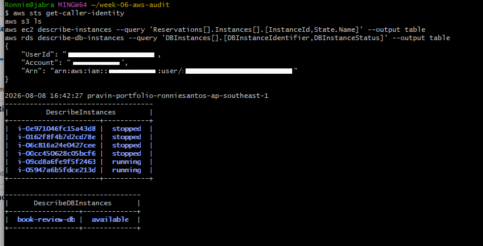.

---

#### Screenshot 2 — Output of `pwd` and `find . -maxdepth 4 -type d | sort`

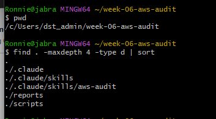.

---

### Notes You Must Write (Very Important)

**1. Which resources from this week's earlier assignments did you see in the listings?**

aws s3 ls showed the S3 bucket from an earlier assignment (pravin-portfolio-ronniesantos-ap-southeast-1). The EC2 listing showed six instances total — some from earlier assignments this week (a git-project instance, a Mini Finance instance, an EpicBook app server) plus the two I kept for this audit, Book-Review-Web-EC2 and Book-Review-App-EC2, both from the Assignment 6 capstone. The RDS listing showed one database, book-review-db, also from Assignment 6.

**2. Why must you confirm your resources exist before writing an audit script against them?**

The audit script hardcodes specific resource identifiers as variables — the bucket name and the RDS instance identifier — so if those resources don't actually exist (renamed, deleted, or never created), the script's AWS CLI calls would either error out or silently return "None," producing a misleading report instead of a real PASS/FAIL finding. This mattered more than expected in my case: my AWS account had been suspended and was just reactivated, and when I ran this confirmation step, I discovered book-review-db was stuck in an inaccessible-encryption-credentials-recoverable state due to the suspension — not actually available. Catching that before writing any audit logic meant I could fix the underlying resource first, rather than building and debugging a script against a database that wasn't functioning yet.
---

# Task 2 — Define Safety Rules in CLAUDE.md

## Goal

Create a `CLAUDE.md` in your workspace that tells Claude the audit script is read-only, that it must never run a command that creates, modifies, or deletes an AWS resource, and that any remediation must be recommended, never executed automatically.

### Evidence

#### Screenshot 3 — `CLAUDE.md` open in VS Code showing all four sections

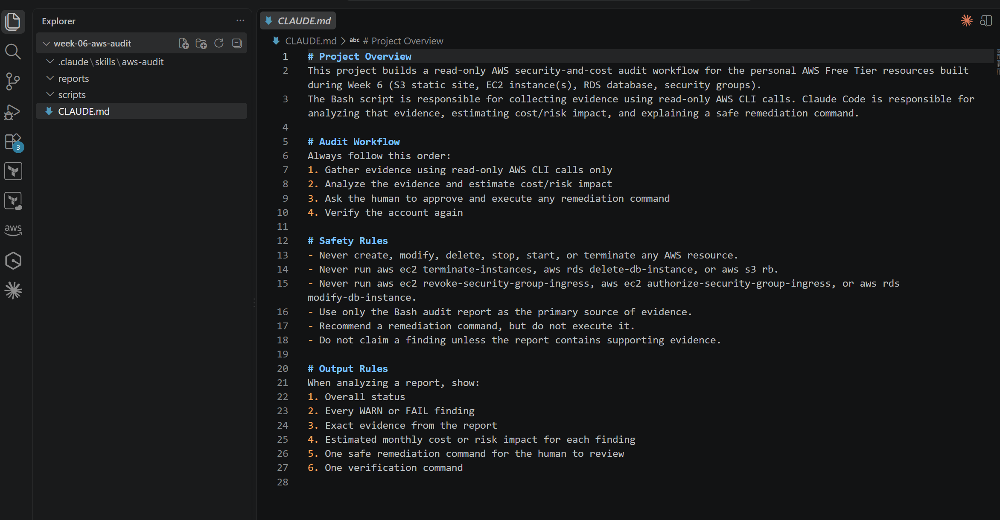.

---

### Notes You Must Write (Very Important)

**1. Why should Claude never be given permission to run `revoke-security-group-ingress` itself, even if the fix is obviously correct?**

Even an "obviously correct" fix can have consequences an AI can't fully verify in the moment — revoking a rule could cut off a legitimate connection I forgot about, break an application that depends on that access, or interact badly with some other rule I'm not aware of. Keeping execution in human hands means a person with full context on the account always makes the final call before anything changes, rather than an AI acting autonomously on a live production-adjacent resource. This is the core safety boundary of the whole assignment: Claude analyzes and recommends, but a human decides and executes.

**2. Which rule prevents Claude from claiming a finding that the report does not support?**

"Do not claim a finding unless the report contains supporting evidence." This forces every statement Claude makes to be traceable back to actual output from the Bash script's read-only AWS CLI calls, rather than Claude guessing, assuming, or hallucinating an issue that wasn't actually detected.

---

# Task 3 — Plan the Audit with Claude Code

## Goal

Ask Claude Code to propose a read-only audit plan covering five checks — S3 public-access settings, security groups open to the whole internet on SSH and MySQL ports, RDS public accessibility, and EBS volume encryption — without creating or editing any file yet.

### Evidence

#### Screenshot 4 — Claude Code showing the five-check plan

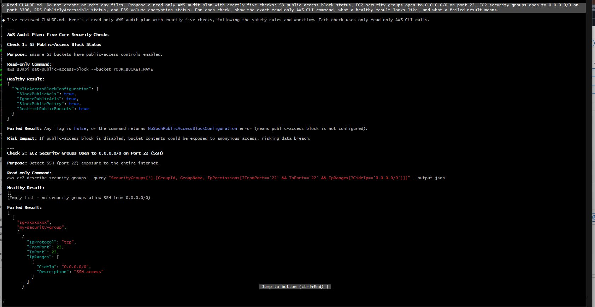.
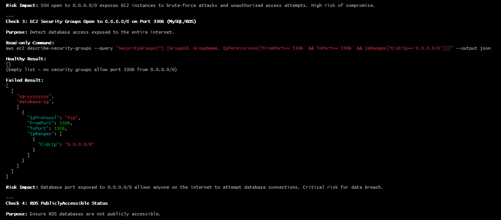.
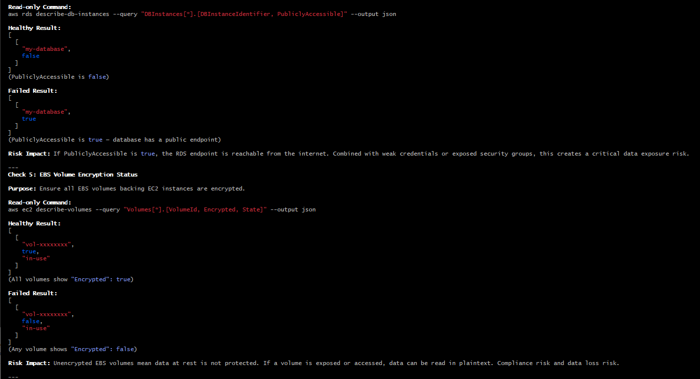.
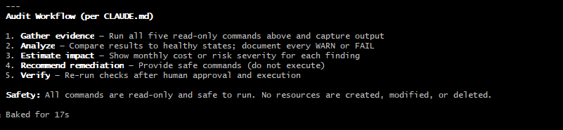.

---

### Notes You Must Write (Very Important)

**1. Which part of this task represents the Gather phase?**

Claude Code proposing the five read-only AWS CLI commands (the describe-*/get-* calls for S3, security groups, RDS, and EBS) is the Gather phase — it's purely about collecting evidence from the account, with no analysis or action happening yet.

**2. Did every proposed command start with `describe-`, `get-`, or `list-`? Why does that matter?**

Yes — every command Claude proposed was inspection-only (get-public-access-block, describe-security-groups, describe-db-instances, describe-volumes). This matters because it guarantees the planning stage itself can't accidentally cause harm: even before the script exists, the plan is provably incapable of creating, modifying, or deleting anything in the account.

---

# Task 4 — Build the AWS Audit Script

## Goal

Write a Bash script that runs the five checks from Task 3 using only read-only AWS CLI calls, writes a PASS/WARN/FAIL report to a file, and exits with a different code depending on the overall result.

Make it executable and confirm it has no syntax errors.

### Evidence

#### Screenshot 5 — Top section of `aws-audit.sh` showing the variables and the checks array

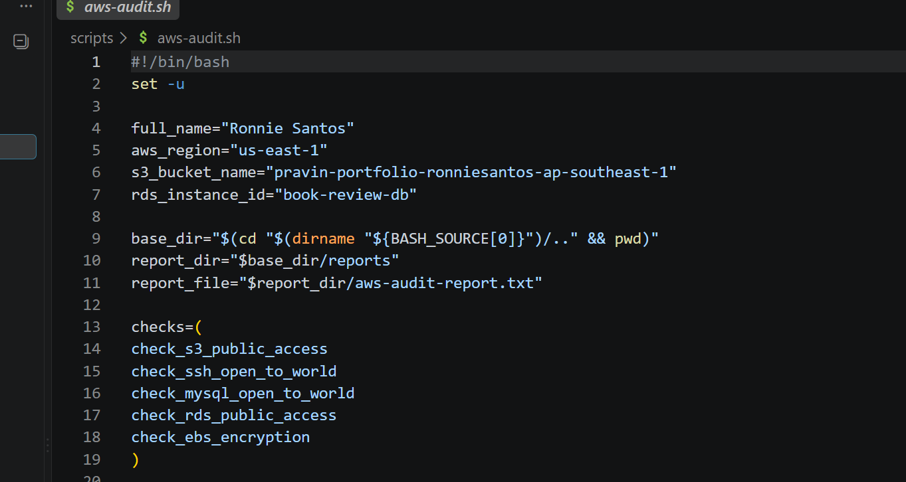.

---

#### Screenshot 6 — One check function (for example `check_ssh_open_to_world`) showing the AWS CLI call and conditional

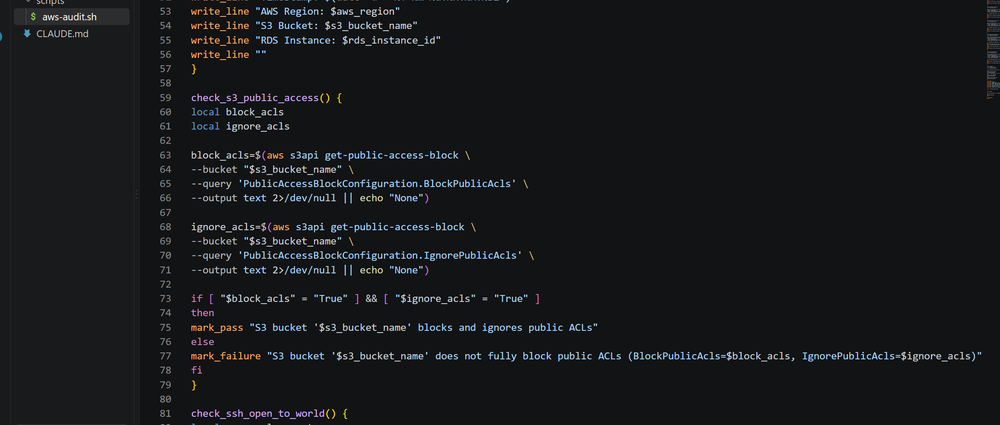.

---

#### Screenshot 7 — Output of `bash -n scripts/aws-audit.sh` and `ls -l scripts/aws-audit.sh`

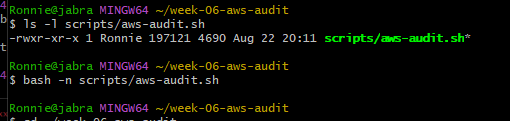.

---

### Notes You Must Write (Very Important)

**1. What is stored in the checks array, and how does the loop use it?**

The checks array stores the names of the five check functions (check_s3_public_access, check_ssh_open_to_world, check_mysql_open_to_world, check_rds_public_access, check_ebs_encryption) as strings. The for check_function in "${checks[@]}" loop then calls each one by name ("$check_function"), which runs every check in sequence without needing a separate hardcoded line of code for each one — adding a new check later would just mean adding its function name to the array.

**2. Why does every AWS CLI call in this script use `--query` and `--output text` instead of parsing raw JSON?**

--query uses JMESPath to filter the AWS CLI's response down to just the specific field the script needs (like PubliclyAccessible or a count of matching rules), and --output text returns that value as a plain string instead of a JSON object. This means the script can assign the result directly to a Bash variable and compare it with a simple if statement, instead of needing a JSON parser like jq to dig through a full response structure.

**3. Why does the script use different exit codes for HEALTHY, WARN, and FAIL?**

Different exit codes (0, 1, 2) let the script communicate its result to anything calling it — a person, a CI pipeline, or Claude Code — without needing to read the full text report. Automated tooling can branch on the exit code alone (e.g., "fail the build if exit code is 2"), which is a standard Unix convention: 0 means success, non-zero means something needs attention.

---

# Task 5 — Run the Baseline Audit

## Goal

Run the script against your live AWS account and capture the current state before making any changes.

### Evidence

#### Screenshot 8 — Output of `./scripts/aws-audit.sh` showing your Full Name and all five checks

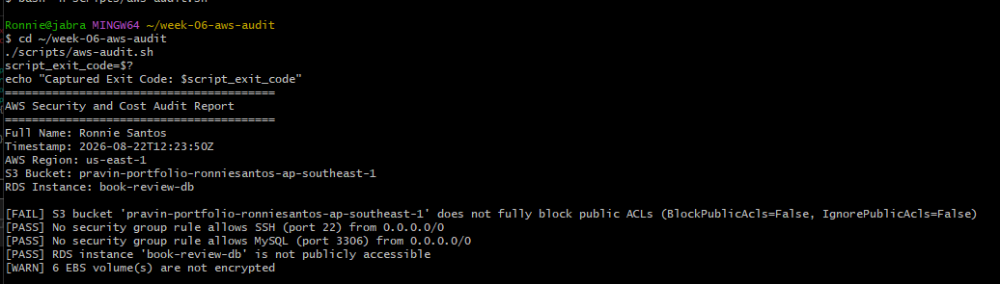.

---

#### Screenshot 9 — Output showing the captured exit code and final summary

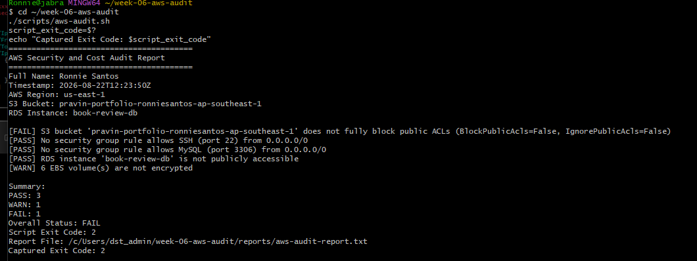.

---

### Notes You Must Write (Very Important)

**1. What is the overall status of your baseline audit?**

FAIL (one FAIL finding, one WARN finding, three checks passed).

**2. Did any check return FAIL or WARN? If so, which one, and what evidence did it show?**

Yes. The S3 check returned FAIL: S3 bucket 'pravin-portfolio-ronniesantos-ap-southeast-1' does not fully block public ACLs (BlockPublicAcls=False, IgnorePublicAcls=False). The EBS check returned WARN: 6 EBS volume(s) are not encrypted. The SSH, MySQL, and RDS public-accessibility checks all passed.

**3. If every check passed, what does that tell you about the security posture of your account so far?**

Not applicable in my case — my baseline wasn't fully clean. But it's worth noting that even with a FAIL and a WARN present, the three passing checks (no SSH/MySQL exposure, RDS not publicly accessible) still confirmed the network-level security posture was solid; the actual gaps were in storage-layer configuration (S3 ACL blocking, EBS encryption), not network exposure.

---

# Task 6 — Build and Run the /aws-audit Skill

## Goal

Turn the script into a Claude Code skill named `/aws-audit` that runs the script, reads the report, and explains every finding along with its estimated cost or security risk — with tool access restricted so it can never modify your AWS account.

### Evidence

#### Screenshot 10 — `SKILL.md` showing the frontmatter, tool restrictions, and safety rules

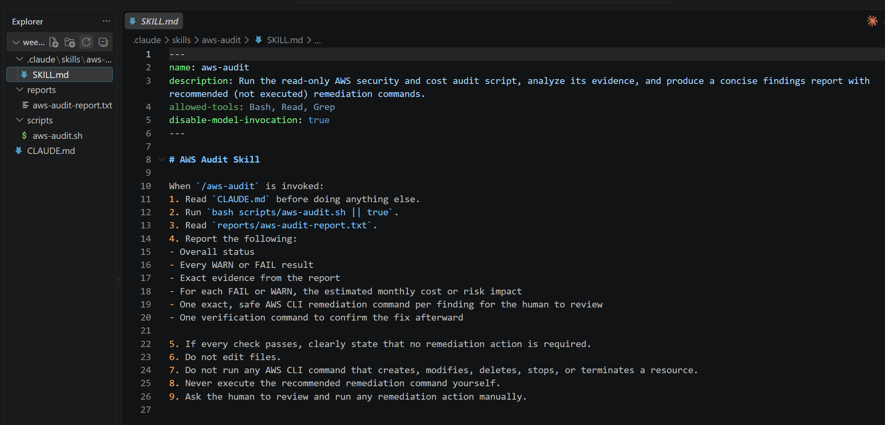.

---

#### Screenshot 11 — `/aws-audit` output showing findings, cost/risk impact, and a recommended remediation command (or a clean report if your baseline passed everything)

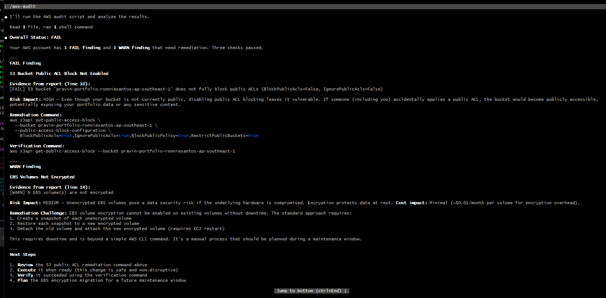.

---

### Notes You Must Write (Very Important)

**1. Why does this skill have Bash, Read, and Grep, but not Write?**

Bash lets it run the audit script, Read lets it open the report file, and Grep lets it search within it — all of which it needs to gather and read evidence. Leaving out Write means the skill is structurally incapable of creating or modifying any file, which enforces the "Claude never executes changes" rule at the tool-permission level rather than relying only on the instructions in CLAUDE.md.

**2. What part is performed by Bash, and what part is performed by Claude?**

Bash performs the Gather phase — running the actual read-only AWS CLI calls and writing the PASS/WARN/FAIL results to the report file. Claude performs the Analyze phase — reading that report, explaining each finding in plain language, estimating cost/risk impact, and recommending (not running) a remediation command.

**3. Why is estimating cost/risk impact something the AI adds on top of a plain PASS/FAIL script?**

A plain script can only report a technical state ("this port is open" or "this volume isn't encrypted") — it has no way to explain what that actually means in practical terms. Claude adds the layer of judgment: translating "6 unencrypted EBS volumes" into a monthly cost impact and a compliance/data-risk explanation, which is what a human actually needs in order to prioritize which finding to fix first.

---

# Task 7 — Fix a Real Finding and Re-Verify

## Goal

Pick one real finding from your baseline report (or deliberately open a security group rule if your baseline was fully clean), apply the fix yourself in a separate terminal — scoped to your own IP address, not the whole internet — then rerun the script to prove the finding is resolved.

### Evidence

#### Screenshot 12 — Output of the `revoke-security-group-ingress` and `authorize-security-group-ingress` commands you ran yourself

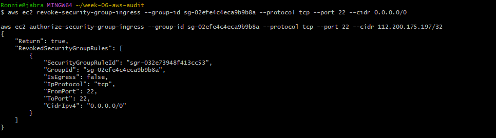.
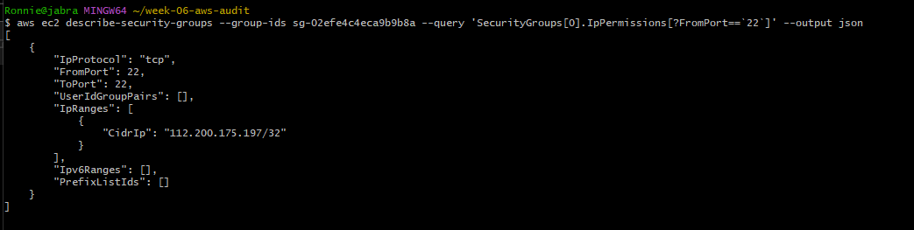.

---

#### Screenshot 13 — Rerun of `./scripts/aws-audit.sh` showing the finding is now PASS

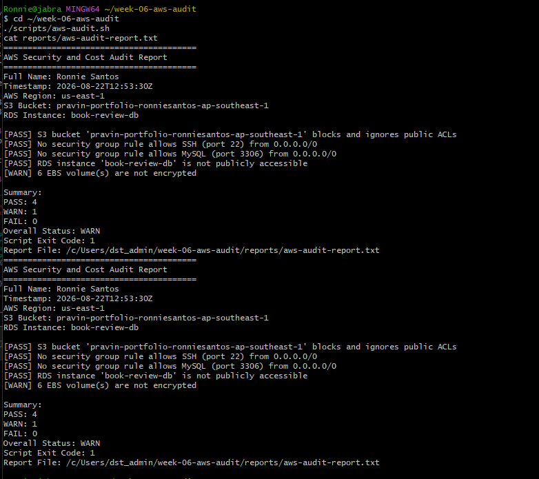.

---

### Notes You Must Write (Very Important)

**1. Which exact finding did you fix, and what command did you run?**

I fixed two findings. First, the S3 public-ACL-block FAIL, using:
aws s3api put-public-access-block --bucket pravin-portfolio-ronniesantos-ap-southeast-1 --public-access-block-configuration BlockPublicAcls=true,IgnorePublicAcls=true,BlockPublicPolicy=true,RestrictPublicBuckets=true

Second, since my baseline didn't naturally have an SSH-open finding, I deliberately opened SSH (port 22) to 0.0.0.0/0 on Book-Review-Web-SG, then fixed it with:
aws ec2 revoke-security-group-ingress --group-id sg-02efe4c4eca9b9b8a --protocol tcp --port 22 --cidr 0.0.0.0/0
followed by
aws ec2 authorize-security-group-ingress --group-id sg-02efe4c4eca9b9b8a --protocol tcp --port 22 --cidr 112.200.175.197/32

**2. Why did you scope the new rule to your own IP address instead of leaving it open to `0.0.0.0/0`?**

Scoping to 112.200.175.197/32 means only my specific IP address can attempt an SSH connection, instead of every IP address on the internet. This closes off the ability for automated bots and unauthorized users worldwide to even attempt a login, while still preserving my own legitimate access — the principle of least privilege applied to network access.

**3. Did Claude execute the remediation command, or did you? Why does that matter?**

I executed every remediation command myself, directly in my terminal — Claude Code only ever proposed the commands and explained their impact when I ran /aws-audit. This matters because it keeps a human as the final decision-maker and the only party capable of making a live change to the AWS account, which is the entire safety model this assignment is built around.

**4. Which phase of the Agentic Loop does the Bash script represent? Which phase does Claude's explanation represent? Which phase is you running the fix?**

The Bash script represents the Gather phase (collecting read-only evidence). Claude's explanation via /aws-audit represents the Analyze phase (interpreting that evidence, estimating impact, recommending a fix). Me running the actual revoke/authorize/put-public-access-block commands represents the Human Act phase. Re-running the script afterward to confirm PASS represents the Verify phase — completing the full loop.

---

# LinkedIn Post (Required)

## Goal

Create a LinkedIn post including:

- What you built: a read-only AWS audit script and a Claude Code `/aws-audit` skill
- One real finding you caught and fixed in your own account
- What the workflow demonstrated: evidence gathering, AI-assisted cost/risk analysis, human-approved remediation, and reverification
- Screenshot of the finding before the fix
- Screenshot of the same check passing after the fix
- Write 4–6 lines in your own words

Suggested tags:

`#DMIByPravinMishra #AWS #AgenticAI #ClaudeCode #DevOps`

### Evidence

#### LinkedIn Post URL

Paste your LinkedIn post URL here:

`Add your URL here`

---

#### Screenshot of Published LinkedIn Post

Add your screenshot here.

---

# Submission Instructions

Complete all tasks in sequence.

Your submission must include:

- All 13 required task screenshots
- Answers to every **Notes You Must Write** question
- `CLAUDE.md`
- `scripts/aws-audit.sh`
- `.claude/skills/aws-audit/SKILL.md`
- `reports/aws-audit-report.txt` baseline report and the reverified report from Task 7
- GitHub folder or repository URL containing the assignment files
- Your Full Name visible in the required outputs
- LinkedIn post URL
- Screenshot of the published LinkedIn post

Submit only a Google Doc link.

Add the GitHub URL inside the Google Doc.

Follow the Assignment Submission Guidelines.

---

# Completion Checklist

- [ ] Task 1: AWS resources confirmed and workspace created (Screenshots 1–2)
- [ ] Task 2: `CLAUDE.md` created with project context and safety rules (Screenshot 3)
- [ ] Task 3: Claude produced a read-only five-check audit plan before any script existed (Screenshot 4)
- [ ] Task 4: `aws-audit.sh` built, executable, and passes `bash -n` (Screenshots 5–7)
- [ ] Task 5: Baseline audit captured and saved with Full Name visible (Screenshots 8–9)
- [ ] Task 6: `/aws-audit` skill loads and runs successfully with no Write permission (Screenshots 10–11)
- [ ] Task 7: A real finding was fixed by you and reverified as PASS (Screenshots 12–13)
- [ ] Skill never executed a remediation command
- [ ] New security group rule is scoped to your own IP, not `0.0.0.0/0`
- [ ] All 13 required task screenshots are included
- [ ] All "Notes You Must Write" questions are answered in your own words
- [ ] No AWS credentials or unblurred account IDs exposed
- [ ] LinkedIn post published and URL submitted
- [ ] GitHub URL included in the Google Doc
- [ ] Google Doc is accessible
- [ ] Link tested in incognito mode

---

# Final Submission

Submit only your Google Doc link.

### Question

Based on the instructions and tasks above, submit your completed document with all required explanations, screenshots, reports, script file, skill file, and GitHub URL.

`Add your Google Doc link here`

---

## 📌 About DMI & CloudAdvisory

DevOps Micro Internship (DMI) is a project-based DevOps program run by Pravin Mishra (The CloudAdvisory) focused on real-world execution, systems thinking, and career readiness.

It helps learners build strong DevOps foundations with hands-on experience.

---

## 📌 Resources

- 🌐 DMI Official Website: https://dmi.pravinmishra.com?utm_source=github&utm_medium=readme  
- 🎓 University: https://university.pravinmishra.com?utm_source=github&utm_medium=readme  
- 💬 Discord Community: https://discord.pravinmishra.com?utm_source=github&utm_medium=readme  
- 📝 Blog: https://dmi.pravinmishra.com/blog?utm_source=github&utm_medium=readme  
- ▶️ YouTube Playlist: https://www.youtube.com/playlist?list=PLFeSNDtI4Cho  
- 🔗 Pravin Mishra (LinkedIn): https://www.linkedin.com/in/pravin-mishra-aws-trainer/  
- 🏢 CloudAdvisory (LinkedIn): https://www.linkedin.com/company/thecloudadvisory/

---

*This submission is part of DevOps Micro Internship (DMI) Cohort 3 — Agentic AI Track.*