# Assignment 6 — Capstone: Deploy Book Review App (Three-Tier Architecture) on Azure

Part of the DevOps Micro Internship (DMI) with Agentic AI

---

## Purpose

This is the most important assignment of the course. You will deploy the Book Review App in a production-ready, best-practice-compliant three-tier architecture on Azure: separated presentation, application, and database tiers, least-privilege network access, a controlled public entry point, protected secrets, and availability/monitoring evidence.

---

# Task 1 — Design the Azure Three-Tier Architecture

## Goal

Create an architecture diagram and implementation plan identifying the presentation, application, and database components, the chosen Azure services, the public entry point, and the internal traffic paths.

### Evidence

#### Screenshot 1 — Architecture diagram showing the public entry point, three tiers, network boundaries, and traffic flow

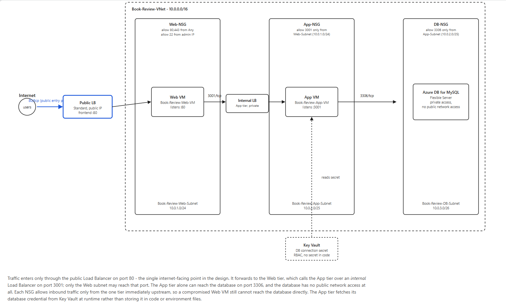.
---

#### Screenshot 2 — Written architecture assumptions and selected Azure services

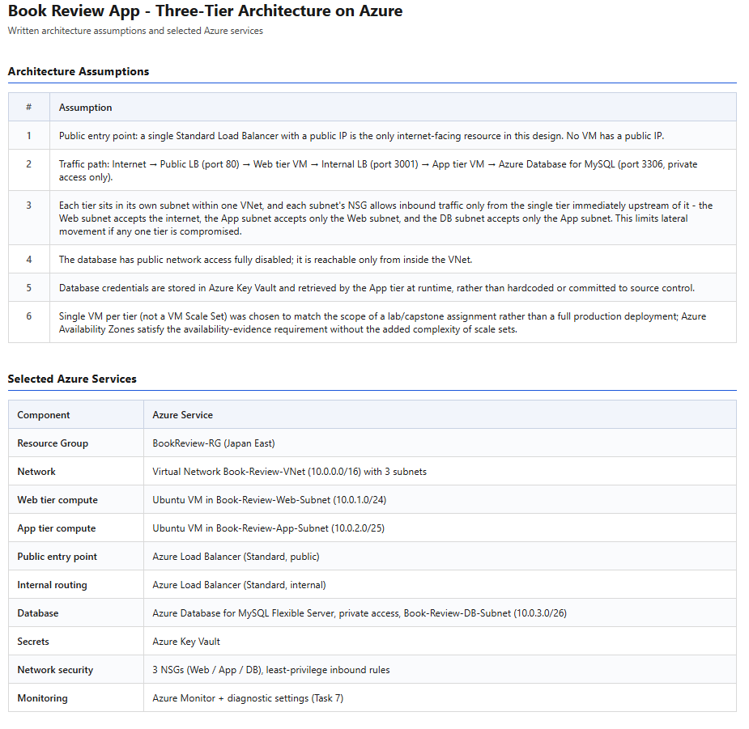.

---

# Task 2 — Create the Azure Network Foundation

## Goal

Create a dedicated Resource Group and VNet with separate subnets for the web, application, and database tiers, keeping the application and database tiers without direct public access.

### Evidence

#### Screenshot 3 — Resource Group overview showing the assignment resources

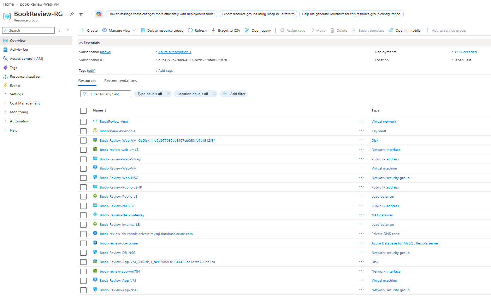.

---

#### Screenshot 4 — VNet overview showing the address space and all required subnets

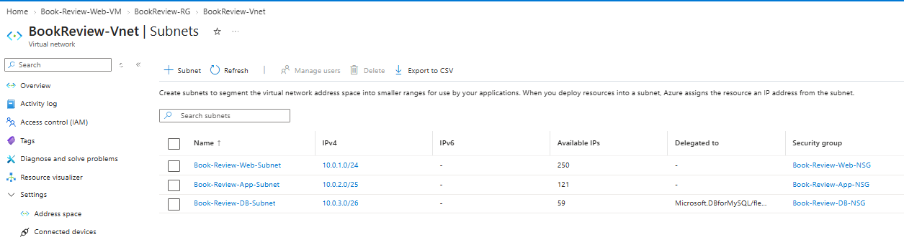.

---

#### Screenshot 5 — Route-table or Private DNS evidence where applicable

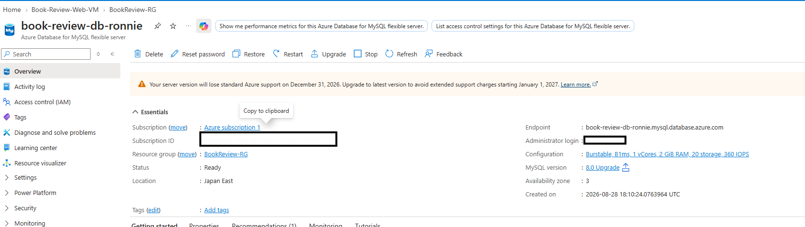.

---

# Task 3 — Configure Security and Secret Management

## Goal

Apply least-privilege NSG rules so traffic flows Internet → public entry point → web tier → application tier → database tier, and store credentials in Azure Key Vault or another approved secure mechanism.

### Evidence

#### Screenshot 6 — NSG rules proving least-privilege access between the tiers

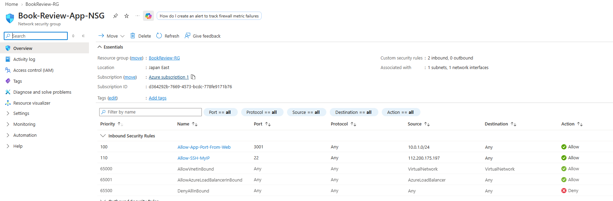.

---

#### Screenshot 7 — Key Vault or approved secret-management configuration (without displaying secret values)

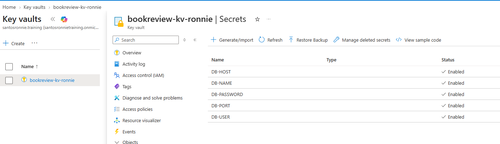.

---

# Task 4 — Deploy the Presentation (Web) Tier

## Goal

Deploy the Book Review App presentation layer on the approved web-tier compute service, configured to route requests to the internal application-tier endpoint, and not directly exposed except through the public entry service.

### Evidence

#### Screenshot 8 — Web-tier compute overview showing subnet and availability configuration

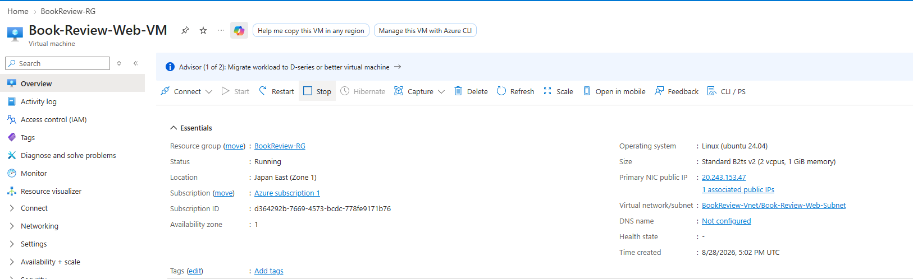.

---

#### Screenshot 9 — Terminal or service output proving the presentation layer is running

.

---

# Task 5 — Deploy the Business (Application) Tier

## Goal

Deploy the Book Review App backend privately in the application subnet, configured to use the private database endpoint and secured environment values, reachable only through its internal endpoint.

### Evidence

#### Screenshot 10 — Application-tier compute overview showing private subnet placement

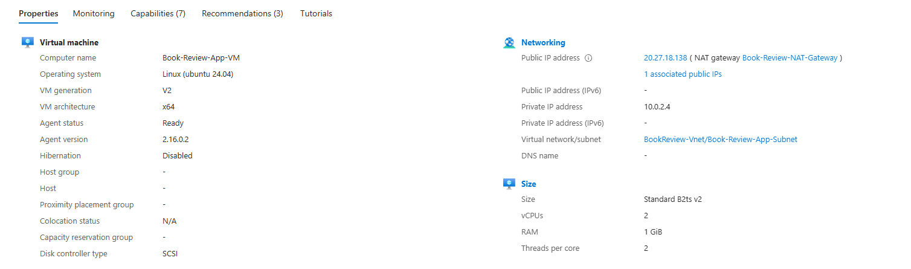.

---

#### Screenshot 11 — Backend process, service, or listening-port evidence

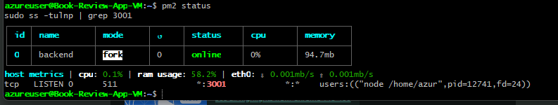.

---

#### Screenshot 12 — Internal health-check or API response (without exposing secrets)

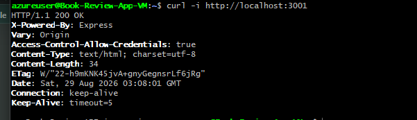.

---

# Task 6 — Deploy the Managed Database Tier

## Goal

Create a private Azure managed database (public access disabled), with availability/backup/retention settings, the Book Review App schema imported, and access restricted to the application tier only.

### Evidence

#### Screenshot 13 — Database overview showing private connectivity and public access disabled

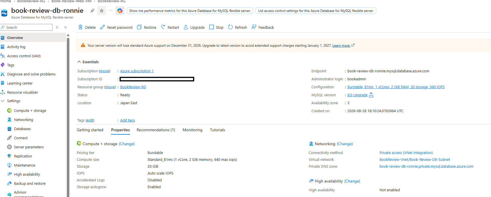.

---

#### Screenshot 14 — Availability, backup, and retention configuration

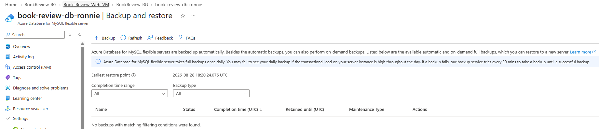.

---

#### Screenshot 15 — Successful schema or connectivity verification (without exposing credentials)

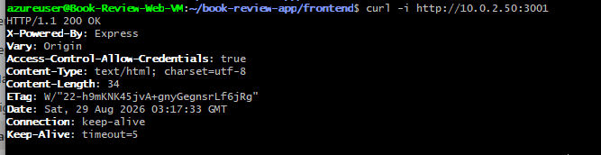.

---

# Task 7 — Configure Traffic Management, Availability, and Monitoring

## Goal

Configure the approved public entry service with health probes and backend pools, internal routing for the application tier where required, and enable Azure Monitor/diagnostics/logs/alerts for the key resources.

### Evidence

#### Screenshot 16 — Public entry service showing listener, frontend endpoint, and healthy web targets

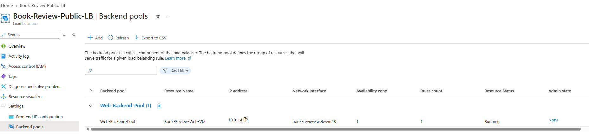.

---

#### Screenshot 17 — Internal application-tier load-balancing or routing configuration where applicable

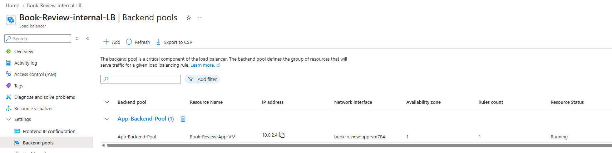.

---

#### Screenshot 18 — Azure Monitor, diagnostic settings, logs, metrics, or alert evidence

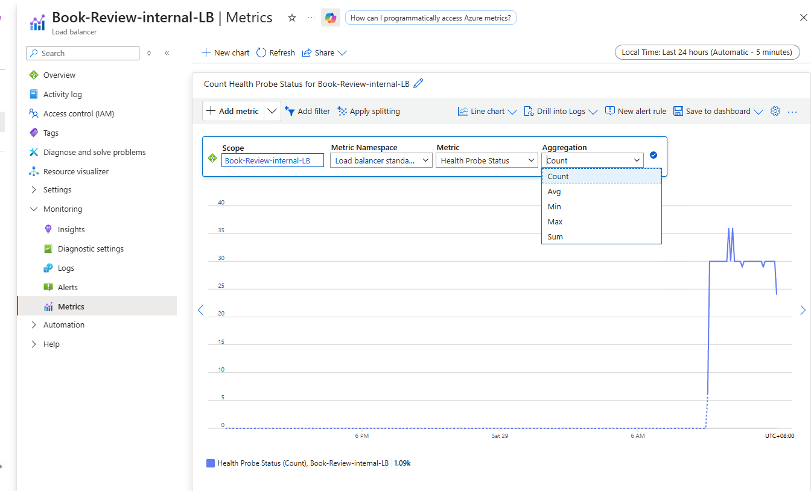.

---

# Task 8 — Validate the Production-Style Deployment

## Goal

Confirm the Book Review App works end to end through the public endpoint, with at least one database read and one write, confirm private tiers are not internet-reachable, and complete a safe availability test.

### Evidence

#### Screenshot 19 — Browser showing the Book Review App through the public endpoint

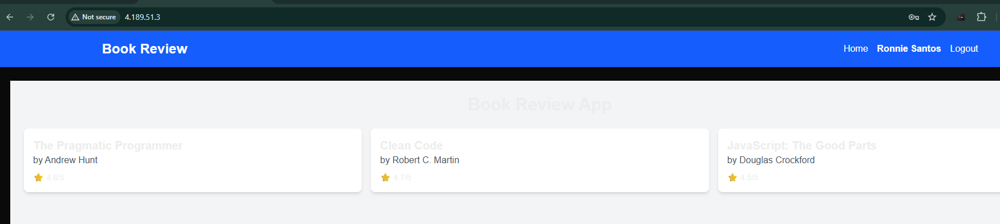.

---

#### Screenshot 20 — Proof of successful database-backed read and write operations

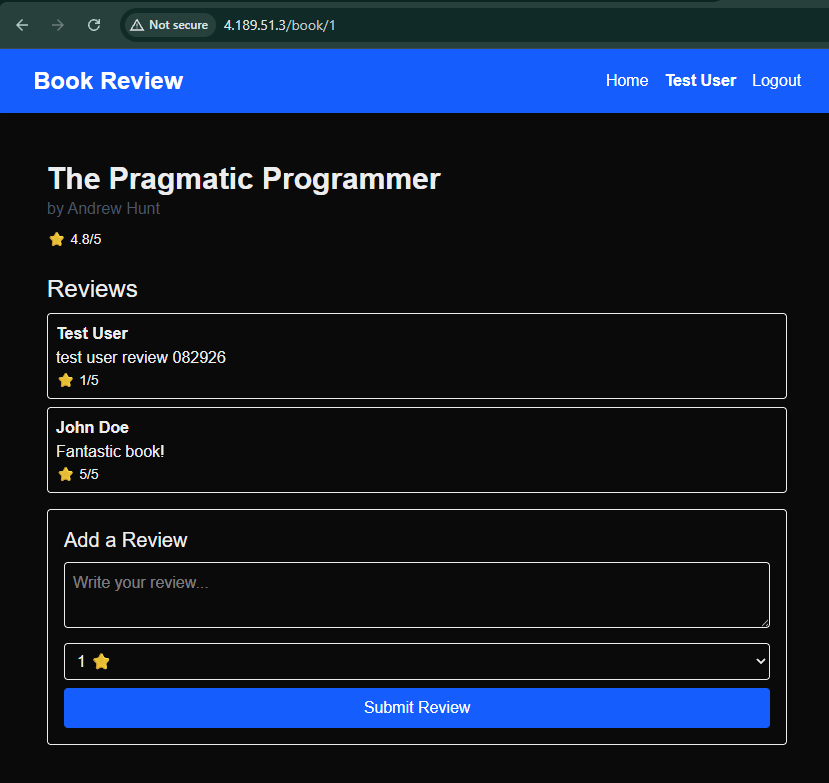.

---

#### Screenshot 21 — Evidence that private tiers are not publicly accessible

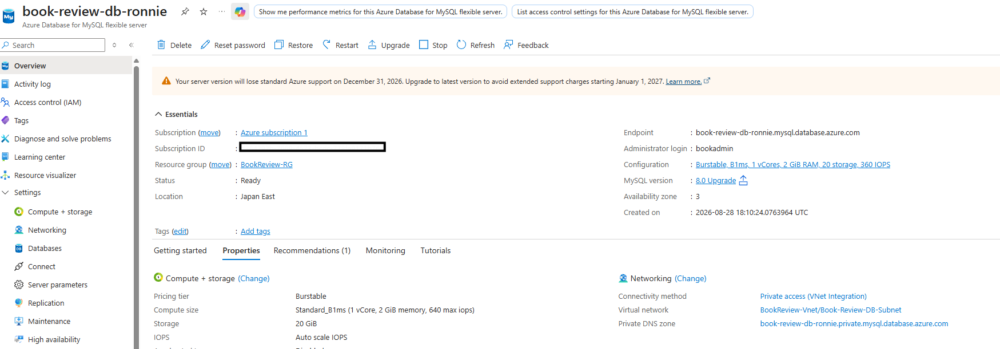.

---

#### Screenshot 22 — Availability-test and healthy-target evidence

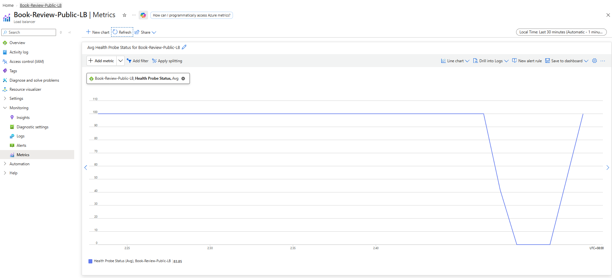.

---

#### Public Endpoint

Paste your public endpoint URL here:

http://4.189.51.3/

---

### Notes

Summarize what worked, issues encountered and how they were fixed, and the availability/security/secrets/monitoring/backup choices made.

What Worked

The full three-tier architecture came together and was validated end to end through the public entry point. A Web VM running Nginx as a reverse proxy in front of a PM2-managed Next.js frontend sits behind a Public Standard Load Balancer, and forwards API traffic to an App VM running a PM2-managed Node/Express backend, which sits behind an Internal Standard Load Balancer and talks to an Azure Database for MySQL Flexible Server configured for private access only. The App VM authenticates to Azure Key Vault using its system-assigned managed identity, so the database credentials, JWT secret, and connection details were never typed into a config file by hand — they were pulled at deploy time with az login --identity plus az keyvault secret show.

End-to-end functional validation passed cleanly through the Public Load Balancer's IP: user registration, login, book browsing, and both reading and writing a review all worked, confirming the whole chain (Public LB → Nginx → Internal LB → Express → MySQL) functions correctly for both reads and writes.

An availability test was also run and validated using the Public Load Balancer's Health Probe Status metric: with Nginx intentionally stopped on the Web VM, the metric visibly dropped from a flat 100 (healthy) toward 0 within about a minute, and a curl to the public IP during that window timed out — confirming the outage was real and externally visible, not just a portal artifact. Restarting Nginx brought the metric back up to 100, confirming the Load Balancer correctly detects and recovers from a backend failure without any manual intervention beyond restarting the affected service.

Issues Encountered and How They Were Fixed

The most significant issue was a non-obvious Azure networking behavior: once the App VM's NIC was added to the Internal Load Balancer's backend pool, its default outbound internet access silently stopped working, even though the subnet itself was never explicitly configured to block outbound traffic. This is a documented but easy-to-miss side effect of Standard SKU Load Balancer backend-pool membership. It was diagnosed by noticing curl to an external host from the App VM hung and timed out immediately after the VM joined the backend pool. The fix was to attach a NAT Gateway directly to the App subnet, which restored outbound connectivity without giving the App VM a public IP of its own.

Building the NAT Gateway surfaced two secondary issues. First, a public IP SKU mismatch (the NAT Gateway wizard defaulted to a SKU that didn't match the already-created public IP), resolved by selecting the matching SKU for the NAT Gateway itself rather than recreating the IP. Second, a subscription-level public IP quota limit was hit while creating the NAT Gateway's outbound IP; this turned out to be caused by an orphaned public IP left behind from deleting an unrelated VM in an earlier assignment, where the NIC and the public IP weren't deleted together. Removing that orphaned IP freed the needed quota.

A similar quota issue came up earlier when creating the App VM itself — a regional vCPU quota for the VM's size family was exhausted because an unused VM from a previous assignment was still deployed. Simply stopping (deallocating) that VM didn't free the family-specific quota bucket; it had to be deleted outright, and a disk snapshot was taken first as a backup precaution before deletion.

On the secrets side, creating the Key Vault under the RBAC authorization model did not automatically grant any usable permissions, even to the account that created it — the first attempt to add a secret failed with a Forbidden error. This was fixed by explicitly assigning the Key Vault Secrets Officer role to the operator's own account for setup, and the read-only Key Vault Secrets User role to the App VM's managed identity for runtime use, following least-privilege practice.

On the application side, the frontend initially returned a 404 on the home page's book listing. Using the browser's Network tab to inspect the failing request revealed a doubled /api/api/books path; grepping the deployed source located a single file with a hardcoded, redundant /api prefix layered on top of the already-/api-prefixed base URL used everywhere else in the codebase. Because Next.js bakes its public environment variables into the build at build time, the fix required editing the source and running a full rebuild, not just a process restart.

Finally, one real security near-miss is worth recording: while verifying the backend's environment file, a terminal screenshot of cat .env briefly exposed the database password in plaintext. That screenshot should not be reused in the submission, and rotating that password is a recommended follow-up that has not yet been carried out.

Availability

Both the web and application tiers sit behind their own Standard Load Balancer (public-facing for the web tier, internal-only for the app tier), each with its own health probe. This was chosen so that a failure in either tier is detected independently and so the application tier is never reachable directly from the internet. The design was validated with a deliberate, reversible failure test — stopping and restarting Nginx on the Web VM while watching the Load Balancer's health probe metric and confirming external requests failed and recovered in step with it.

Security

The database and application tiers run without public IP addresses; only the Web VM and the Load Balancer frontends are reachable from the internet. Network security groups scope traffic per subnet, and the MySQL Flexible Server was created with public network access disabled, reachable only through the private DNS zone integration inside the virtual network.

Secrets Management

Azure Key Vault (RBAC authorization model) was chosen over a plain .env file checked into the VM by hand, specifically so that the database password, database connection details, and JWT signing secret are centrally managed and access-controlled rather than duplicated across files. The App VM's system-assigned managed identity is granted read-only access to the vault's secrets, and the operator's account is granted read/write access separately, so no long-lived credentials needed to be shared or embedded in scripts.

Monitoring

A Log Analytics workspace was created to centralize diagnostics for the deployed resources, and the Load Balancers' built-in Health Probe Status metrics were used directly to validate availability behavior, as described above. Wiring up diagnostic settings against the Log Analytics workspace, an action group for notifications, and a threshold-based alert rule (for example, on App VM CPU) is the remaining piece of the monitoring task and is still in progress.

Backup

The Azure Database for MySQL Flexible Server relies on its built-in automated backup feature for the application's data. Separately, during the VM quota troubleshooting described above, a full disk snapshot was taken of an unrelated VM before it was deleted, as a precaution — a pattern worth carrying forward for any VM that might need to be rebuilt.

---

# Submission Instructions

- Add all required screenshots and links in your submission
- Do not expose passwords, keys, connection strings, or subscription IDs

---

# Completion Checklist

- [✓] Task 1: Architecture diagram and assumptions documented (Screenshots 1–2)
- [✓] Task 2: Network foundation created with isolated tiers (Screenshots 3–5)
- [✓] Task 3: Least-privilege security and secret management configured (Screenshots 6–7)
- [✓] Task 4: Presentation tier deployed (Screenshots 8–9)
- [✓] Task 5: Application tier deployed privately (Screenshots 10–12)
- [✓] Task 6: Managed database tier deployed privately (Screenshots 13–15)
- [✓] Task 7: Public entry, internal routing, and monitoring configured (Screenshots 16–18)
- [✓] Task 8: End-to-end validation and availability test completed (Screenshots 19–22, Public Endpoint, Notes)
- [✓] No sensitive data exposed

---

## 📌 About DMI & CloudAdvisory

DevOps Micro Internship (DMI) is a project-based DevOps program run by Pravin Mishra (The CloudAdvisory) focused on real-world execution, systems thinking, and career readiness.

It helps learners build strong DevOps foundations with hands-on experience.

---

## 📌 Resources

- 🌐 DMI Official Website: https://dmi.pravinmishra.com?utm_source=github&utm_medium=readme  
- 🎓 University: https://university.pravinmishra.com?utm_source=github&utm_medium=readme  
- 💬 Discord Community: https://discord.pravinmishra.com?utm_source=github&utm_medium=readme  
- 📝 Blog: https://dmi.pravinmishra.com/blog?utm_source=github&utm_medium=readme  
- ▶️ YouTube Playlist: https://www.youtube.com/playlist?list=PLFeSNDtI4Cho  
- 🔗 Pravin Mishra (LinkedIn): https://www.linkedin.com/in/pravin-mishra-aws-trainer/  
- 🏢 CloudAdvisory (LinkedIn): https://www.linkedin.com/company/thecloudadvisory/

---

*This submission is part of DevOps Micro Internship (DMI) — Agentic AI Track.*
