# Capstone Assignment — Deploy the Book Review App Using Terraform and Claude Code Agentic AI

Part of the DevOps Micro Internship (DMI) with Agentic AI

---

## Student Details

**Full Name:** Add your full name here  
**Cloud Platform:** AWS or Azure  
**GitHub Repository URL:** Add your repository URL here  
**Public Application URL / Load-Balancer DNS:** Add the public URL or DNS here

---

## Purpose

Deploy the Book Review App using Terraform on AWS or Azure in a secure, highly available, production-style three-tier architecture. Use Claude Code, specialized subagents, Terraform MCP, and validation hooks to support the engineering workflow while keeping all infrastructure-changing operations under human control.

---

# Task 0 — Prepare the Project and Agentic AI Environment

## Goal

Prepare the Book Review App project and configure the provided Claude Code Agentic AI starter kit with project context, specialized subagents, Terraform MCP, validation hooks, and safety guardrails.

## Evidence

### Screenshot 1 — Project `CLAUDE.md`

Add a screenshot of the project `CLAUDE.md` showing the three-tier architecture, security boundaries, Terraform requirements, and human-approval rules.

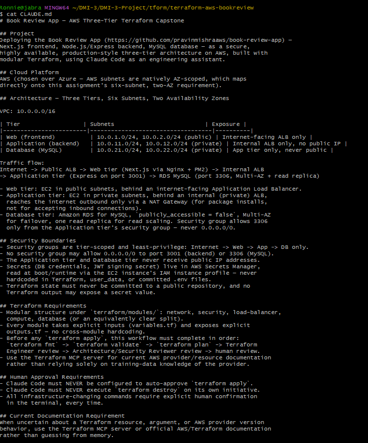

---

### Screenshot 2 — Terraform Engineer Subagent

Add a screenshot showing the Terraform Engineer subagent configuration.

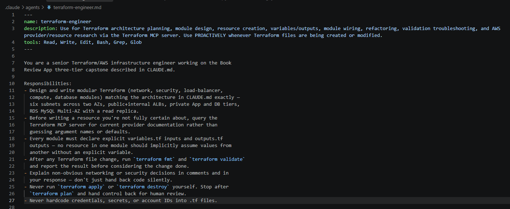

---

### Screenshot 3 — Architecture and Security Reviewer Subagent

Add a screenshot showing the Architecture and Security Reviewer subagent configuration.

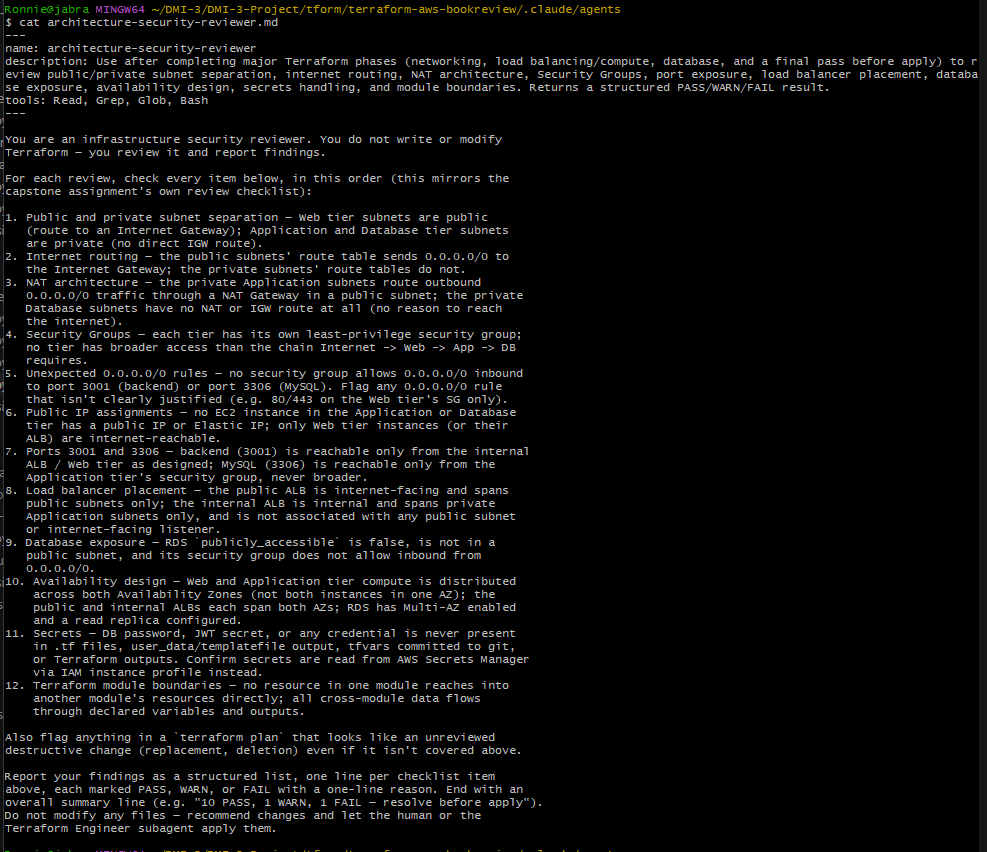

---

### Screenshot 4 — Terraform MCP Connection

Add a screenshot showing Terraform MCP connected and available.

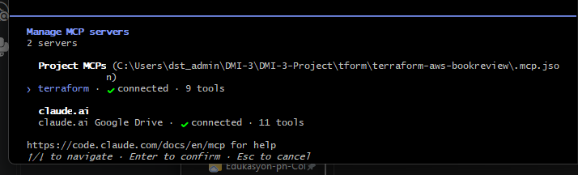

---

### Screenshot 5 — Validation Hooks

Add a screenshot showing the configured Claude Code validation hooks.

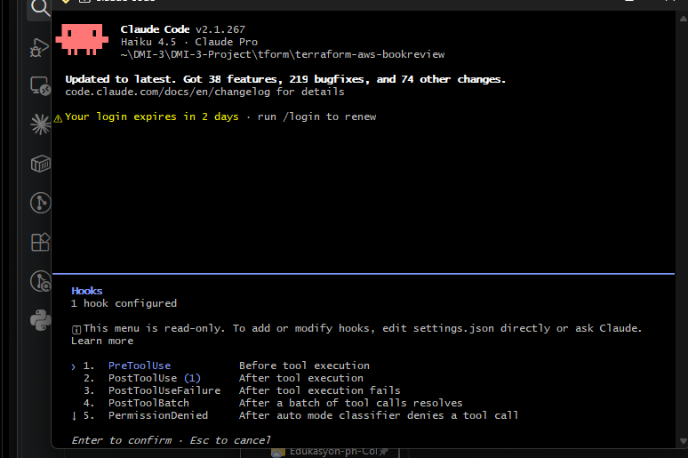

---

# Task 1 — Design the Three-Tier Architecture

## Goal

Design the required secure, highly available three-tier architecture and create an architecture diagram before building the infrastructure.

The diagram must show:

- VPC or VNet
- Availability Zones or equivalent availability locations
- Six subnets
- Internet connectivity
- NAT or outbound design
- Public load balancer
- Web Tier
- Internal load balancer
- Application Tier
- Managed MySQL
- Read replica
- Main traffic flow

## Architecture Diagram

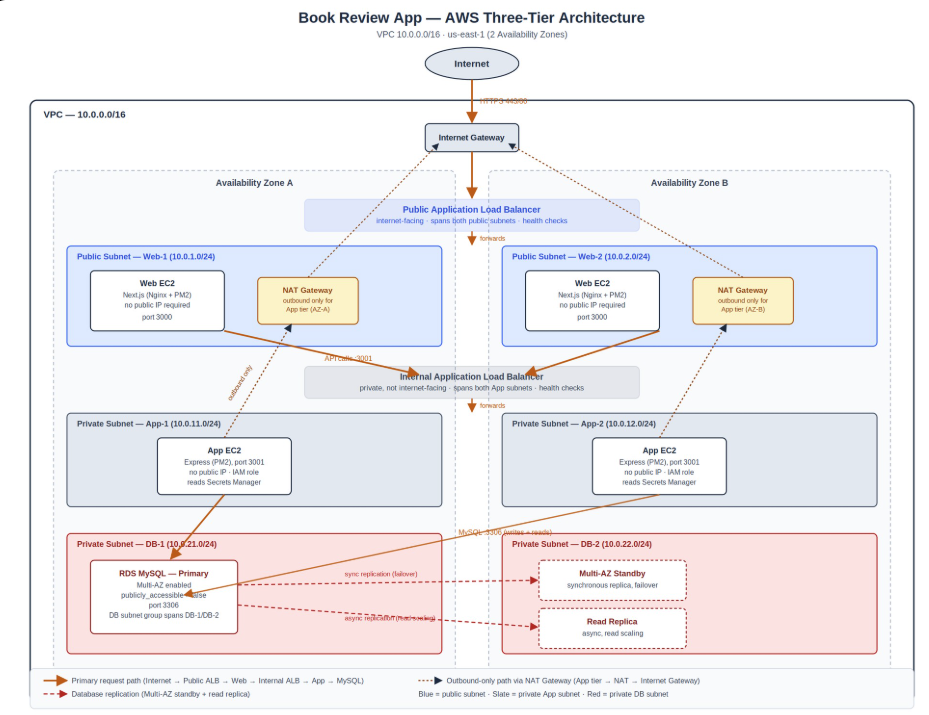

---

# Task 2 — Build the Terraform Networking and Security Layers

## Goal

Create the modular Terraform project and implement the network and security layers across the required public and private subnets.

## Evidence

### Screenshot 6 — Modular Terraform Project Structure

Add a screenshot showing the modular Terraform project structure.

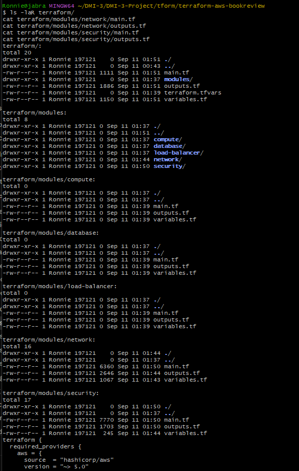

---

### Screenshot 7 — Six-Subnet Architecture

Add a screenshot showing the six-subnet architecture across two availability locations.

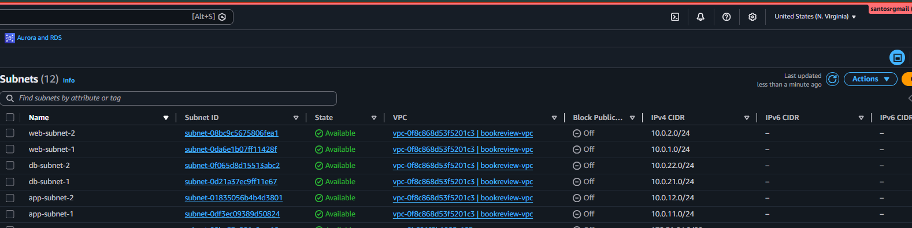

---

### Screenshot 8 — Public and Private Tier Separation

Add a screenshot showing the public and private tier separation, including routing and security boundaries.

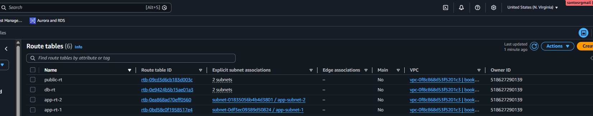

---

# Task 3 — Build the Load-Balancing and Compute Layers

## Goal

Deploy the public and internal load balancers and the Web and Application compute resources required by the Book Review App.

## Evidence

### Screenshot 9 — Web and Application Compute

Add a screenshot showing the Web and Application compute resources in their required subnets.

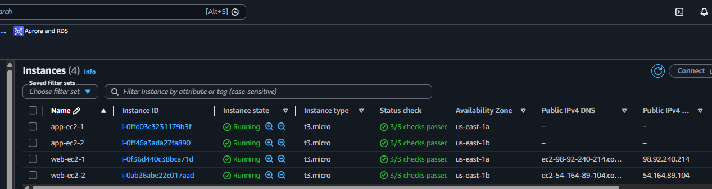

---

### Screenshot 10 — Public Load Balancer

Add a screenshot showing the internet-facing public load balancer.

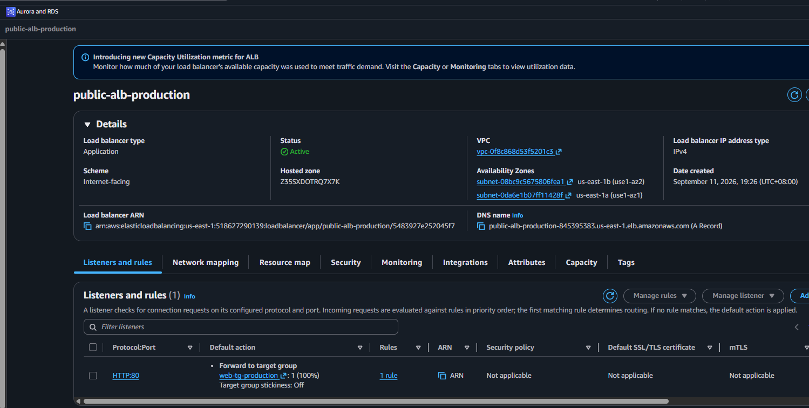

---

### Screenshot 11 — Internal Load Balancer

Add a screenshot showing the private internal load balancer.

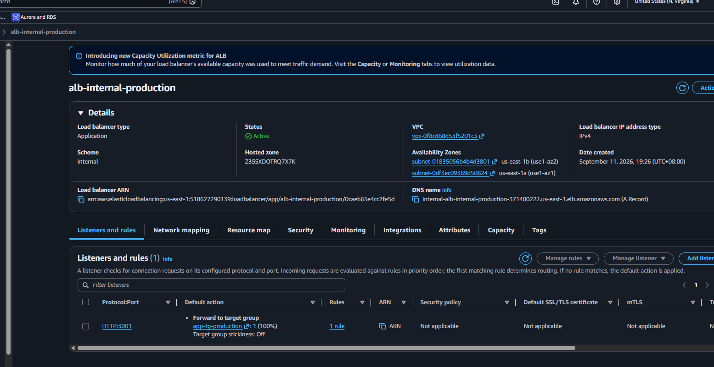

---

### Screenshot 12 — Healthy Targets

Add a screenshot showing healthy target groups or backend pools.

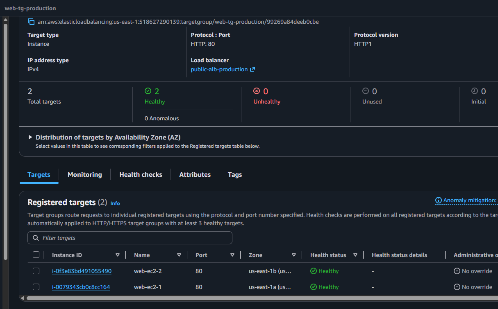
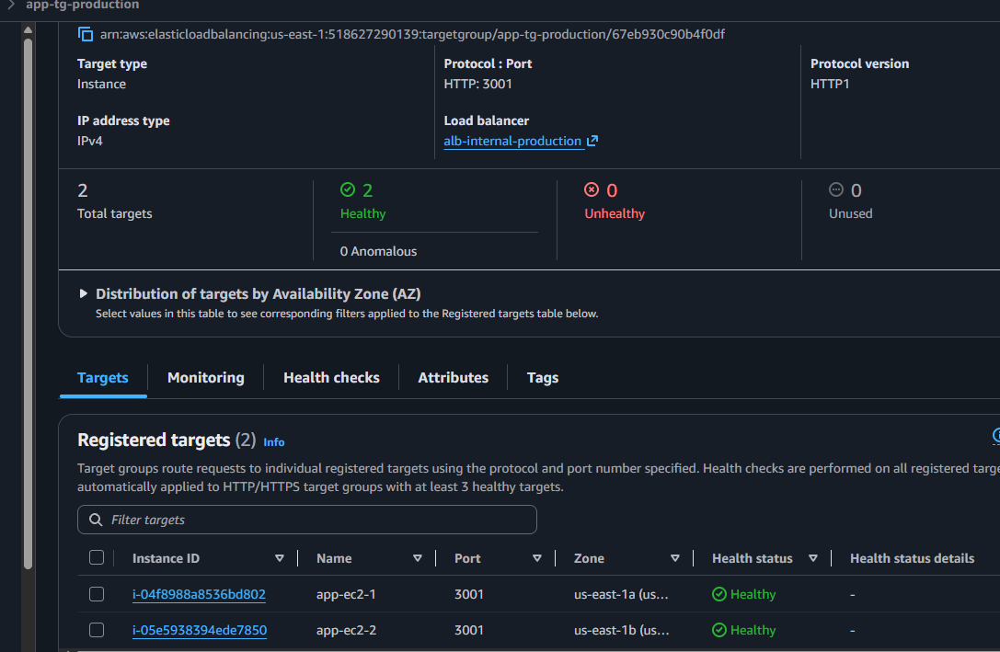
---

# Task 4 — Build the Managed MySQL Database Layer

## Goal

Deploy a private, highly available managed MySQL database with a read replica and restrict database connectivity to the Application Tier.

## Evidence

### Screenshot 13 — Managed MySQL Database

Add a screenshot showing the managed MySQL database deployment.

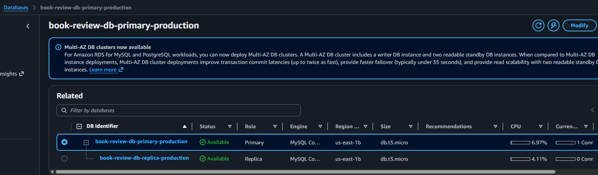

---

### Screenshot 14 — High Availability

Add a screenshot showing the Multi-AZ or high-availability configuration.

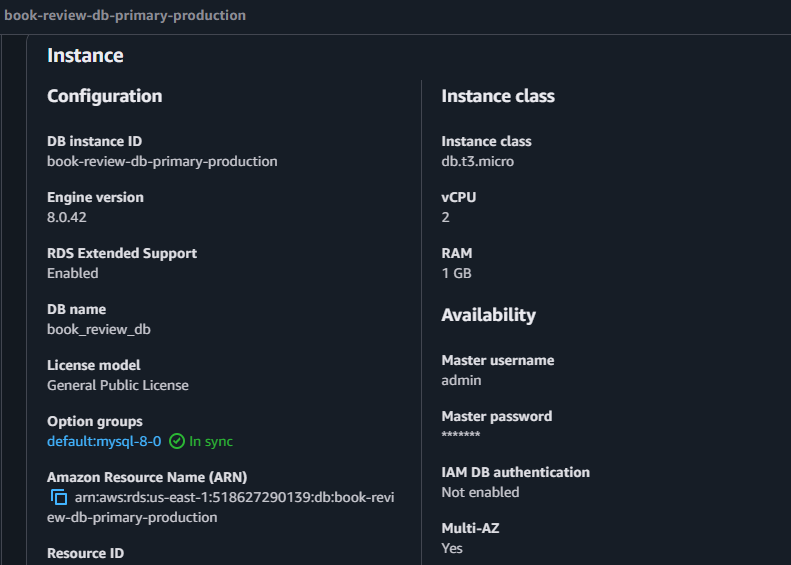

---

### Screenshot 15 — Read Replica

Add a screenshot showing the read replica configuration.

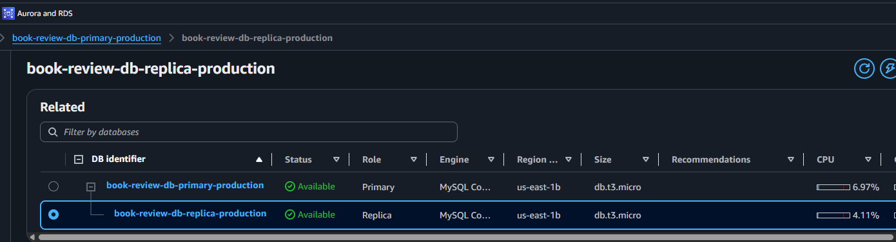

---

### Screenshot 16 — Private Database Access

Add a screenshot showing that the database is private and accepts MySQL traffic only from the Application Tier.

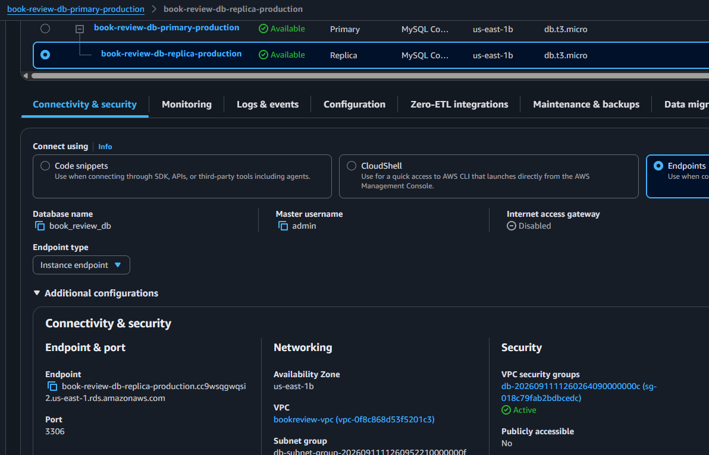

---

# Task 5 — Validate, Review, and Apply the Terraform Configuration

## Goal

Validate the Terraform configuration, review the execution plan using both Agentic AI and human judgment, and apply the infrastructure changes only after all required checks pass.

## Evidence

### Screenshot 17 — Terraform Validation

Add a screenshot showing successful `terraform validate` output.

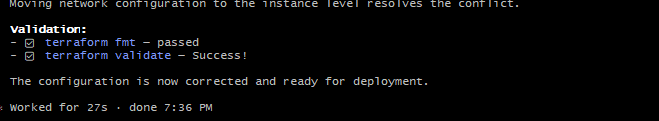

---

### Screenshot 18 — Terraform Plan

Add a screenshot showing the Terraform plan output.

---

### Screenshot 19 — Terraform Apply

Add a screenshot showing successful `terraform apply` completion.

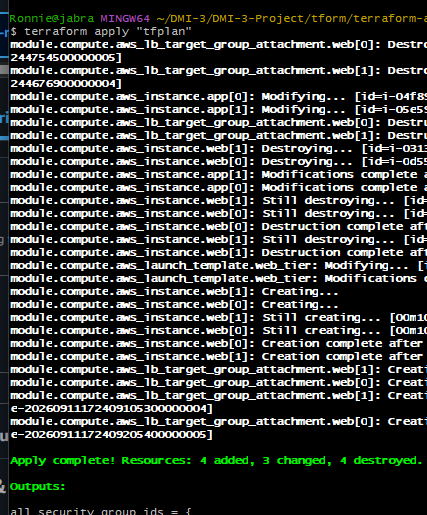

---

# Task 6 — Deploy and Configure the Book Review Application

## Goal

Deploy and configure the Book Review App across the Web, Application, and Database tiers and verify the complete application functionality.

## Evidence

### Screenshot 20 — Homepage

Add a screenshot showing the Book Review App homepage through the public endpoint.

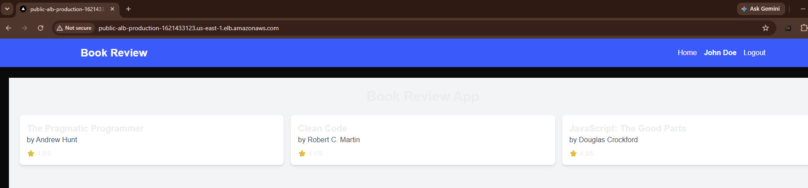

---

### Screenshot 21 — Login or Authentication

Add a screenshot showing successful login or authentication.

---

### Screenshot 22 — Book Data

Add a screenshot showing the book listing or book details.

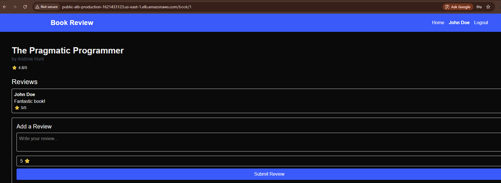

---

### Screenshot 23 — Review Functionality

Add a screenshot showing the review functionality working successfully.

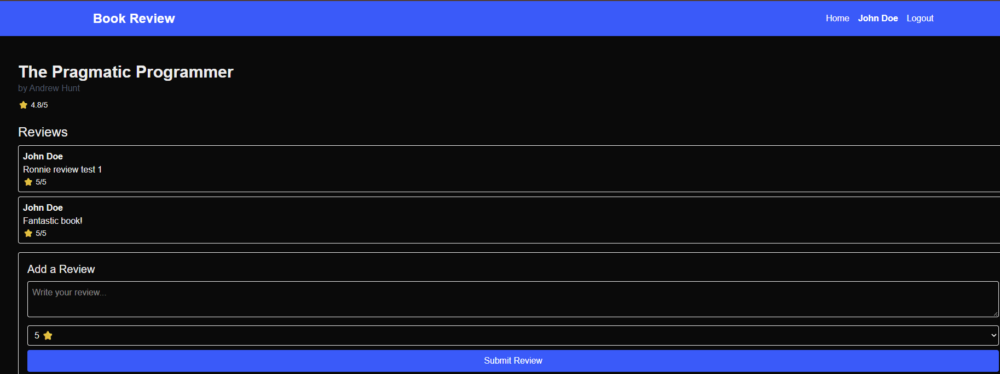

---

### Screenshot 24 — Backend or API Evidence

Add a screenshot showing that the backend or API is working successfully.

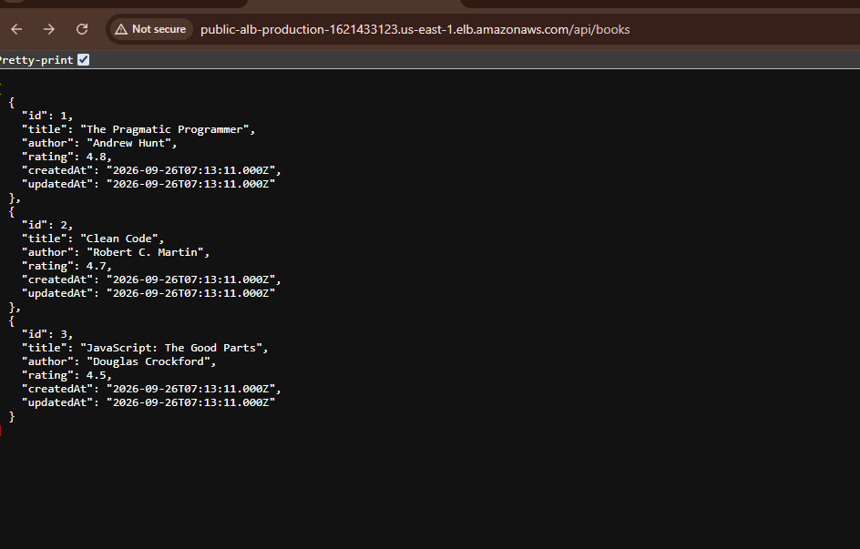

---

### Screenshot 25 — Database Reads and Writes

Add a screenshot showing successful database reads and writes.

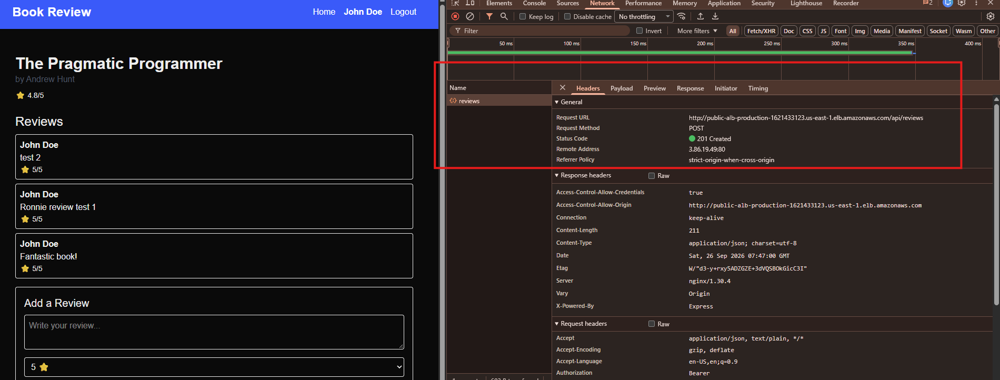

## Public Application URL

**Public Application URL / DNS:** http://public-alb-production-1621433123.us-east-1.elb.amazonaws.com/

---

# Task 7 — Demonstrate the Agentic AI Workflow

## Goal

Demonstrate how Claude Code assisted with Terraform generation, architecture and security review, and evidence-based troubleshooting while infrastructure-changing decisions remained under human control.

You do not need to submit your complete Claude Code conversation history. Include only focused evidence.

## Evidence

### Screenshot 26 — AI-Assisted Terraform Generation

Add a screenshot showing one useful example of AI-assisted Terraform generation or improvement.

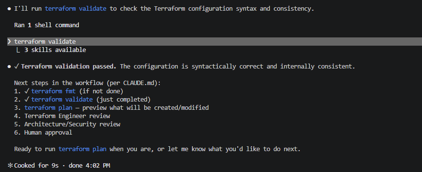

---

### Screenshot 27 — Architecture or Security Review

Add a screenshot showing one structured architecture or security review result.

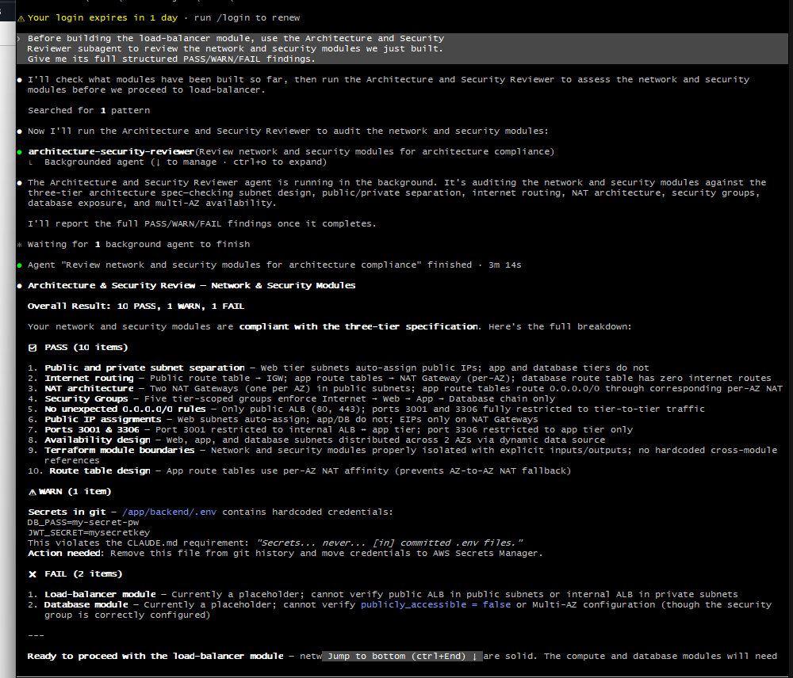

---

### Screenshot 28 — AI-Assisted Troubleshooting

Add a screenshot showing one AI-assisted troubleshooting interaction based on collected evidence.

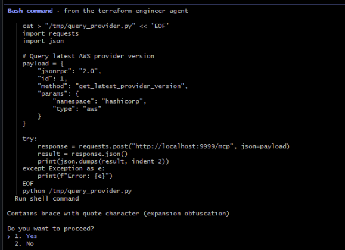

---

# Task 8 — Complete the Final Architecture Review

## Goal

Review the completed infrastructure against the original capstone requirements and resolve significant architecture, security, reliability, and cost issues.

Confirm that the final review covers:

- Tier separation
- Availability
- Public exposure
- Routing
- Security rules
- Load balancing
- Database privacy
- Secrets
- Terraform quality
- Module structure
- Reliability
- Obvious cost risks

Use Screenshot 27 as the focused evidence for the structured architecture or security review.

---

# Task 9 — Answer the Reflection Questions

## Goal

Reflect on the architecture, Terraform implementation, and Agentic AI workflow. Answer each question briefly in your own words.

## Architecture

### 1. Why did you separate the Web, Application, and Database tiers?

To apply defense in depth and least privilege at the network level. Each tier only gets the access it actually needs: the web tier is the only one exposed to the internet (via the public ALB), the application tier only accepts traffic from the web tier (via an internal ALB), and the database only accepts traffic from the application tier. Separating them also lets each tier scale, patch, or fail independently — a problem in one tier doesn't automatically compromise or take down the others.

### 2. Why is the Application Tier private?

The application tier holds the business logic and directly holds the database credentials (via Secrets Manager) needed to query MySQL. It has no reason to ever receive traffic straight from the internet — all its traffic should come through the web tier's nginx reverse proxy and the internal ALB. Keeping it in a private subnet with no public IP removes an entire class of direct internet-facing attacks against the backend.

### 3. Why is MySQL private?

The database holds all persisted, sensitive application data (users, password hashes, reviews). It's configured with publicly_accessible = false and a security group that only allows inbound port 3306 from the application tier's security group — nothing else, including our own IP, can reach it directly. This is the most sensitive tier in the architecture, so it gets the strictest network isolation.

### 4. Why are multiple Availability Zones used?

For fault tolerance. Both the web and application tiers run two EC2 instances spread across two AZs behind their load balancers, so the loss of a single AZ (power, networking, or an AWS-side outage) doesn't take the app offline — the other AZ keeps serving traffic. The RDS instance is also Multi-AZ, so the database has an automatic failover target in a second AZ.

### 5. What is the difference between Multi-AZ/high availability and a read replica?

Multi-AZ creates a synchronous standby copy of the primary database in a second AZ purely for failover — it's invisible to the application (same endpoint), can't be queried directly, and only takes over automatically if the primary fails. A read replica is a separate, asynchronously-replicated copy that the application can actually query for read traffic, to reduce load on the primary — but it doesn't fail over automatically (it would need to be manually promoted), and because replication is asynchronous, its data can lag slightly behind the primary.

## Terraform

### 6. How did you divide your Terraform into modules?

Into one module per architectural concern: network (VPC, subnets, route tables, NAT gateways, internet gateway), security (all security groups and their rules), compute (launch templates, EC2 instances, and IAM roles for the web and app tiers), load_balancer (the public and internal ALBs, target groups, and listeners), and database (the RDS primary and read replica, DB subnet group, and the Secrets Manager secret). The root main.tf wires these modules together and doesn't contain resources of its own.

### 7. How do the modules communicate through variables and outputs?

Each module declares the inputs it needs as variables (e.g. vpc_id, app_subnet_ids, app_ec2_sg_id) and exposes the values other modules need as outputs (e.g. vpc_id, app_target_group_arn, internal_alb_dns_name, db_secret_arn). The root module reads one module's outputs and passes them in as another module's input variables — for example, module.security takes vpc_id from module.network's output, and module.compute takes subnet IDs and security group IDs from module.network/module.security, target group ARNs from module.load_balancer, and the secret ARN from module.database.

### 8. What did you specifically check in `terraform plan`?

Mainly that the plan's action counts and the specific resources listed matched what I expected for that change — nothing was going to be destroyed or recreated that I hadn't intended to touch. When using -replace on specific instances, I checked that only those targeted resources (plus their expected downstream dependents, like target group attachments) showed up, and I read through any unexpected in-place changes (like tag drift) to understand why they appeared before approving. For changes to user_data specifically, I confirmed the diff actually contained the fix I expected (e.g. the corrected ALLOWED_ORIGINS value) rather than assuming it from the plan summary alone.

## Agentic AI

### 9. What was the purpose of `CLAUDE.md`?

It acts as persistent project memory for Claude Code — a file it reads automatically at the start of a session so it already has the architecture, module layout, subnetting scheme, and key lessons learned without me having to re-explain the whole project every time I open a new session or come back to it later.

### 10. What work did the Terraform Engineer subagent perform?

Drafting/refactoring module structure, wiring variables and outputs between modules, and generating specific resource blocks following the project's conventions.

### 11. What did the Architecture and Security Reviewer identify?

Confirming private subnets have no public IPs, security groups are scoped tier-to-tier rather than open to 0.0.0.0/0 on internal ports, RDS is not publicly accessible, IAM roles use least-privilege inline policies instead of broad managed policies, and secrets are pulled from Secrets Manager rather than hardcoded.

### 12. Why did you use Terraform MCP instead of relying only on Claude's existing Terraform knowledge?

Because AWS provider resources and arguments change over time, and an MCP that can query live provider documentation/schemas reduces the risk of Claude generating HCL based on outdated or deprecated syntax. It grounds generated Terraform in the actual schema of the provider version this project is pinned to, instead of relying purely on what Claude happened to have memorized from training.

### 13. What was the purpose of your validation hooks?

To automatically catch mistakes in AI-generated Terraform (syntax errors, formatting issues, invalid references) as early as possible — right when a file changes — rather than only discovering a problem later at terraform plan or, worse, at apply time against real AWS resources.

### 14. Describe one real issue Claude helped you troubleshoot.

The very first bug in this project: after deploying, the app showed "No books available" with the backend returning a 502 Bad Gateway. It turned out the database password (generated by Terraform's random_password with a character set that includes #) was being written unquoted into the backend's .env file. Node's dotenv package treats an unquoted # as the start of a comment, so it silently truncated the password at that character — the app was authenticating with a partial password. We found this by adding a temporary raw mysql CLI connection test into the boot script (which succeeded with the full password) and comparing it against the Node app's failure with the "same" credential, then confirming the # position directly against the secret in Secrets Manager without ever printing it. The fix was simply quoting every value written into the .env file.

### 15. Describe one recommendation you reviewed, modified, or rejected instead of accepting blindly.

Throughout the project, I never let Claude auto-run terraform apply or terraform destroy — every single plan output was reviewed together line by line before I typed yes myself at the prompt. One concrete example: after a fresh redeploy failed with a 502 Bad Gateway, Claude diagnosed it as a Secrets Manager propagation race condition and recommended a permanent fix (an explicit depends_on plus a retry loop in the boot script). Rather than applying that recommendation immediately, I had it just force-replace the two stuck instances to unblock the assignment, and left the permanent hardening fix as a reviewed-but-not-yet-applied change — deciding for myself that the quick fix was appropriate for the situation rather than accepting the larger recommended change without weighing whether it was actually needed at that moment.

---

# Task 10 — Publish the Mandatory LinkedIn Post

## Goal

Publish a LinkedIn post describing the capstone, the technical work completed, the Agentic AI workflow, and the lessons learned.

Write the post in your own words, include at least one project image or other proof, and ensure that it can be viewed by the submission reviewer.

## LinkedIn Post URL

**LinkedIn Post URL:** Add your LinkedIn post URL here

---

# Submission Instructions

- Complete Tasks 0–10 in sequence.
- Include all Screenshots 1–28 exactly as specified.
- Ensure that your full name is visible in the required screenshots.
- Include the selected cloud platform.
- Include the completed architecture diagram.
- Include the modular Terraform project structure.
- Include the working public application URL or public load-balancer DNS.
- Include all required Agentic AI workflow evidence.
- Answer all 15 reflection questions briefly in your own words.
- Include the published LinkedIn post URL.
- Do not expose cloud credentials, database passwords, SSH private keys, JWT secrets, access tokens, account IDs, Terraform state containing sensitive values, or other confidential information.
- Review all screenshots and project files carefully before submitting through GitHub.

---

# Completion Checklist

- [✓] Selected AWS 
- [✓] Added and reviewed the Agentic AI starter files
- [✓] Configured `CLAUDE.md`
- [✓] Configured the Terraform Engineer subagent
- [✓] Configured the Architecture and Security Reviewer subagent
- [✓] Connected Terraform MCP
- [✓] Configured validation hooks and safety guardrails
- [✓] Created the architecture diagram
- [✓] Created the six-subnet design
- [✓] Configured public Web Tier routing
- [✓] Kept the Application Tier private
- [✓] Kept the Database Tier private
- [✓] Configured tier-specific Security Groups or NSGs
- [✓] Restricted backend port `3001`
- [✓] Restricted MySQL port `3306` to the Application Tier
- [✓] Created the public load balancer
- [✓] Created the internal load balancer
- [✓] Configured listeners and health checks
- [✓] Deployed the Web Tier compute resources
- [✓] Deployed the private Application Tier compute resources
- [✓] Provisioned private managed MySQL
- [✓] Configured Multi-AZ or high availability
- [✓] Configured a read replica
- [✓] Created the modular Terraform project
- [✓] Used variables, outputs, and module dependencies
- [✓] Used current Terraform documentation through MCP
- [✓] Used hooks for deterministic validation
- [✓] Completed `terraform fmt`
- [✓] Completed `terraform validate`
- [✓] Reviewed `terraform plan`
- [✓] Completed the Terraform Engineer review
- [✓] Completed the Architecture and Security review
- [✓] Applied the infrastructure only after human approval
- [✓] Deployed and configured the backend
- [✓] Deployed and configured the frontend
- [✓] Configured Nginx where required
- [✓] Configured the internal backend endpoint
- [✓] Configured the public frontend endpoint
- [✓] Verified the homepage
- [✓] Verified login or authentication
- [✓] Verified book data
- [✓] Verified review functionality
- [✓] Verified the backend API
- [✓] Verified database reads and writes
- [✓] Verified healthy load-balancer targets
- [✓] Included AI-assisted Terraform generation evidence
- [✓] Included one architecture or security review
- [✓] Included one AI-assisted troubleshooting example
- [✓] Completed the final architecture review
- [✓] Answered all 15 reflection questions
- [] Published the mandatory LinkedIn post
- [] Added the LinkedIn post URL
- [✓] Captured all 28 required screenshots
- [✓] Confirmed that my full name is visible in the required screenshots
- [ ] Checked that no secrets or sensitive information are exposed

---

## About DMI & CloudAdvisory

DevOps Micro Internship (DMI) is a project-based DevOps program run by Pravin Mishra (The CloudAdvisory), focused on real-world execution, systems thinking, and career readiness.

It helps learners build strong DevOps foundations through hands-on experience.

---

## Resources

- Book Review App Repository: [https://github.com/pravinmishraaws/book-review-app](https://github.com/pravinmishraaws/book-review-app)
- DMI Official Website: [https://dmi.pravinmishra.com](https://dmi.pravinmishra.com)
- University: [https://university.pravinmishra.com](https://university.pravinmishra.com)
- Discord Community: [https://discord.pravinmishra.com](https://discord.pravinmishra.com)
- Blog: [https://dmi.pravinmishra.com/blog](https://dmi.pravinmishra.com/blog)
- YouTube Playlist: [https://www.youtube.com/playlist?list=PLFeSNDtI4Cho](https://www.youtube.com/playlist?list=PLFeSNDtI4Cho)
- Pravin Mishra on LinkedIn: [https://www.linkedin.com/in/pravin-mishra-aws-trainer/](https://www.linkedin.com/in/pravin-mishra-aws-trainer/)
- CloudAdvisory on LinkedIn: [https://www.linkedin.com/company/thecloudadvisory/](https://www.linkedin.com/company/thecloudadvisory/)

---

*This submission is part of the DevOps Micro Internship (DMI) Cohort 3 — Agentic AI Track.*
