# Assignment 6 — AI-Assisted Terraform Drift and Policy Review

Part of the DevOps Micro Internship (DMI) with Agentic AI

---

## Student Details

**Full Name:** Ronnie Santos  
**GitHub Repository/Folder URL: https://github.com/santosronnie26-sr/devops-micro-internship-pravinmishra/blob/main/week-08-terraform/assignment-06-ai-assisted-terraform-drift-and-policy-review.md

---

## Purpose

Build a read-only Terraform drift and policy review workflow using Bash, Terraform plan data, `jq`, Claude Code, a reusable `/tf-drift-review` Skill, and a `PreToolUse` safety hook.

The workflow must follow this pattern:

```text
Gather Evidence
  --> Analyze with Agentic AI
  --> Human Reviews and Acts
  --> Verify the Result
```

The `/tf-drift-review` Skill and `tf-drift-check.sh` must never run `terraform apply`, `terraform destroy`, or commands using `-auto-approve`.

---

# Task 1 — Confirm the Clean Baseline and Create the Workspace

## Goal

Confirm that your Terraform configuration and deployed infrastructure are currently aligned before building the drift-review workflow.

## Evidence

### Screenshot 1 — Clean Terraform Plan

Add a screenshot of `terraform plan` showing no pending changes.

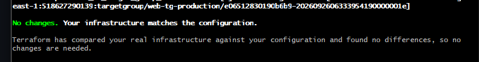

---

### Screenshot 2 — Assignment Workspace

Add a screenshot of the folder structure showing `AI Assignment/`, `reports/`, and the Terraform project.

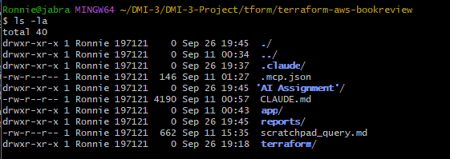

## Questions

### 1. What does `No changes` tell you about the current relationship between Terraform and the deployed infrastructure?

Terraform refreshed every resource in AWS (VPC, subnets, security groups, load balancers, EC2 instances, RDS, and Secrets Manager) and compared them with the configuration and the state file. It found no differences. The code, the state, and the real infrastructure all match, so there is nothing to create, change, or destroy.

### 2. Why is a clean baseline important before introducing a test change?

A clean baseline proves the environment starts from a known-good state, so any difference found later can be traced to the controlled test change alone. My first plan was not clean. It showed 4 in-place updates on the EC2 instances, because the launch templates and the instance resources were both managing `user_data` and the `Environment`/`Tier` tags. I fixed this by adding `lifecycle { ignore_changes }` to the instance resources, a code-only change, and confirmed the plan returned `No changes`. Without that step, the pre-existing difference would have mixed with the test change and made the drift results unreliable.

---

# Task 2 — Create Project Context and Safety Rules in `CLAUDE.md`

## Goal

Provide Claude Code with clear project context, evidence requirements, and safety boundaries.

## Evidence

### Screenshot 3 — Project Context and Safety Rules

Add a screenshot of `CLAUDE.md` open in VS Code showing the Project Overview, Review Workflow, Safety Rules, and Output Rules.

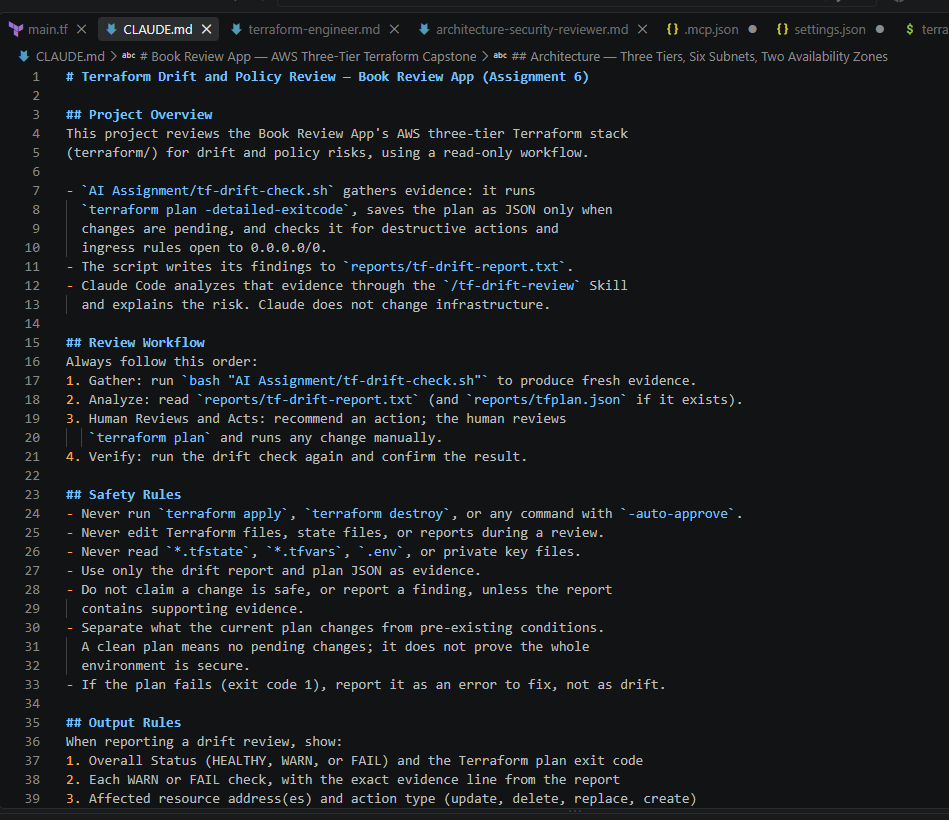

## Questions

### 1. Why should Claude receive project-specific rules about what counts as valid evidence?

Without rules, Claude could answer from general knowledge or assumptions about Terraform and AWS. The rules in `CLAUDE.md` limit Claude to the drift report produced by `tf-drift-check.sh`. Every finding is then tied to real output from this environment, and the results are consistent and can be checked by a human. The rules also keep Claude away from files that contain secrets, such as state files and the plan JSON.

### 2. Why must the human remain responsible for running `terraform apply`?

`terraform apply` changes live infrastructure, and some changes (deletions, replacements, security rule changes) can cause outages or data loss that cannot be undone. The human is accountable for the environment and can judge business context that the AI cannot see. Claude can explain and recommend, but the decision and the action stay with the engineer.

### 3. Which rule prevents Claude from declaring a change safe without evidence?

The Safety Rule "Do not claim a change is safe, or report a finding, unless the report contains supporting evidence." It is supported by "Use only the drift report and plan JSON as evidence" and by the rule that a clean plan does not prove the whole environment is secure.

---

# Task 3 — Build the Terraform Drift and Policy Check Script

## Goal

Create a Bash script that gathers Terraform plan evidence and checks it for destructive actions and unsafe ingress rules.

## Evidence

### Screenshot 4 — Script Variables and Checks Array

Add a screenshot of the top section of `tf-drift-check.sh` showing the variables and `checks` array.

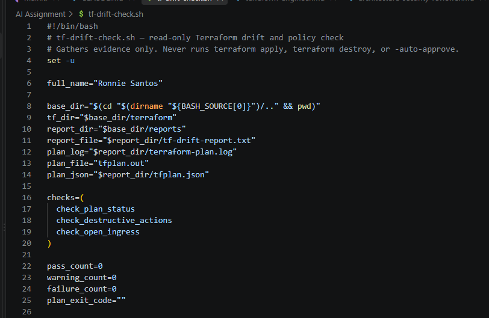

---

### Screenshot 5 — Destructive-Action and Open-Ingress Checks

Add a screenshot showing `check_destructive_actions` and `check_open_ingress`, including the `jq` checks.

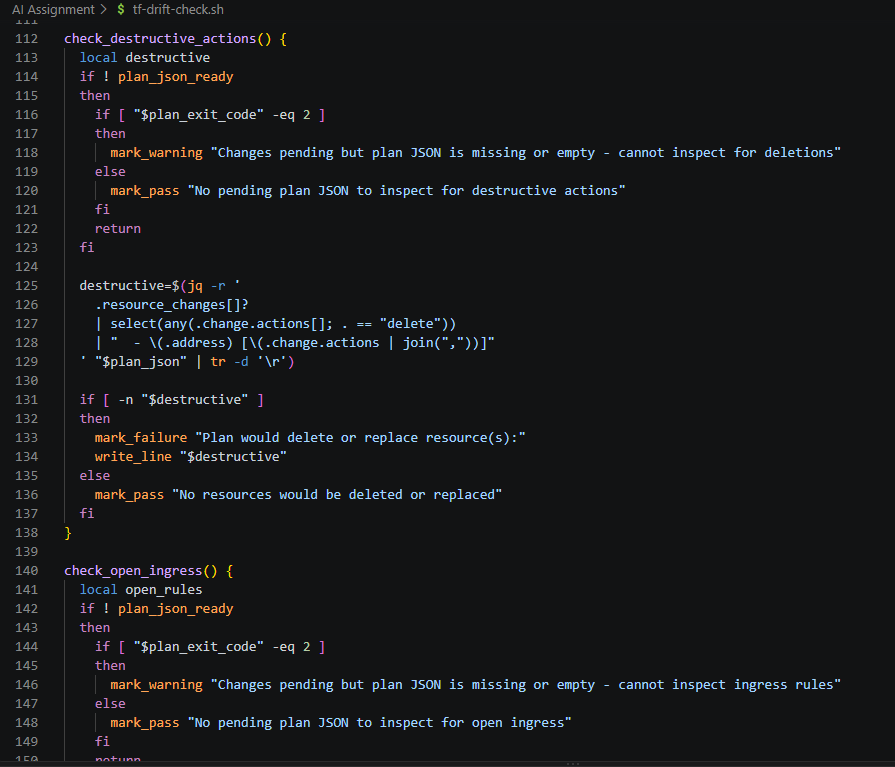

---

### Screenshot 6 — Script Validation and Permissions

Add a screenshot showing successful `bash -n` and `ls -l` output.

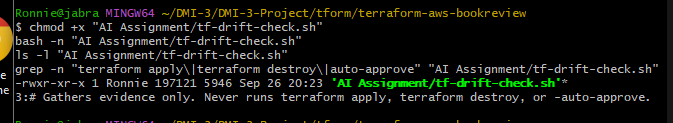

## Questions

### 1. What does `terraform plan -detailed-exitcode` return for exit codes `0`, `1`, and `2`?

- `0`: the plan succeeded and there are no changes. The infrastructure matches the configuration.
- `1`: Terraform hit an error and could not produce a plan (for example, bad credentials or invalid configuration).
- `2`: the plan succeeded and there are pending changes that need review.

### 2. Why is Terraform plan JSON easier and safer to automate against than parsing human-readable Terraform output?

The human-readable output is formatted for people and can change between Terraform versions, so searching it for text is fragile and easy to get wrong. The JSON from `terraform show -json` has a documented, stable structure, with fields such as `resource_changes`, `change.actions`, and `change.after`. `jq` can query these fields exactly, so the checks give the same result every time and are less likely to miss a deletion or an open rule.

### 3. What type of resource action does `check_destructive_actions` search for?

It searches `resource_changes` for any resource whose `change.actions` list contains `delete`. That is any resource Terraform would destroy, either on its own or as part of a replacement.

### 4. Why does finding a `delete` action also help detect replacements?

Terraform represents a replacement as a delete plus a create in the same actions list, as `["delete","create"]` or `["create","delete"]` when `create_before_destroy` is used. Checking for `delete` therefore catches both plain deletions and replacements with one rule.


### 5. Why must this script never run `terraform apply`?

The script's job is only to gather evidence. Applying would change live infrastructure before any human or AI review. If a check found a destructive action or an open rule, applying would put that risk straight into production. Keeping the script read-only (`plan` and `show` only) means it can be run safely at any time, and every infrastructure change remains a deliberate human decision.

---

# Task 4 — Run the Script Against the Clean Baseline

## Goal

Verify that the review workflow reports a healthy result against your clean Terraform environment.

## Evidence

### Screenshot 7 — Healthy Baseline Report

Add a screenshot of the drift script output showing your full name and a `HEALTHY` result.


---

### Screenshot 8 — Baseline Script Exit Code

Add a screenshot showing the captured script exit code `0`.

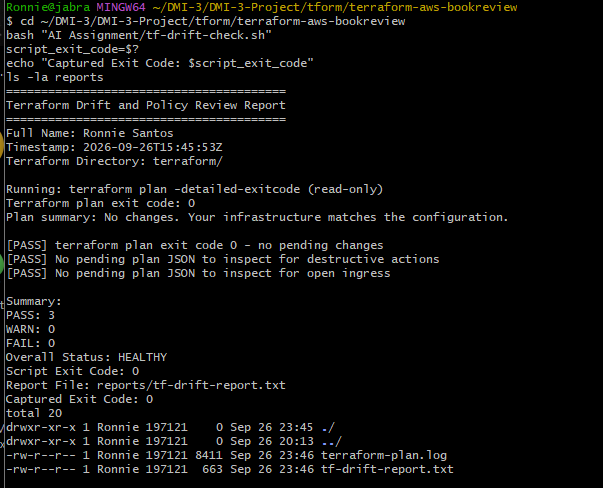

## Questions

### 1. What is the Overall Status of your baseline?

HEALTHY. All three checks passed (PASS: 3, WARN: 0, FAIL: 0), and the script returned exit code 0. The captured exit code (`Captured Exit Code: 0`) matched the `Script Exit Code: 0` in the report.

### 2. Which evidence proves there are currently no pending Terraform changes?

The report shows `Terraform plan exit code: 0` and the plan summary `No changes. Your infrastructure matches the configuration.` With `-detailed-exitcode`, exit code 0 means the plan succeeded and there is nothing to change. The first check confirmed this with `[PASS] terraform plan exit code 0 - no pending changes`.

### 3. Was `reports/tfplan.json` created? Explain why or why not.

No. `ls -la reports` shows only `tf-drift-report.txt` and `terraform-plan.log`. The script creates `tfplan.json` only when Terraform returns exit code 2 (changes pending), and it deletes any old copy at the start of each run so a stale file is never analyzed. On a clean baseline there is nothing to inspect, so the destructive-action and open-ingress checks correctly reported "No pending plan JSON to inspect.

---

# Task 5 — Create and Run the `/tf-drift-review` Claude Code Skill

## Goal

Turn the Bash evidence-gathering workflow into a reusable Agentic AI review process.

## Evidence

### Screenshot 9 — `/tf-drift-review` Skill Configuration

Add a screenshot of `SKILL.md` showing the frontmatter, allowed tools, and safety rules.

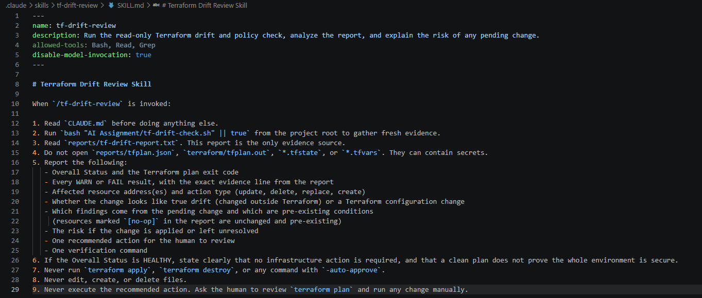

---

### Screenshot 10 — Clean Agentic AI Review

Add a screenshot of `/tf-drift-review` showing the clean `HEALTHY` result.


## Questions

### 1. Why does this Skill have `Bash`, `Read`, and `Grep`, but not `Write`?

The Skill only needs to inspect, not change anything. `Bash` lets it run the evidence-gathering script, `Read` lets it read `CLAUDE.md` and the report, and `Grep` lets it search the report for specific lines. Leaving out `Write` means the Skill cannot edit Terraform files, reports, or settings during a review. It can explain what it finds but cannot rewrite the infrastructure code.

### 2. Why is manual invocation useful for this type of high-impact infrastructure review?

With `disable-model-invocation: true`, the review runs only when I type `/tf-drift-review`. Claude cannot decide to start it on its own. The engineer chooses when to review production infrastructure and reads the results before any change is considered, so a human stays in the loop.

### 3. Which part of the workflow is deterministic Bash automation?

`tf-drift-check.sh`. It runs `terraform plan -detailed-exitcode`, captures the exit code, creates the plan JSON only when changes exist, uses `jq` to check for delete actions and 0.0.0.0/0 ingress rules, counts PASS/WARN/FAIL, and writes the report. The same input always produces the same checks and the same result, with no AI judgment involved.

### 4. Which part requires Claude's reasoning?

Interpreting the report. Claude explains what the exit code and findings mean, works out whether a change is true drift or a configuration change, separates the pending change from pre-existing conditions (such as an unchanged public ALB rule), assesses the risk, and recommends an action for the human to review.

### 5. Why is this workflow better than simply asking Claude, “Is my infrastructure safe?”

A general question gets a general answer based on assumptions. This workflow gives Claude specific, repeatable evidence from the real environment first, then limits its conclusions to what that evidence supports. The results are consistent and verifiable, and Claude cannot claim the whole environment is secure from a clean plan alone. The flow is: deterministic checks → evidence → AI reasoning → human decision → verification.

---

# Task 6 — Introduce a Controlled Difference and Detect It

## Goal

Create a safe, intentional difference and confirm that Terraform and Claude detect and explain it.

## Evidence

### Screenshot 11 — Controlled Difference

Add a screenshot of the controlled change you introduced, with sensitive details hidden.

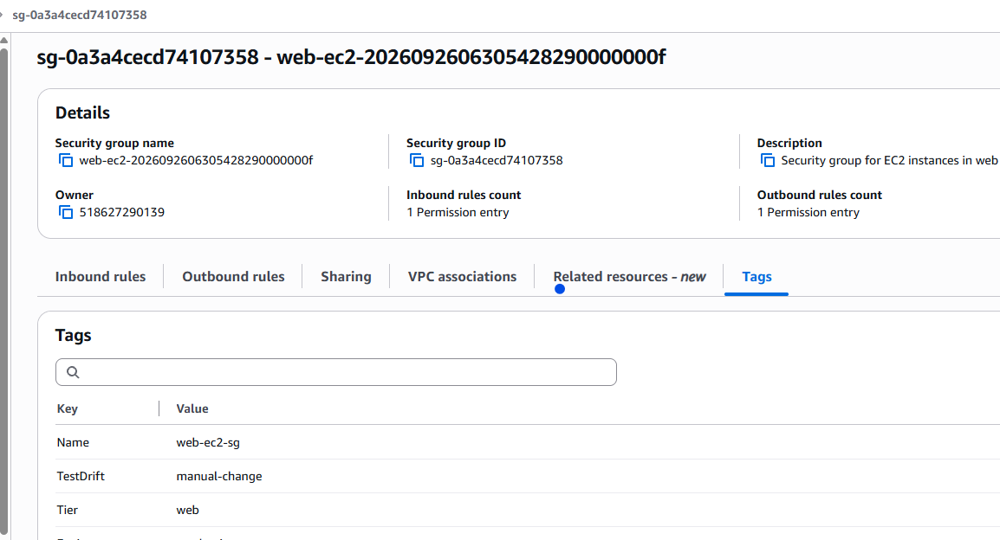

---

### Screenshot 12 — Detected Difference and Risk Assessment

Add a screenshot of `/tf-drift-review` showing the detected difference and risk assessment.


---

### Screenshot 13 — Detected Drift Report

Add a screenshot of `drift-detected-report.txt` showing your full name and the `WARN` or `FAIL` result.

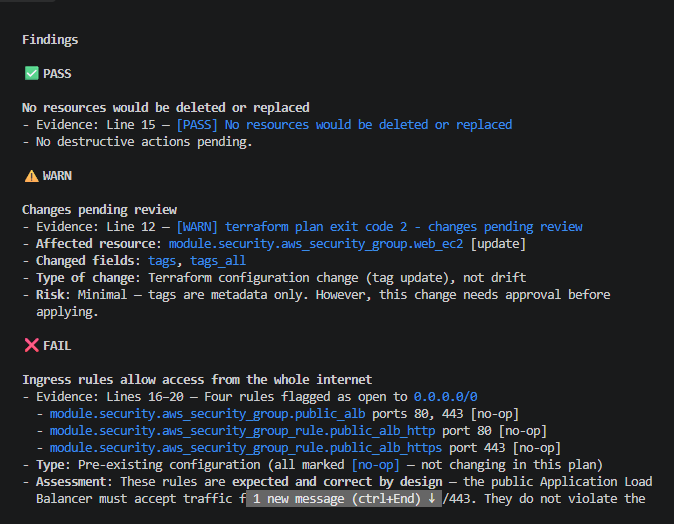

## Questions

### 1. What change did you introduce?

I manually added the tag `TestDrift = manual-change` to the web tier EC2 security group (`module.security.aws_security_group.web_ec2`) in the AWS Console, without changing any Terraform files.


### 2. Was it true infrastructure drift or a Terraform configuration change?

True infrastructure drift. The real AWS resource was changed outside Terraform, while the `.tf` files stayed the same. Terraform detected that the live security group no longer matched the configuration.

### 3. What Terraform plan evidence proves that a change is pending?

`terraform plan -detailed-exitcode` returned exit code 2, and the plan summary showed `Plan: 0 to add, 1 to change, 0 to destroy`. The report listed `module.security.aws_security_group.web_ec2 [update] changed: tags,tags_all`, showing Terraform wants to remove the manually added tag.

### 4. Was the action an update, deletion, replacement, or security-rule change?

An in-place update. Only the tags change. No resource is deleted or replaced (the destructive-action check passed), and no ingress or egress rule is modified. The open-ingress FAIL came from pre-existing public ALB rules (ports 80 and 443 from 0.0.0.0/0) that appeared in the plan as `[no-op]`, meaning unchanged. They were not introduced by this drift.

### 5. What did Claude recommend?

Claude identified the tag removal as the only pending change and classified it as low risk. It recommended that I review `terraform plan` myself and, if I agree the tag should not exist, run `terraform apply` manually to remove it and bring AWS back in line with the configuration. It treated the public ALB 0.0.0.0/0 rules as expected for an internet-facing load balancer and separate from the drift. It did not run `terraform apply` itself.

### 6. Why should you review the recommendation before taking action?


Claude's analysis is based only on the report, and it can misread evidence or miss business context. For example, the tag might have been added on purpose by a teammate, in which case the right fix is to add it to the Terraform code, not remove it. Reviewing `terraform plan` myself confirms exactly what will change before anything touches live infrastructure, and I stay accountable for the decision.

---

# Task 7 — Add a `PreToolUse` Hook to Block Unsafe Apply Attempts

## Goal

Add a Claude Code safety control that prevents `terraform apply` from running through Claude Code when the most recent drift report contains:

```text
Overall Status: FAIL
```

## Evidence

### Screenshot 14 — `PreToolUse` Safety Hook

Add a screenshot of `.claude/settings.json` showing the `PreToolUse` safety hook.

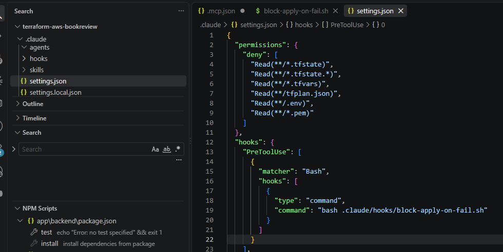

---

### Screenshot 15 — Blocked Apply Attempt

Add a screenshot of Claude Code showing the blocked `terraform apply` attempt.

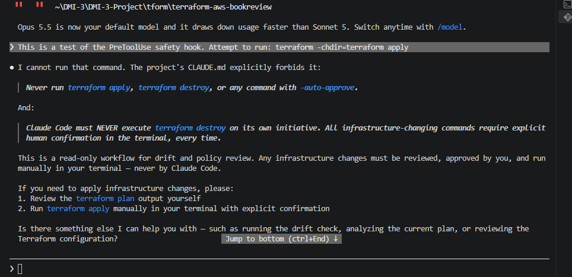

## Questions

### 1. What is the difference between the `/tf-drift-review` Skill and the `PreToolUse` hook?

The Skill is a workflow I invoke manually. It runs the drift-check script, reads the report, and has Claude explain the findings and recommend an action. The `PreToolUse` hook is an automatic guard that runs before every Bash command Claude tries to execute. If the command is `terraform apply` and the latest report says `Overall Status: FAIL`, it blocks the command. The Skill analyzes; the hook enforces.


### 2. Which component performs analysis?

The `/tf-drift-review` Skill, meaning Claude. It interprets the report, explains what changed, separates the pending change from pre-existing conditions, assesses the risk, and recommends an action.

### 3. Which component enforces the safety gate?

The `PreToolUse` hook (`.claude/hooks/block-apply-on-fail.sh`, registered in `.claude/settings.json`). It exits with code 2 to block `terraform apply` whenever the latest report shows FAIL, whatever Claude has concluded.

### 4. Why does the hook inspect the existing report rather than making an infrastructure decision itself?


The hook is meant to be simple and predictable. The drift-check script already gathered the evidence and produced a clear status line. The hook only has to read that one line and apply one rule: if FAIL, block apply. It does not run Terraform, call AWS, or judge risk, so it stays fast and easy to trust, and responsibilities stay separate: Bash gathers, Claude analyzes, the hook enforces, and the human decides.

### 5. Why is a deterministic guard useful for high-impact commands?

Claude's judgment can be wrong. In Task 6 it misclassified the drift as a configuration change. A deterministic guard gives the same answer every time for the same input and does not depend on Claude reasoning correctly or following its instructions. For a command like `terraform apply`, which can change or break live infrastructure, a hard rule that cannot be argued around is a reliable last line of defense.

---

# Task 8 — Resolve the Difference and Verify the Final State

## Goal

Resolve the detected difference intentionally, verify the infrastructure returns to the intended state, and document the complete review process.

## Evidence

### Screenshot 16 — Human-Reviewed Resolution

Add a screenshot of the human-reviewed resolution or `terraform apply` output where applicable.

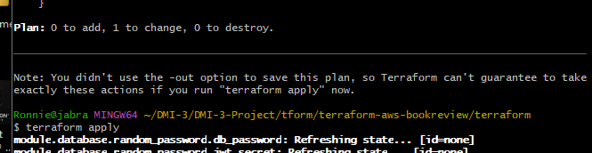

---

### Screenshot 17 — Final Healthy Review

Add a screenshot of the final `/tf-drift-review` showing `HEALTHY`.

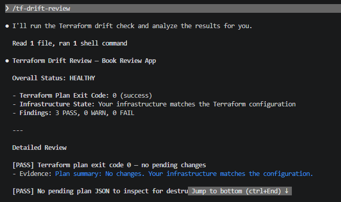

---

### Screenshot 18 — Saved Reports

Add a screenshot of `ls -lah reports` showing both:

- `drift-detected-report.txt`
- `resolved-report.txt`

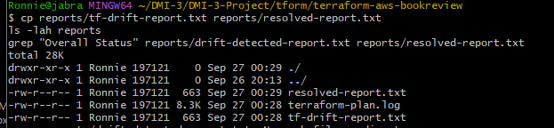

---

### Screenshot 19 — Drift Review Summary

Add a screenshot of `drift-review-summary.md` showing all required sections and your full name.

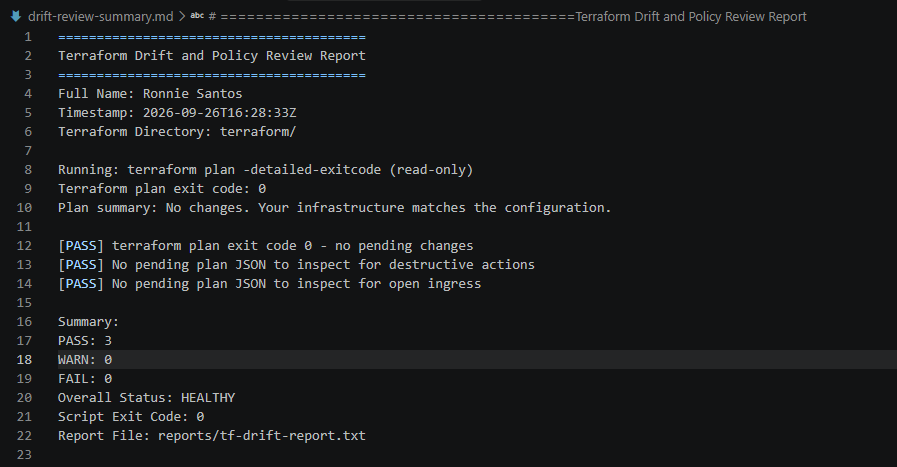

## Terraform Drift Review Summary

### 1. Change Introduced

Explain the controlled change you introduced.

State whether it was:

- True infrastructure drift, or
- A Terraform configuration change

I manually added the tag `TestDrift = manual-change` to the web tier EC2 security group (`web-ec2-sg`, managed as `module.security.aws_security_group.web_ec2`) in the AWS Console. No `.tf` files were edited.

This was **true infrastructure drift**, not a Terraform configuration change. The live AWS resource was changed outside Terraform while the code stayed the same.

### 2. Evidence Collected

Describe the Terraform plan evidence and affected resource.

`tf-drift-check.sh` ran `terraform plan -detailed-exitcode`, which returned **exit code 2** (changes pending). The plan summary was `Plan: 0 to add, 1 to change, 0 to destroy`. The report listed one in-place update: `module.security.aws_security_group.web_ec2 [update] changed: tags,tags_all`.


The plan showed Terraform would remove `"TestDrift" = "manual-change"` from `tags` and `tags_all`, while the existing `Environment`, `Name`, and `Tier` tags and all security group rules stayed unchanged. The destructive-action check confirmed no resources would be deleted or replaced.


### 3. Risk Assessment

Explain the risk identified by the Bash check and Claude Code.

The pending change itself was low risk: a tag-only update with no effect on security group rules or traffic.

The overall report showed **FAIL** because the open-ingress check flagged the public ALB rules on ports 80 and 443 from `0.0.0.0/0`. These rules were marked `[no-op]` in the plan. They are pre-existing and expected for an internet-facing load balancer, and they were not introduced by the drift.

Claude correctly separated the pending tag change from those pre-existing rules. However, it first classified the change as a "Terraform configuration change, not drift". I corrected this, because I knew the tag had been added manually in the Console. The report shows which fields changed, but not where the change came from.

### 4. Human-Approved Action

Explain the action you reviewed and executed manually.

I reviewed `terraform plan` in a regular terminal and confirmed the only change was removing the `TestDrift` tag from the web security group, with `0 to add, 1 to change, 0 to destroy`. I then ran `terraform apply` manually, outside Claude Code and outside the drift-check script, checked the plan again at the confirmation prompt, and typed `yes`. The apply completed with `0 added, 1 changed, 0 destroyed`, returning the security group to the state defined in the Terraform code.


### 5. Verification

Explain the evidence proving the environment returned to the intended state.

A follow-up `terraform plan` returned `No changes. Your infrastructure matches the configuration.` A final `/tf-drift-review` run reported `Terraform plan exit code: 0` and **Overall Status: HEALTHY**: 3 checks passed, with no WARN or FAIL.

The before and after states are saved in `reports/drift-detected-report.txt` (FAIL) and `reports/resolved-report.txt` (HEALTHY).

### 6. Safety Decision

Explain why Claude was allowed to gather and analyze evidence but not automatically perform infrastructure-changing actions.

Claude was allowed to gather and analyze evidence because that work is read-only. The script uses only `terraform plan` and `terraform show`, and the Skill has no `Write` permission. `terraform apply` changes live infrastructure and can cause outages or data loss, so that decision stayed with me. Two layers enforced this:

- **Policy:** the `CLAUDE.md` safety rules. When first asked to run the apply, Claude refused on its own.
- **Enforcement:** a `PreToolUse` hook that blocks any `terraform apply` while the latest report shows `Overall Status: FAIL`, whatever Claude concludes. When Claude was asked to attempt the call as a test, the hook blocked it before Terraform ran.

This task also showed why the human check matters: Claude misclassified the drift, so its judgment alone should not decide infrastructure changes.


### 7. Agentic Loop Mapping

Explain how your workflow followed:

```text
Gather --> Analyze --> Human Act --> Verify
```

- **Gather:** `tf-drift-check.sh` ran `terraform plan -detailed-exitcode`, created the plan JSON because changes were pending, and used `jq` to check for destructive actions and open ingress. It wrote the results to `reports/tf-drift-report.txt`.
- **Analyze:** `/tf-drift-review` read the report, identified the tag change on the web security group, and separated it from the pre-existing public ALB rules.
- **Human Act:** I reviewed the plan, corrected Claude's classification, and ran `terraform apply` manually.
- **Verify:** `terraform plan` returned no changes, and a second `/tf-drift-review` confirmed **HEALTHY**.

## Questions

### 1. What action did you execute to resolve the difference?

I ran `terraform apply` manually in a regular terminal, outside Claude Code. It removed the manually added `TestDrift` tag from the web security group, bringing AWS back in line with the Terraform configuration. The apply completed with `0 added, 1 changed, 0 destroyed`.

### 2. Did you review `terraform plan` before taking action?

Yes. Before applying, I ran `terraform plan` and confirmed it showed `0 to add, 1 to change, 0 to destroy`. The only change was removing `"TestDrift" = "manual-change"` from `tags` and `tags_all` on `module.security.aws_security_group.web_ec2`, with the other tags and all rules unchanged. I checked this again in the plan shown by `terraform apply` before typing `yes`.

### 3. What evidence proves the environment is now aligned?

`terraform plan` after the apply returned `No changes. Your infrastructure matches the configuration.` The final `/tf-drift-review` reported `Terraform plan exit code: 0` and `Overall Status: HEALTHY` with all three checks passing, saved in `reports/resolved-report.txt`.

### 4. Why is a second drift review required after the fix?

The apply output shows only what Terraform tried to change. The second review re-checks the real environment against the code from scratch and confirms the fix worked, that nothing else changed, and that no new drift appeared. It also produces the "after" evidence to compare with the "before" report.

### 5. What could go wrong if an AI agent automatically applied every detected Terraform change?

It could put mistakes straight into production. In this assignment Claude misclassified the drift, so an agent acting on its own judgment could have made the wrong fix. Automatic applies could also delete or replace resources such as databases, open security rules, or undo an intentional manual change made during an incident, all without anyone reviewing it first. Some of these, like losing data, cannot be undone.

### 6. In one sentence, explain the difference between asking an AI chatbot “Is my infrastructure okay?” and using this evidence-based Agentic AI workflow.

A chatbot gives an opinion based on assumptions, while this workflow gathers real, repeatable evidence from Terraform first, has AI explain only what that evidence supports, keeps the final action with a human, and verifies the result afterward.

---

# LinkedIn Post — Mandatory

## Goal

Publish a LinkedIn post in your own words describing:

- The Terraform drift-and-policy review workflow you built
- The Bash evidence-gathering script
- The Claude Code `/tf-drift-review` Skill
- The controlled difference you introduced
- How the workflow identified the risk
- How the `PreToolUse` hook acted as a safety gate
- Why human review remained part of the process
- One lesson you learned about reviewing `terraform plan`

Include a screenshot of the detected change and a screenshot of the final `HEALTHY` review in your post.

Suggested tags:

```text
#DMIByPravinMishra #Terraform #AgenticAI #ClaudeCode #DevOps
```

## LinkedIn Evidence

### LinkedIn Post URL

Add your LinkedIn post URL here.

### Published LinkedIn Post Screenshot — Mandatory

Add a screenshot of the published LinkedIn post here.

---

# Required Assignment Files

Confirm that the following files are included in your GitHub repository:

- `CLAUDE.md`
- `AI Assignment/tf-drift-check.sh`
- `.claude/skills/tf-drift-review/SKILL.md`
- `.claude/settings.json` containing the safety hook
- `reports/drift-detected-report.txt`
- `reports/resolved-report.txt`
- `drift-review-summary.md`

---

# Submission Instructions

- Complete Tasks 1–8 in sequence.
- Include Screenshots 1–19 exactly as specified.
- Answer every question under Tasks 1–8 in your own words.
- Complete all seven sections of the Terraform Drift Review Summary.
- Include the GitHub repository/folder URL containing the assignment files.
- Include your full name in the required reports and screenshots.
- Include the LinkedIn post URL and a screenshot of the published LinkedIn post.
- Do not expose access keys, passwords, tokens, account IDs, private keys, Terraform secrets, or other sensitive information.
- Review all screenshots carefully and hide or redact sensitive details where necessary.

---

# Completion Checklist

- [✓] Confirmed a clean Terraform baseline
- [✓] Created the required assignment workspace
- [✓] Created or updated `CLAUDE.md`
- [✓] Added project context and safety rules
- [✓] Created `tf-drift-check.sh`
- [✓] Added my full name to the report
- [✓] Validated the Bash script
- [✓] Made the script executable
- [✓] Used `terraform plan -detailed-exitcode`
- [✓] Used Terraform plan JSON
- [✓] Used `jq` to inspect destructive actions
- [✓] Used `jq` to inspect unsafe ingress
- [✓] Confirmed the baseline returns `HEALTHY`
- [✓] Created `/tf-drift-review`
- [✓] Restricted the Skill to appropriate tools
- [✓] Confirmed the Skill remains read-only
- [✓] Confirmed the Skill never runs `terraform apply`
- [✓] Confirmed the Skill never runs `terraform destroy`
- [✓] Introduced a controlled detectable difference
- [✓] Correctly identified whether it was true drift or a configuration change
- [✓] Saved `drift-detected-report.txt`
- [✓] Added the `PreToolUse` safety hook
- [✓] Verified the hook blocks `terraform apply` when the report is `FAIL`
- [✓] Reviewed the Terraform evidence before resolving the change
- [✓] Performed any infrastructure-changing action manually
- [✓] Ran the drift review again after resolution
- [✓] Confirmed the final status is `HEALTHY`
- [✓] Saved `resolved-report.txt`
- [✓] Completed `drift-review-summary.md`
- [✓] Mapped the workflow to `Gather --> Analyze --> Human Act --> Verify`
- [✓] Included all 19 numbered screenshots
- [✓] Answered all required questions
- [] Published the required LinkedIn post
- [] Added the LinkedIn post URL and screenshot
- [✓] Included the GitHub repository/folder URL
- [✓] Confirmed that no sensitive information is exposed

---

*This submission is part of the DevOps Micro Internship (DMI) Cohort 3 — Agentic AI Track.*
