# Assignment 02 — Provision Linux VMs with Terraform and Run Ansible Ad-Hoc Commands

Part of the DevOps Micro Internship (DMI) with Agentic AI

---

## Purpose

In this assignment, you will use Terraform to provision three or four Ubuntu Linux Virtual Machines on either Microsoft Azure or Amazon Web Services.

You will configure SSH key-based authentication, organize the servers using a custom Ansible inventory, and run Ansible ad-hoc commands across individual hosts and inventory groups.

---

# Task 1 — Create the Multi-Host Lab Structure

## Goal

Create a separate project directory for the multi-host lab and prepare the Terraform, Ansible, and documentation files.

This project will use the Git repository and Ansible controller prepared in Assignment 01.

### Evidence

#### Screenshot 1 — Terminal showing the complete `ansible-adhoc-lab` project structure

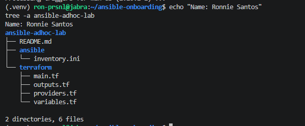

---

#### Screenshot 2 — Terminal showing `git status --short` with the new project files and updated `.gitignore`

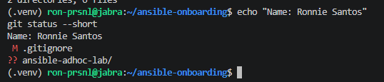

---

### Notes

I created the `ansible-adhoc-lab` project inside the `ansible-onboarding` repository from Assignment 01, so this lab reuses the same Git repo, Python virtual environment, Ansible controller, SSH key, and pre-commit hooks. The lab has two subfolders: `terraform/` for the infrastructure code (`providers.tf`, `main.tf`, `variables.tf`, `outputs.tf`) and `ansible/` for `inventory.ini`, with a `README.md` at the top level.

I updated `.gitignore` to exclude Terraform's working files: `.terraform/`, state files (`*.tfstate`, `*.tfstate.*`), variable files (`*.tfvars`), plan files, and crash logs. State files can contain IP addresses, resource IDs, and other sensitive values, and `terraform.tfvars` holds my controller's public IP, so none of these should be committed. I left `.terraform.lock.hcl` tracked on purpose, because it pins the AWS provider version so anyone running this code gets the same provider.

---

# Task 2 — Create the Terraform Configuration

## Goal

Create the Terraform configuration required to provision three or four Ubuntu Linux VMs on your selected cloud platform.

Complete only one option:

- Option A — Microsoft Azure
- Option B — Amazon Web Services

Do not configure both providers for this assignment.

### Evidence

#### Screenshot 3 — Terraform configuration showing the three or four server roles and the `for_each` or `count` implementation

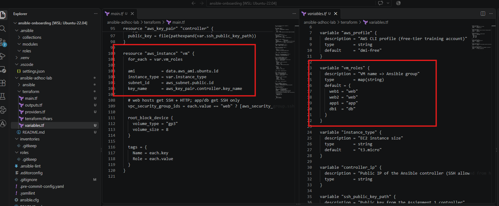

---

#### Screenshot 4 — Terraform configuration showing SSH restricted to the controller IP and HTTP allowed only for web hosts

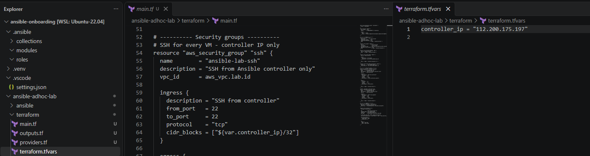

---

#### Screenshot 5 — Terraform output configuration showing how public IP addresses are associated with the server roles

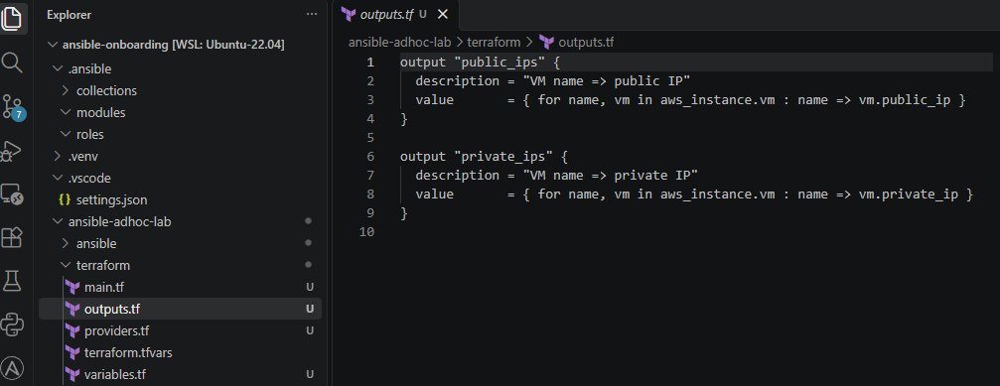

---

### Notes

The `vm_roles` map defines four servers and their Ansible groups (web1/web2 → web, app1 → app, db1 → db). `aws_instance.vm` loops over this map with `for_each`, so one resource block creates all four EC2 instances, each named after its role.

The `ssh` security group allows port 22 only from `${var.controller_ip}/32`, my controller's public IP. The `web` security group allows port 80, and the conditional on `vpc_security_group_ids` attaches it only to instances whose role is `web`. App and db hosts get the SSH group only.

The `public_ips` output uses a `for` expression over `aws_instance.vm` to build a map of VM name → public IP. Because the instances were created with `for_each`, each IP stays tied to its role name, which makes it easy to build the Ansible inventory. A matching `private_ips` output is included for reference.
---

# Task 3 — Provision the Infrastructure with Terraform

## Goal

Initialize and validate the Terraform configuration, review the execution plan, provision the selected three or four VMs, and retrieve their public IP addresses.

### Evidence

#### Screenshot 6 — Final `terraform apply` output showing `Apply complete`

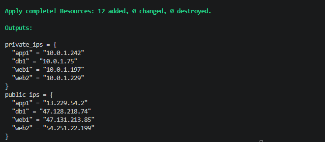

---

#### Screenshot 7 — `terraform output public_ips` showing the role-to-IP mapping for all three or four VMs

---

#### Screenshot 8 — Azure Portal or AWS Management Console showing all three or four VMs in the `Running` state, with their role-based names visible

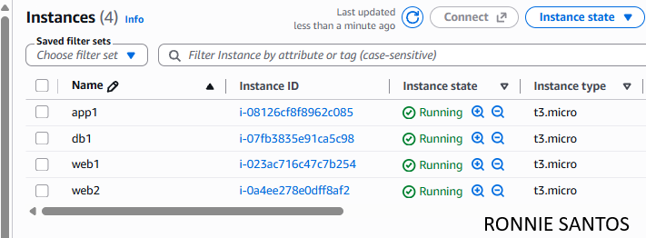

---

### Notes

I provisioned the infrastructure on **AWS** using the **four-VM option** (web1, web2, app1, db1) in the `ap-southeast-1` (Singapore) region, using a separate free-tier training account through a dedicated AWS CLI profile (`dmi-free`). The profile is also set in `providers.tf`, so Terraform can only deploy to that account.

`terraform init` downloaded the AWS provider (v5.100.0) and created `.terraform.lock.hcl` to pin that version. `terraform validate` confirmed the configuration was syntactically correct before anything touched AWS. I then reviewed `terraform plan` before applying and checked three things: the plan showed exactly **12 resources to add** (VPC, subnet, internet gateway, route table, route table association, two security groups, key pair, and four EC2 instances); the SSH rule's source was my controller's IP as a `/32`, not `0.0.0.0/0`; and the HTTP rule existed only in the web security group. After confirming those, `terraform apply` completed with 12 resources added.

`terraform output public_ips` returns a map of VM name to public IP, so each address stays tied to its role. That made the inventory in Task 5 straightforward to build. All four instances use Ubuntu 22.04 on `t3.micro` with 8 GB gp3 disks, and every resource carries `Project` and `Owner` tags through the provider's `default_tags`, which makes the lab easy to find and clean up.

---

# Task 4 — Verify SSH Key-Based Access

## Goal

Verify that each managed VM can be accessed from the Ansible controller using SSH key-based authentication.

### Evidence

#### Screenshot 9 — Terminal showing successful SSH hostname output from all VMs

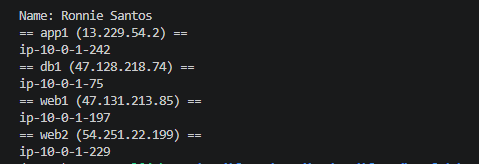

---

### Notes

All four VMs accept SSH key authentication from the controller using the ED25519 key from Assignment 01. Terraform registered the public key as an AWS key pair. The private key never left the controller.

On first connection, SSH prompted to confirm each host's fingerprint (because of `StrictHostKeyChecking ask`), and I accepted them, which saved them to `~/.ssh/known_hosts`. The second run returned each hostname (`ip-10-0-1-xx`) with no password or fingerprint prompt. The login user is `ubuntu`, the default for AWS Ubuntu AMIs.

---

# Task 5 — Create the Custom Ansible Inventory

## Goal

Create an Ansible inventory file that groups the managed VMs by role.

The inventory allows Ansible to run commands against all servers, or only specific groups such as `web`, `app`, or `db`.

### Evidence

#### Screenshot 10 — `inventory.ini` showing the `web`, `app`, and `db` groups

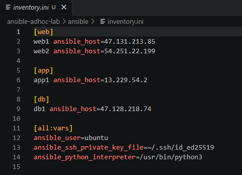

---

#### Screenshot 11 — Output of `ansible-inventory -i inventory.ini --graph`

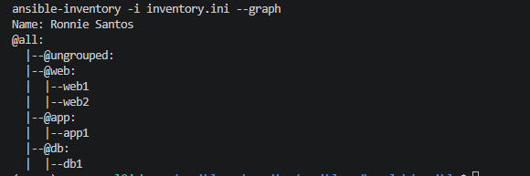

---

### Notes

`inventory.ini` groups the four VMs by role: `web` (web1, web2), `app` (app1), and `db` (db1). Each host uses a readable name with `ansible_host=` set to its public IP, so Ansible's output shows `web1` instead of a raw IP.

Settings shared by every host sit under `[all:vars]`: the SSH user (`ubuntu`), the private key path, and the Python interpreter on the managed nodes. `ansible-inventory --graph` confirmed each host is in the correct group, so commands can target `all` or a single group such as `web`.

---

# Task 6 — Run Ansible Ad-Hoc Commands

## Goal

Run Ansible ad-hoc commands from the controller to verify connectivity, check server information, and manage packages and services across inventory groups.

This task proves that the inventory is working and that Ansible can control multiple managed VMs without writing a playbook.

### Evidence

#### Screenshot 12 — Output of `ansible all -i inventory.ini -m ping`

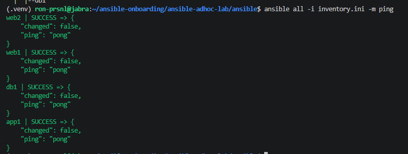

---

#### Screenshot 13 — Output of `ansible all -i inventory.ini -m command -a "uptime"`

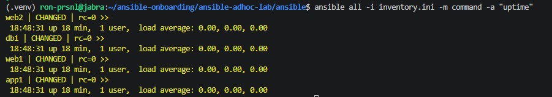

---

#### Screenshot 14 — Output of `ansible web -i inventory.ini -m apt -a "name=nginx state=present update_cache=yes" --become`

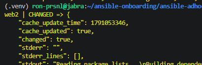

---

#### Screenshot 15 — Output of `ansible web -i inventory.ini -m service -a "name=nginx state=started enabled=yes" --become`

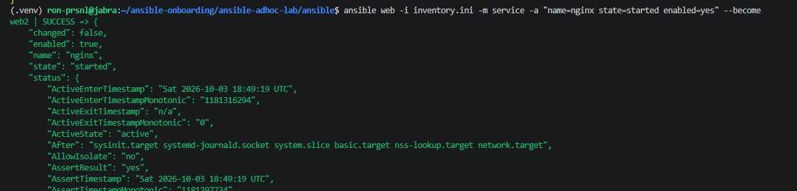

---

#### Screenshot 16 — Output of `ansible all -i inventory.ini -m apt -a "name=htop state=present update_cache=yes" --become`

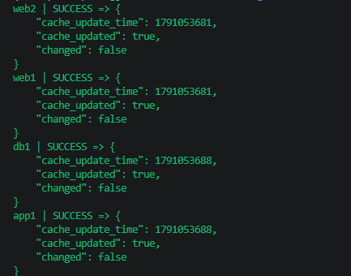

---

#### Screenshot 17 — Output of `ansible web -i inventory.ini -m command -a "systemctl is-active nginx"`

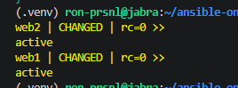

---

### Notes

### Notes

I ran all ad-hoc commands from the controller against `inventory.ini`, without writing a playbook. `ping` returned `SUCCESS` / `pong` from all four hosts, which confirms SSH access, authentication, and a working Python interpreter on each VM. This is Ansible's module check, not an ICMP ping. `uptime` ran through the `command` module and returned the load and uptime for every host.

For package and service tasks, I targeted only the `web` group and used `--become`, because installing packages and managing services needs root privileges. The `apt` module installed nginx on web1 and web2 only; app1 and db1 were not touched. The `service` module then reported `"changed": false`, since installing nginx on Ubuntu already starts and enables it. Ansible checked the state and found nothing to change, which is idempotency. The `htop` install ran across all hosts and also reported no change, because Ubuntu 22.04 ships with it.

Finally, `systemctl is-active nginx` returned `active` on both web hosts. Note that the `command` module always reports `CHANGED` because it can't tell whether a command modified anything. The return code (`rc=0`) and the output are what confirm success.

---

# LinkedIn Post Required

## Evidence

#### LinkedIn Post URL

Paste your LinkedIn post URL here:

`Add your URL here`

---

#### Screenshot — Published LinkedIn post

Add your screenshot here.

---

# Assignment Questions

Answer the following in your own words:

**1. What is the purpose of an Ansible inventory file?**

The inventory tells Ansible which servers to manage and how to connect to them. It lists the hosts, groups them, and stores connection details like the IP address, SSH user, private key, and Python interpreter. Grouping lets me run a command against all servers or just one group without typing IP addresses every time.

---

**2. What is the difference between the `web`, `app`, and `db` groups in your inventory?**

The groups split the servers by role. `web` contains web1 and web2, which serve HTTP traffic and are the only hosts with port 80 open. `app` contains app1 for the application tier, and `db` contains db1 for the database tier. In this lab all four are the same Ubuntu VM, but the grouping lets me target each tier on its own. For example, I installed nginx only on `web`, while `htop` went to `all`.

---

**3. What does the Ansible `ping` module verify?**

It checks that Ansible can actually manage the host. That means it can connect over SSH, authenticate with the key, and run Python on the remote machine. It returns `pong` if all of that works. It is not a network ICMP ping, so a server can answer a normal ping and still fail Ansible's `ping` if SSH or Python is broken.

---

**4. Why do package installation commands require `--become`?**

Ansible connects as the `ubuntu` user, which doesn't have root privileges by default. Installing packages and managing services change system files, so they need root. `--become` tells Ansible to escalate privileges with `sudo` for that command. Without it, `apt` fails with a permission error.

---

**5. When would you use an ad-hoc command instead of a playbook?**

Ad-hoc commands suit quick, one-off tasks: checking connectivity, uptime, or disk space, restarting a service, or installing a single package across a group. A playbook is better when the work has several steps, needs to be repeated, or should be version-controlled and reviewed. Basically, I'd use ad-hoc commands to check or fix something now, and a playbook for anything I'd want to run the same way again.

---

**6. What is one challenge you faced while setting up SSH or inventory, and how did you fix it?**

Because the SSH rule only allows my controller's public IP as a `/32`, SSH depends on that IP being correct. Home internet connections can change public IP, so I checked my current IP with `curl https://checkip.amazonaws.com` before applying, and kept it in `terraform.tfvars` so it can be updated and re-applied if it changes. When I first connected, SSH also asked me to confirm each server's fingerprint, because my SSH config uses `StrictHostKeyChecking ask`. I accepted the four fingerprints once, which saved them to `known_hosts`, and after that both SSH and Ansible connected without prompts.

---

# Required Files

Confirm that the following files are included in your assignment workspace:

- [✓] `ansible-adhoc-lab/README.md`
- [✓] `ansible-adhoc-lab/terraform/providers.tf`
- [✓] `ansible-adhoc-lab/terraform/main.tf`
- [✓] `ansible-adhoc-lab/terraform/variables.tf`
- [✓] `ansible-adhoc-lab/terraform/outputs.tf`
- [✓] `ansible-adhoc-lab/ansible/inventory.ini`
- [✓] Updated `.gitignore`

---

# Submission Instructions

- Add all required screenshots from the tasks.
- Full Name must be visible in required screenshots.
- Mention whether you used Azure or AWS.
- Mention whether you used the three-VM option or four-VM option.
- Add the public IP addresses of the VMs, redacted if preferred.
- Add your `inventory.ini` proof.
- Add a short explanation of what you learned.
- Answer all assignment questions clearly in your own words.
- Add your LinkedIn post URL.
- Do not expose SSH private keys, Terraform state files, cloud credentials, passwords, access keys, secret keys, account IDs, or subscription IDs.

---

# Completion Checklist

- [✓] Task 1: `ansible-adhoc-lab` project structure created
- [✓] Task 1: `.gitignore` updated for Terraform files
- [✓] Task 2: Terraform configuration created
- [✓] Task 2: Server roles defined for either three or four VMs
- [✓] Task 2: `count` or `for_each` used
- [✓] Task 2: SSH restricted to the controller public IP
- [✓] Task 2: HTTP allowed only for web hosts
- [✓] Task 2: Terraform output maps roles to public IPs
- [✓] Task 3: Terraform initialized successfully
- [✓] Task 3: Terraform configuration validated
- [✓] Task 3: Terraform apply completed successfully
- [✓] Task 3: All selected VMs are running
- [✓] Task 4: SSH key-based access works for every VM
- [✓] Task 5: `inventory.ini` contains `web`, `app`, and `db` groups
- [✓] Task 5: `ansible-inventory -i inventory.ini --graph` shows the correct groups
- [✓] Task 6: `ansible all -i inventory.ini -m ping` returns `SUCCESS`
- [✓] Task 6: Ad-hoc commands run successfully
- [✓] Task 6: `--become` was used for package and service tasks
- [✓] Task 6: Nginx is active on the `web` group
- [✓] Screenshots 1–17 are included
- [✓] Assignment questions are answered
- [ ] LinkedIn post published
- [ ] LinkedIn post URL added
- [✓] No sensitive information is exposed

---

## About DMI & CloudAdvisory

DevOps Micro Internship (DMI) is a project-based DevOps program run by Pravin Mishra and The CloudAdvisory, focused on real-world execution, systems thinking, and career readiness.

It helps learners build strong DevOps foundations with hands-on experience.

---

## Resources

- DMI Official Website: [https://dmi.pravinmishra.com?utm_source=github&utm_medium=readme](https://dmi.pravinmishra.com?utm_source=github&utm_medium=readme)
- University: [https://university.pravinmishra.com?utm_source=github&utm_medium=readme](https://university.pravinmishra.com?utm_source=github&utm_medium=readme)
- Discord Community: [https://discord.pravinmishra.com?utm_source=github&utm_medium=readme](https://discord.pravinmishra.com?utm_source=github&utm_medium=readme)
- Blog: [https://dmi.pravinmishra.com/blog?utm_source=github&utm_medium=readme](https://dmi.pravinmishra.com/blog?utm_source=github&utm_medium=readme)
- YouTube Playlist: [https://www.youtube.com/playlist?list=PLFeSNDtI4Cho](https://www.youtube.com/playlist?list=PLFeSNDtI4Cho)
- Pravin Mishra LinkedIn: [https://www.linkedin.com/in/pravin-mishra-aws-trainer/](https://www.linkedin.com/in/pravin-mishra-aws-trainer/)
- CloudAdvisory LinkedIn: [https://www.linkedin.com/company/thecloudadvisory/](https://www.linkedin.com/company/thecloudadvisory/)

---

*This submission is part of DevOps Micro Internship (DMI) — Agentic AI Track.*