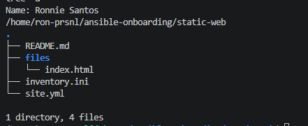
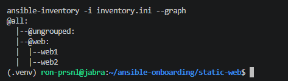
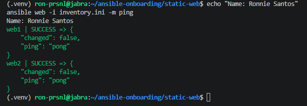
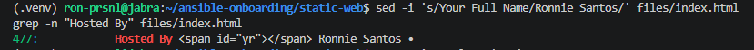
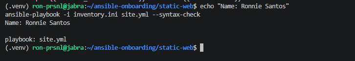
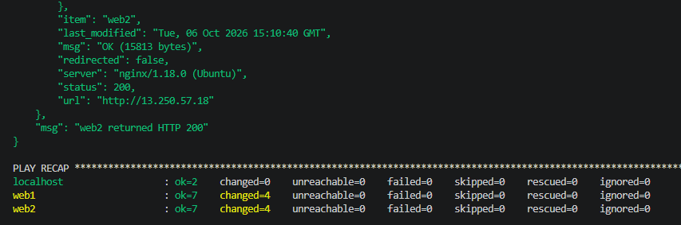
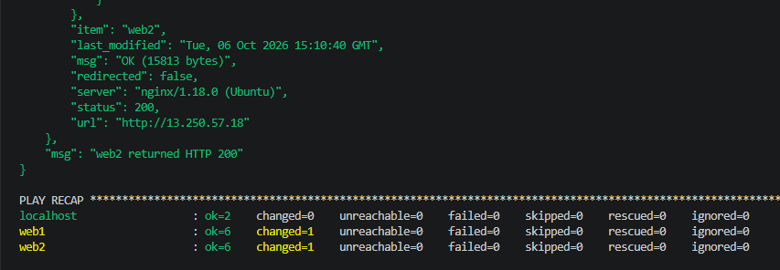
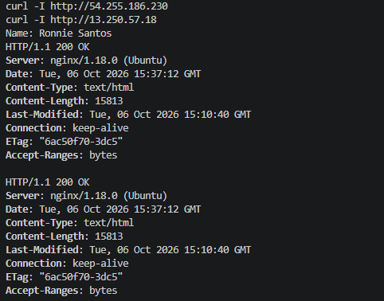
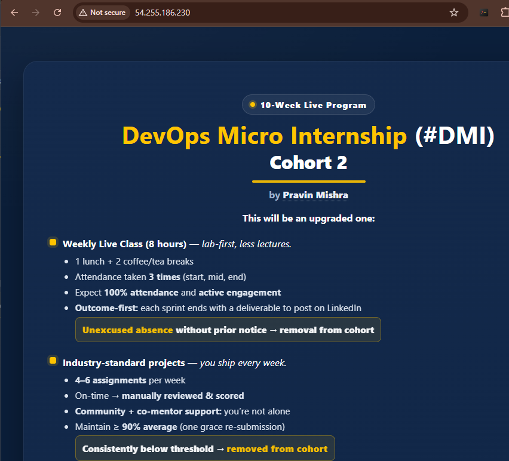
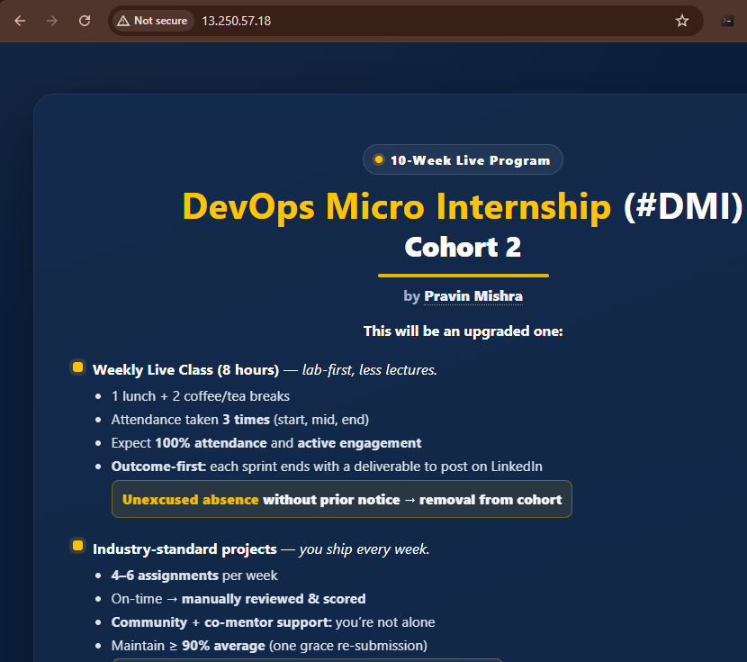

# Assignment 03 — Deploy a Static Website to Multiple Servers Using a Multi-Play Ansible Playbook

Part of the DevOps Micro Internship (DMI) with Agentic AI

---

## Student Details

**Full Name:** Add your full name here  
**Cloud Platform Used:** AWS / Azure  
**Server 1 URL:** `http://<SERVER_1_PUBLIC_IP>`  
**Server 2 URL:** `http://<SERVER_2_PUBLIC_IP>`

---

## Purpose

In this assignment, you will create a multi-play Ansible playbook to install Nginx, deploy a static website to two Ubuntu servers, and verify that the website is accessible from both servers.

You may use either AWS EC2 instances or Azure Virtual Machines as your managed servers.

---

# Task 1 — Create the Project Structure

## Goal

Create the required folders and files for the Ansible project.

## Evidence

### Screenshot 1 — Terminal or VS Code showing the complete `static-web` project structure



---

# Task 2 — Configure the Ansible Inventory

## Goal

Add both Ubuntu servers to the Ansible inventory.

## Evidence

### Screenshot 2 — Output of `ansible-inventory -i inventory.ini --graph` showing `web1` and `web2`



---

## Configuration File

Copy and paste the complete contents of your `inventory.ini` file below:

```ini
[web]
web1 ansible_host=47.131.213.85
web2 ansible_host=54.251.22.199


[all:vars]
ansible_user=ubuntu
ansible_ssh_private_key_file=~/.ssh/id_ed25519
ansible_python_interpreter=/usr/bin/python3
```

---

# Task 3 — Verify Ansible Connectivity

## Goal

Confirm that the Ansible controller can connect to both servers.

## Evidence

### Screenshot 3 — Ansible ping output showing `SUCCESS` and `pong` for both servers



---

# Task 4 — Download and Personalize the Static Website

## Goal

Download `index.html` to the Ansible controller and personalize the website with your full name.

## Evidence

### Screenshot 4 — Edited `files/index.html` showing the footer line with your full name



---

# Task 5 — Create the Multi-Play Ansible Playbook

## Goal

Create a single Ansible playbook containing separate plays for installation, deployment, and verification.

## Configuration File

Copy and paste the complete contents of your `site.yml` file below:

```yaml
---
- name: Install and configure Nginx
  hosts: web
  become: true
  tasks:
    - name: Update the APT package cache
      ansible.builtin.apt:
        update_cache: true

    - name: Install Nginx
      ansible.builtin.apt:
        name: nginx
        state: present

    - name: Start and enable Nginx
      ansible.builtin.service:
        name: nginx
        state: started
        enabled: true

- name: Deploy the static website
  hosts: web
  become: true
  tasks:
    - name: Copy index.html to the web root
      ansible.builtin.copy:
        src: files/index.html
        dest: /var/www/html/index.html
        owner: www-data
        group: www-data
        mode: "0644"
      notify: Reload nginx

  handlers:
    - name: Reload nginx
      ansible.builtin.service:
        name: nginx
        state: reloaded

- name: Verify both websites from the controller
  hosts: localhost
  connection: local
  gather_facts: false
  become: false
  tasks:
    - name: Send an HTTP GET request to each web server
      ansible.builtin.uri:
        url: "http://{{ hostvars[item].ansible_host }}"
        status_code: 200
      loop: "{{ groups['web'] }}"
      register: website_checks

    - name: Confirm each server returned HTTP 200
      ansible.builtin.assert:
        that:
          - item.status == 200
        success_msg: "{{ item.item }} returned HTTP {{ item.status }}"
      loop: "{{ website_checks.results }}"

```

---

# Task 6 — Validate the Playbook Syntax

## Goal

Check the playbook for YAML or Ansible syntax errors before running it.

## Evidence

### Screenshot 5 — Successful syntax-check output showing `playbook: site.yml`




---

# Task 7 — Run the Multi-Play Playbook

## Goal

Install Nginx, deploy the website, and verify both servers in one playbook run.

## Evidence

### Screenshot 6 — Play 3 verification showing HTTP `200` for both servers


---

### Screenshot 7 — Final play recap showing `unreachable=0` and `failed=0` for `web1`, `web2`, and `localhost`



---

# Task 8 — Verify Idempotency

## Goal

Run the playbook again and confirm that it does not make unnecessary changes.

## Evidence

### Screenshot 8 — Second playbook run showing the play recap with `changed=0`, `unreachable=0`, and `failed=0` for both web servers



---

# Task 9 — Test Both Websites Manually

## Goal

Confirm that the static website is accessible from both public IP addresses.

## Evidence

### Screenshot 9 — `curl -I` output showing HTTP `200 OK` from both servers



---

### Screenshot 10 — Browser showing the website from Server 1 with the public IP and your full name visible



---

### Screenshot 11 — Browser showing the website from Server 2 with the public IP and your full name visible



---

## Website URLs

Add both deployed website URLs below:

```text
Server 1: http://54.255.186.230/
Server 2: http://13.250.57.18/
```

---

# Task 10 — Complete the Project README

## Goal

Document how the project works and record what you learned.

## README Content

Copy and paste the complete contents of your `README.md` file below:

```markdown
# Static Website Deployment — Multi-Play Ansible Playbook

**Author:** Ronnie Santos
**Program:** DevOps Micro Internship (DMI) — Week 9, Assignment 03

## Summary

A single Ansible playbook (`site.yml`) installs Nginx on two Ubuntu web servers,
deploys a personalized static website to both, and checks from the controller
that each one returns HTTP 200. The work is split into three plays, each with one job.

## Environment

| Item       | Detail                                                     |
|------------|------------------------------------------------------------|
| Controller | WSL2 Ubuntu 22.04, Ansible in the project venv             |
| Servers    | 2 × AWS EC2 Ubuntu 22.04 (`web1`, `web2`), `ap-southeast-1` |
| Provisioned by | Terraform from `../ansible-adhoc-lab/terraform`        |
| Access     | Key-based SSH (ED25519); SSH limited to controller IP      |

## Project Structure

| Path               | Purpose                                         |
|--------------------|-------------------------------------------------|
| `inventory.ini`    | `web` group with web1 and web2, plus SSH vars   |
| `site.yml`         | Multi-play playbook                             |
| `files/index.html` | Website content, personalized with my name      |
| `README.md`        | This document                                   |

## How the Playbook Works

**Play 1 — Install and configure Nginx** (`hosts: web`, `become: true`)
Refreshes the APT cache, installs Nginx, then starts it and enables it on boot.

**Play 2 — Deploy the static website** (`hosts: web`, `become: true`)
Copies `files/index.html` to `/var/www/html/index.html`, owned by `www-data`
with mode `0644`. If the file changes, it notifies the `Reload nginx` handler.
If the file is already identical, the handler does not run.

**Play 3 — Verify from the controller** (`hosts: localhost`, `gather_facts: false`)
Loops over the `web` group, sends an HTTP GET to each server's `ansible_host`
with the `uri` module, then uses `assert` to confirm each returned HTTP 200.

## How to Run

    source ~/ansible-onboarding/.venv/bin/activate
    cd ~/ansible-onboarding/static-web

    ansible-inventory -i inventory.ini --graph
    ansible web -i inventory.ini -m ping
    ansible-playbook -i inventory.ini site.yml --syntax-check
    ansible-playbook -i inventory.ini site.yml

## Results

| Run | web1 / web2         | Handler | Play 3              |
|-----|---------------------|---------|---------------------|
| 1st | ok=7, changed=4     | Ran     | Both returned 200   |
| 2nd | ok=6, changed=1     | Skipped | Both returned 200   |

The first run installed Nginx, copied the site, and reloaded Nginx. The second
run changed only the APT cache refresh, which reports a change every time.
Install, start, and copy all reported `ok`, and the handler did not fire.
`curl -I` returned `HTTP/1.1 200 OK` from both servers, and the browser showed
the footer "Hosted By 2026 Ronnie Santos" on both IPs.

## What I Learned

- **Plays separate responsibilities.** Install, deploy, and verify each have
  their own play, so a failure points straight to the stage that broke.
- **Handlers prevent unnecessary restarts.** Nginx reloads only when the
  website file actually changes, not on every run.
- **Idempotency can be seen in the recap.** Going from `changed=4` to
  `changed=1` showed the playbook only acts when the server's state doesn't
  match what's declared.
- **Verify from outside the server.** Running the checks from `localhost`
  tests the real network path, including the security group, not just
  whether Nginx is running locally.
- **Accept host keys before parallel runs.** On first contact, Ansible's
  parallel connections produced overlapping fingerprint prompts. Accepting each
  host key with `ssh` first avoids this.

## Cleanup

The servers were destroyed with `terraform destroy` after evidence was captured.
The IPs in `inventory.ini` are no longer active.

```

---

# LinkedIn Post Required

## Evidence

### LinkedIn Post URL

Paste your LinkedIn post URL here:

`Add your URL here`

---

### Screenshot — Published LinkedIn post

Add your screenshot here.

---

# Assignment Questions

**1. What issue did you face while completing this assignment, and how did you fix it?**

The two web servers didn't exist at the start, because I had destroyed the Assignment 2 lab to avoid charges. Instead of writing new Terraform, I reused the Assignment 2 code and overrode `vm_roles` in `terraform.tfvars` to create only web1 and web2. I put the override in `tfvars` rather than passing `-var`, so `terraform destroy` later uses the same two-VM set.

The second issue came from the new VMs having new host keys. When I ran `ansible web -m ping`, Ansible connected to both servers in parallel and two fingerprint prompts appeared at the same time. My `yes` only answered web1, and web2 kept waiting. I fixed it by accepting the remaining host key with a direct `ssh` connection, and after that the ping returned `SUCCESS` from both servers with no prompts.

---

**2. What did you learn from this assignment?**

I learned how a playbook with several plays runs from top to bottom, with each play targeting its own hosts. Handlers only run when a task reports `changed`: in the first run the copy changed the file, so Nginx reloaded, and in the second run nothing changed, so the handler was skipped. Comparing the two `PLAY RECAP`s made idempotency easy to see. I also learned that a play can run on `localhost` to test the servers from outside, the way a real visitor would reach them.

---

**3. Why is it useful to split installation, deployment, and verification into separate plays?**

Each play has one clear job, so the playbook is easier to read, and when something fails, the output shows which stage broke: installing, deploying, or verifying. It also lets each stage use different settings. The verification play runs on `localhost` without `become` or fact gathering, while the other two need root on the web servers. The plays can also be reused or run separately later, for example running only the verification after a manual change.

---

**4. What is one benefit of using the Ansible `copy` module instead of cloning the website directly from Git on every managed server?**

The controller stays the single source of truth. Every server gets exactly the same file, the one I edited and checked locally, so there's no risk of servers pulling different versions or a newer commit. The servers also don't need Git installed, don't need access to GitHub, and don't need repository credentials. `copy` also compares the files first and only transfers when something differs, which is what made the second run report `ok` and skip the Nginx reload.

---

**5. What does idempotency mean in this assignment?**

It means running the playbook again only makes changes where the server doesn't already match what the playbook describes. The first run reported `changed=4` per server: it updated the APT cache, installed Nginx, copied the site, and reloaded Nginx. The second run, with nothing modified, reported `changed=1`, which was only the APT cache refresh. Nginx was already installed and running, the file was already identical, and the handler didn't fire. Both runs ended with the same working website.

---

**6. What does the Ansible `uri` module verify in Play 3?**

It sends a real HTTP GET request from the controller to each web server's public IP and checks that the response status is 200. A passing result means more than "Nginx is running": the request made it across the internet, through the security group's port 80 rule, to Nginx, and got a successful page back. The results are saved with `register`, and the `assert` task then confirms each server returned 200, printing a message like `web1 returned HTTP 200`.

---

# Required Files

Confirm that the following files are included in your assignment folder:

- [✓] `inventory.ini`
- [✓] `site.yml`
- [✓] `files/index.html`
- [✓] `README.md`

---

# Submission Instructions

- Add all required screenshots in the correct order.
- Full Name must be visible in required screenshots.
- Include both deployed website URLs.
- Paste `inventory.ini`, `site.yml`, and `README.md` as editable text.
- Answer all assignment questions clearly in your own words.
- Add your LinkedIn post URL.
- Do not expose SSH private keys, passwords, cloud account IDs, or other sensitive information.

---

# Completion Checklist

- [✓] Task 1: `static-web` folder structure is complete
- [✓] Task 2: Both servers are listed under the `[web]` group in `inventory.ini`
- [✓] Task 2: Inventory graph shows `web1` and `web2`
- [✓] Task 3: Ansible ping returns `SUCCESS` and `pong` for both servers
- [✓] Task 4: `files/index.html` contains your full name
- [✓] Task 5: `site.yml` contains three separate plays
- [✓] Task 5: Play 1 installs, starts, and enables Nginx
- [✓] Task 5: Play 2 deploys `index.html` using the `copy` module
- [✓] Task 5: Nginx reload handler is included
- [✓] Task 5: Play 3 verifies both web servers from the controller
- [✓] Task 6: Playbook syntax check passes
- [✓] Task 7: First playbook run completes with `unreachable=0` and `failed=0`
- [✓] Task 7: URI verification returns HTTP `200` for both servers
- [✓] Task 8: Second playbook run demonstrates idempotency
- [✓] Task 8: Second run shows `changed=0` for both web servers
- [✓] Task 9: Both `curl -I` commands return HTTP `200 OK`
- [✓] Task 9: Website loads from Server 1
- [✓] Task 9: Website loads from Server 2
- [✓] Task 9: Full name is visible on both deployed websites
- [✓] Task 10: `README.md` contains all required explanations
- [✓] Screenshots 1–11 are included
- [✓] `inventory.ini`, `site.yml`, and `README.md` are pasted as editable text
- [✓] Both website URLs are included
- [✓] Assignment questions are answered
- [ ] LinkedIn post published
- [ ] LinkedIn post URL added
- [✓] No sensitive information is exposed

---

## About DMI & CloudAdvisory

DevOps Micro Internship (DMI) is a project-based DevOps program run by Pravin Mishra and The CloudAdvisory, focused on real-world execution, systems thinking, and career readiness.

It helps learners build strong DevOps foundations with hands-on experience.

---

## Resources

- DMI Official Website: [https://dmi.pravinmishra.com?utm_source=github&utm_medium=readme](https://dmi.pravinmishra.com?utm_source=github&utm_medium=readme)
- University: [https://university.pravinmishra.com?utm_source=github&utm_medium=readme](https://university.pravinmishra.com?utm_source=github&utm_medium=readme)
- Discord Community: [https://discord.pravinmishra.com?utm_source=github&utm_medium=readme](https://discord.pravinmishra.com?utm_source=github&utm_medium=readme)
- Blog: [https://dmi.pravinmishra.com/blog?utm_source=github&utm_medium=readme](https://dmi.pravinmishra.com/blog?utm_source=github&utm_medium=readme)
- YouTube Playlist: [https://www.youtube.com/playlist?list=PLFeSNDtI4Cho](https://www.youtube.com/playlist?list=PLFeSNDtI4Cho)
- Pravin Mishra LinkedIn: [https://www.linkedin.com/in/pravin-mishra-aws-trainer/](https://www.linkedin.com/in/pravin-mishra-aws-trainer/)
- CloudAdvisory LinkedIn: [https://www.linkedin.com/company/thecloudadvisory/](https://www.linkedin.com/company/thecloudadvisory/)

---

*This submission is part of DevOps Micro Internship (DMI) — Agentic AI Track.*