# Assignment 04 — Deploy Mini Finance on Azure Using Terraform and Ansible

Part of the DevOps Micro Internship (DMI) with Agentic AI

---

## Purpose

In this assignment, you will provision Azure infrastructure using Terraform and deploy the Mini Finance website using an Ansible multi-play playbook.

Terraform will create the Azure Virtual Machine and networking resources. Ansible will install Nginx, clone the Mini Finance repository, deploy the website, and verify the deployment.

---

# Task 1 — Create the Project Structure

## Goal

Create separate directories and files for the Terraform infrastructure and Ansible configuration.

### Evidence

#### Screenshot 1 — Terminal or VS Code showing the complete `mini-finance` project structure

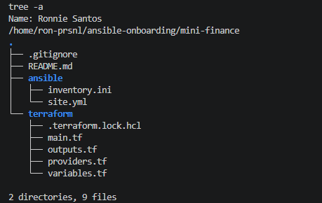

---

### Notes

I created the `mini-finance` project inside the `ansible-onboarding` repository from Assignment 01, so it uses the same Git repo, Python virtual environment, Ansible controller, SSH key, and pre-commit hooks. The project keeps infrastructure and configuration separate: `terraform/` holds the provisioning code (`providers.tf`, `main.tf`, `variables.tf`, `outputs.tf`), and `ansible/` holds `inventory.ini` and the multi-play `site.yml`. `README.md` sits at the project root.

The `.gitignore` excludes Terraform's working directory (`.terraform/`), state files, plan files, crash logs, `*.tfvars`, and any `.pem` or `.key` files. State files can contain resource IDs and IP addresses, and `terraform.tfvars` holds my controller's public IP, so none of these should be committed. `.terraform.lock.hcl` is kept on purpose, because it pins the AWS provider version.

**Platform note:** this assignment is written for Azure, but I completed it on AWS because I no longer have Azure credits. The solution guide also adapts it for AWS. Resources use Azure-equivalent names: security group `nsg-mini-finance` (NSG), network interface `nic-mini-finance` (NIC), Elastic IP `pip-mini-finance` (public IP), and EC2 instance `vm-mini-finance` (VM).

---

# Task 2 — Create the Azure Infrastructure Using Terraform

## Goal

Use Terraform to provision an Ubuntu Virtual Machine with the required Azure networking and security resources.

### Evidence

#### Screenshot 2 — Terraform code showing the `Allow-SSH` rule for port `22` and the `Allow-HTTP` rule for port `80`

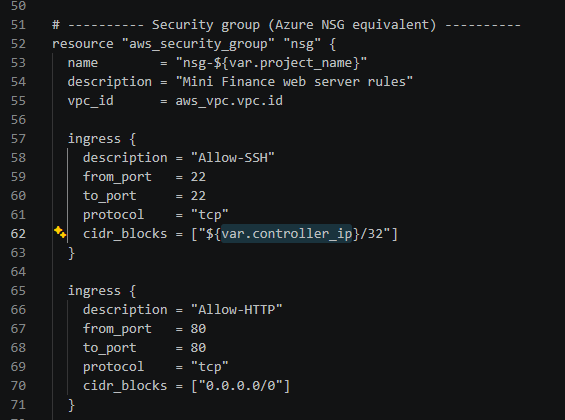

---

#### Screenshot 3 — Terraform code showing the association between `nsg-mini-finance` and `nic-mini-finance`

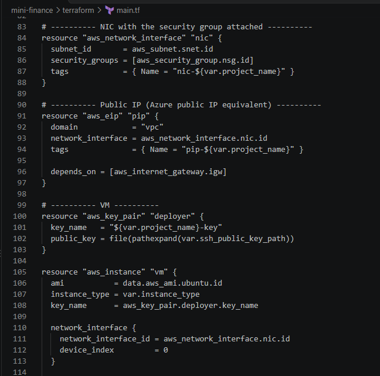

---

### Notes

The Terraform code provisions one Ubuntu 22.04 VM and its supporting network on AWS in `ap-southeast-1`. Resources use Azure-equivalent names to match the assignment. The network is a VPC (`vpc-mini-finance`, 10.0.0.0/16) with one subnet (`snet-mini-finance`, 10.0.1.0/24), an internet gateway, and a route table that sends `0.0.0.0/0` to the gateway.

The security group `nsg-mini-finance` is the AWS equivalent of an Azure NSG and has two inbound rules. **Allow-SSH** permits port 22 only from my controller's public IP as a `/32`, so no one else can attempt SSH logins. **Allow-HTTP** permits port 80 from anywhere, because the website has to be publicly reachable. Outbound traffic is allowed so the VM can download packages and clone the repository.

To mirror Azure's NSG-to-NIC association, I created an explicit network interface (`nic-mini-finance`) with the security group attached, then attached that interface to the VM as its primary NIC (`device_index = 0`). Because AWS doesn't auto-assign a public IP to a pre-created interface, an Elastic IP (`pip-mini-finance`) provides the public address, the same role as an Azure public IP resource. The VM (`vm-mini-finance`, `t3.micro`) uses key-based SSH with my controller's ED25519 public key, and cloud-init sets its hostname to `mini-finance` at first boot.

Values that might change between deployments (region, AWS profile, instance size, controller IP, and key path) are defined in `variables.tf` instead of being hardcoded. The controller IP is supplied through the gitignored `terraform.tfvars`. `outputs.tf` exposes `public_ip`, which the SSH test, the Ansible inventory, and the browser check all use.

---

# Task 3 — Initialize and Apply the Terraform Configuration

## Goal

Format and validate the Terraform configuration, review the execution plan, and provision the Azure infrastructure.

### Evidence

#### Screenshot 4 — End of the `terraform apply` output showing `Apply complete!` with no errors

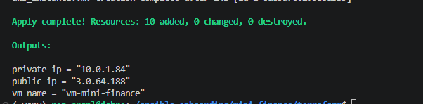

---

#### Screenshot 5 — Output of `terraform output public_ip` showing the VM’s public IP address

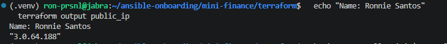

---

### Notes

I ran the Terraform workflow in order from `mini-finance/terraform`, using the `dmi-free` AWS CLI profile for the free-tier training account.

- `terraform fmt` standardized the formatting of the `.tf` files.
- `terraform init` downloaded the AWS provider, using the version pinned in `.terraform.lock.hcl`.
- `terraform validate` confirmed the configuration was valid before anything was sent to AWS.
- `terraform plan` showed **10 resources to add, 0 to change, 0 to destroy**: the VPC, subnet, internet gateway, route table, route table association, security group, network interface, Elastic IP, key pair, and EC2 instance.

Before applying, I checked that the plan only created new resources, with no changes or deletions, and that the SSH rule's source was my controller's IP as a `/32`. Because this project has its own state, separate from the Assignment 2 and 3 lab, the plan started from zero and couldn't affect any other deployment.

`terraform apply` completed with 10 resources added and no errors. `terraform output public_ip` returned the Elastic IP attached to `vm-mini-finance`. That IP stays the same for as long as the Elastic IP exists, and I used it for the SSH test, the Ansible inventory, and the browser check.

---

# Task 4 — Verify Passwordless SSH Access

## Goal

Confirm that the Ansible controller can connect to the Terraform-provisioned Azure VM using SSH key authentication.

### Evidence

#### Screenshot 6 — Passwordless SSH command and the returned `mini-finance` hostname

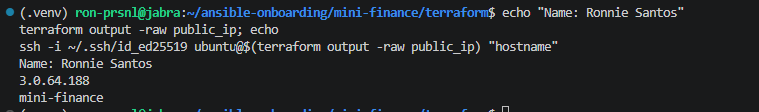

---

### Notes

I tested SSH from the controller to `vm-mini-finance` using the public IP from `terraform output public_ip` and the `ubuntu` user, the default for AWS Ubuntu AMIs (the Azure equivalent is `azureuser`). The `-i ~/.ssh/id_ed25519` flag points SSH at the private key that matches the public key Terraform registered as the `mini-finance-key` key pair.

The command returned the hostname `mini-finance` with no password prompt. This confirms the whole chain Terraform built is working: the key pair matches the controller's private key, the `Allow-SSH` rule lets in my controller's IP, the Elastic IP routes through the internet gateway to the network interface, and cloud-init set the hostname at first boot.

In a new terminal, the SSH agent wasn't running, so I started it and loaded the key before connecting. On first connection, SSH asked me to confirm the server's fingerprint. I accepted it once, which saved it to `known_hosts`, and later connections, including Ansible's, went through without prompts.

---

# Task 5 — Create the Ansible Inventory and Verify Connectivity

## Goal

Add the Terraform-provisioned Azure VM to the Ansible inventory and confirm that Ansible can connect to it.

### Evidence

#### Screenshot 7 — Ansible ping output showing `SUCCESS` and `pong` from the Azure VM

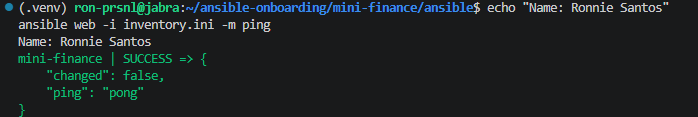

---

### Configuration File

Copy and paste the complete contents of your `ansible/inventory.ini` file below:

```ini
[web]
mini-finance ansible_host=3.0.64.188

[web:vars]
ansible_user=ubuntu
ansible_ssh_private_key_file=~/.ssh/id_ed25519
ansible_python_interpreter=/usr/bin/python3
```

---

# Task 6 — Create the Multi-Play Ansible Playbook

## Goal

Create one Ansible playbook containing separate plays to install Nginx, deploy the Mini Finance website, and verify the deployment.

### Evidence

#### Screenshot 8 — `site.yml` showing Play 1 and the beginning of Play 2

Screenshot must show:

- Play 1 targeting the `web` group
- Installation of `nginx`, `git`, and `rsync`
- Nginx service configured as started and enabled
- Beginning of Play 2 with the Git repository URL and synchronization task

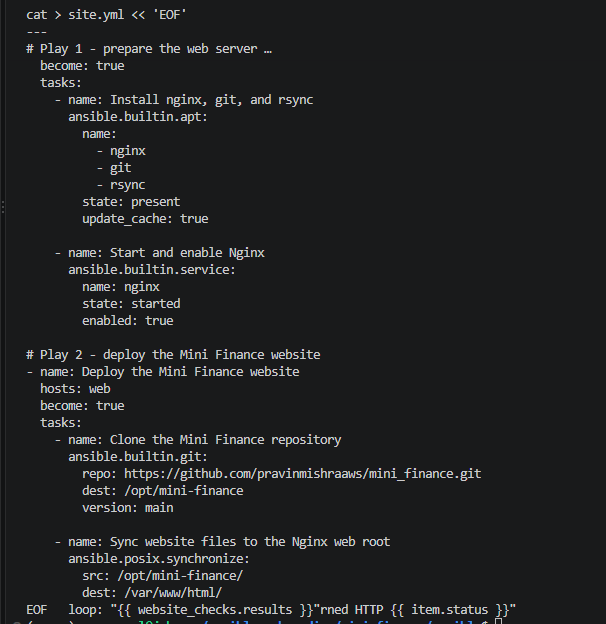

---

#### Screenshot 9 — `site.yml` showing the deployment destination, handler, and Play 3 verification

Screenshot must show:

- Website destination `/var/www/html/`
- Ownership set to `www-data:www-data`
- Nginx reload handler
- Play 3 targeting `localhost`
- The `uri` verification and `assert` condition

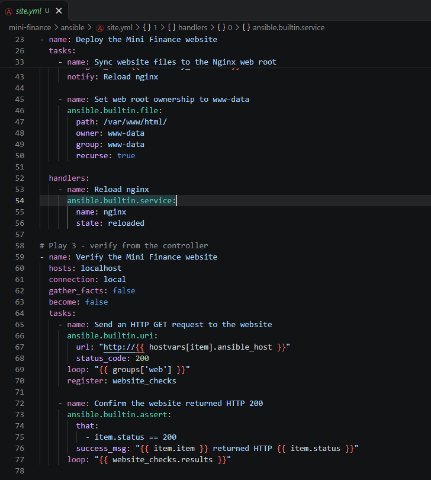

---

### Configuration File

Copy and paste the complete contents of your `ansible/site.yml` file below:

```yaml
---
# Play 1 - prepare the web server
- name: Install and configure Nginx
  hosts: web
  become: true
  tasks:
    - name: Install nginx, git, and rsync
      ansible.builtin.apt:
        name:
          - nginx
          - git
          - rsync
        state: present
        update_cache: true

    - name: Start and enable Nginx
      ansible.builtin.service:
        name: nginx
        state: started
        enabled: true

# Play 2 - deploy the Mini Finance website
- name: Deploy the Mini Finance website
  hosts: web
  become: true
  tasks:
    - name: Clone the Mini Finance repository
      ansible.builtin.git:
        repo: https://github.com/pravinmishraaws/mini_finance.git
        dest: /opt/mini-finance
        version: main

    - name: Sync website files to the Nginx web root
      ansible.posix.synchronize:
        src: /opt/mini-finance/
        dest: /var/www/html/
        delete: true
        owner: false
        group: false
        rsync_opts:
          - "--exclude=.git"
      delegate_to: "{{ inventory_hostname }}"
      notify: Reload nginx

    - name: Set web root ownership to www-data
      ansible.builtin.file:
        path: /var/www/html/
        owner: www-data
        group: www-data
        recurse: true

  handlers:
    - name: Reload nginx
      ansible.builtin.service:
        name: nginx
        state: reloaded

# Play 3 - verify from the controller
- name: Verify the Mini Finance website
  hosts: localhost
  connection: local
  gather_facts: false
  become: false
  tasks:
    - name: Send an HTTP GET request to the website
      ansible.builtin.uri:
        url: "http://{{ hostvars[item].ansible_host }}"
        status_code: 200
      loop: "{{ groups['web'] }}"
      register: website_checks

    - name: Confirm the website returned HTTP 200
      ansible.builtin.assert:
        that:
          - item.status == 200
        success_msg: "{{ item.item }} returned HTTP {{ item.status }}"
      loop: "{{ website_checks.results }}"

```

---

# Task 7 — Validate and Run the Ansible Playbook

## Goal

Validate the syntax of the multi-play Ansible playbook and run it to install Nginx, deploy the Mini Finance website, and verify the deployment.

### Evidence

#### Screenshot 10 — Successful playbook syntax check showing `playbook: site.yml`

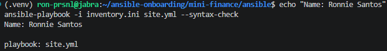

---

#### Screenshot 11 — Play 3 output showing the successful HTTP verification and assertion

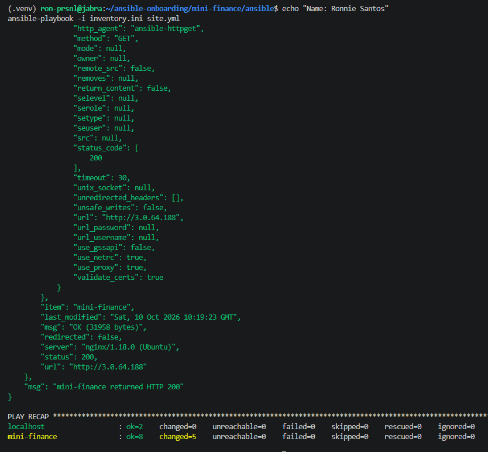

---

#### Screenshot 12 — Final `PLAY RECAP` showing `failed=0` and `unreachable=0`

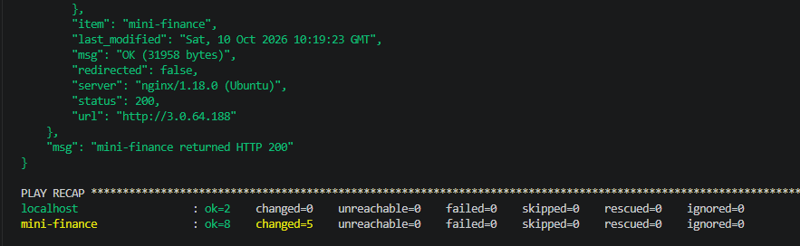

---

### Notes

I ran the playbook from `mini-finance/ansible`. Before the real run, `--syntax-check` parsed all three plays, every task, and the handler, and returned `playbook: site.yml` without connecting to the VM. I also confirmed that the `ansible.posix` collection (1.6.2) was installed in my venv, because the `synchronize` module comes from it.

In the real run, the three plays ran in order:

- **Play 1** installed `nginx`, `git`, and `rsync`. The Nginx service task reported `ok`, because installing Nginx on Ubuntu already starts and enables it.
- **Play 2** cloned the Mini Finance repository to `/opt/mini-finance` and synced it into `/var/www/html/`, excluding `.git` and removing Nginx's default page. It then set ownership to `www-data:www-data`. The sync changed files, so the `Reload nginx` handler ran.
- **Play 3** ran on the controller (`localhost`) and sent an HTTP GET to the VM's public IP. It got status 200 from `nginx/1.18.0 (Ubuntu)` with 31,958 bytes, the exact size of Mini Finance's `index.html`, which proves the real site was being served and not the default Nginx page. The `assert` confirmed it with `mini-finance returned HTTP 200`.

The recap showed `mini-finance: ok=8 changed=5` and `localhost: ok=2 changed=0`, with **`failed=0` and `unreachable=0`** on both hosts.

Two settings in the sync task were deliberate. `delegate_to: "{{ inventory_hostname }}"` makes rsync copy between two folders on the VM itself, instead of trying to push from the controller. `owner: false` and `group: false` stop rsync from resetting file ownership to root on every run, which keeps the separate `www-data` ownership task idempotent.

---

# Task 8 — Test the Mini Finance Website in a Browser

## Goal

Confirm that the Mini Finance website is publicly accessible through the Azure VM’s public IP address.

### Evidence

#### Screenshot 13 — Mini Finance website successfully loading in the browser, with the Azure VM’s public IP address visible in the address bar

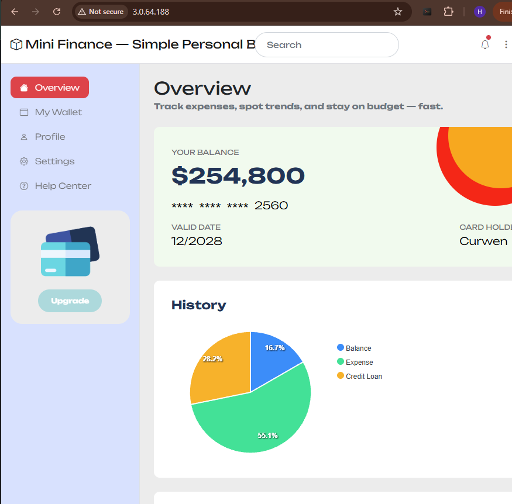

---

### Website URL

Add your deployed website URL below:

```text
http://3.0.64.188/
```

---

# Task 9 — Create the Project README

## Goal

Create a `README.md` file to document the Mini Finance infrastructure and deployment project.

### Evidence

#### Screenshot 14 — Completed `README.md` displayed in the VS Code Markdown preview or terminal

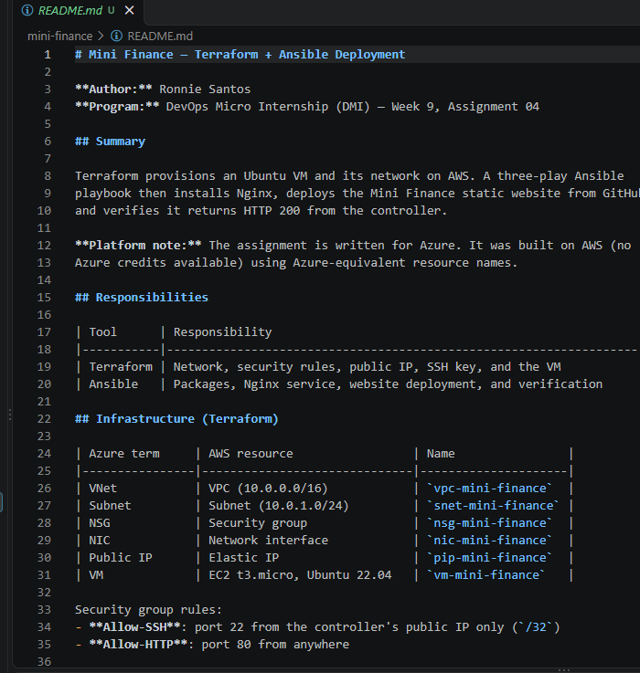

---

### README Content

Copy and paste the complete contents of your `README.md` file below:

```markdown
# Mini Finance — Terraform + Ansible Deployment

**Author:** Ronnie Santos
**Program:** DevOps Micro Internship (DMI) — Week 9, Assignment 04

## Summary

Terraform provisions an Ubuntu VM and its network on AWS. A three-play Ansible
playbook then installs Nginx, deploys the Mini Finance static website from GitHub,
and verifies it returns HTTP 200 from the controller.

**Platform note:** The assignment is written for Azure. It was built on AWS (no
Azure credits available) using Azure-equivalent resource names.

## Responsibilities

| Tool      | Responsibility                                                    |
|-----------|-------------------------------------------------------------------|
| Terraform | Network, security rules, public IP, SSH key, and the VM            |
| Ansible   | Packages, Nginx service, website deployment, and verification      |

## Infrastructure (Terraform)

| Azure term     | AWS resource                 | Name                |
|----------------|------------------------------|---------------------|
| VNet           | VPC (10.0.0.0/16)            | `vpc-mini-finance`  |
| Subnet         | Subnet (10.0.1.0/24)         | `snet-mini-finance` |
| NSG            | Security group               | `nsg-mini-finance`  |
| NIC            | Network interface            | `nic-mini-finance`  |
| Public IP      | Elastic IP                   | `pip-mini-finance`  |
| VM             | EC2 t3.micro, Ubuntu 22.04   | `vm-mini-finance`   |

Security group rules:
- **Allow-SSH**: port 22 from the controller's public IP only (`/32`)
- **Allow-HTTP**: port 80 from anywhere

The security group is attached to the network interface, which is attached to the
VM as its primary interface. Cloud-init sets the hostname to `mini-finance`.

## Project Structure

    mini-finance/
    ├── .gitignore
    ├── README.md
    ├── terraform/
    │   ├── providers.tf
    │   ├── main.tf
    │   ├── variables.tf
    │   └── outputs.tf
    └── ansible/
        ├── inventory.ini
        └── site.yml

## Playbook (site.yml)

**Play 1 — Install and configure Nginx** (`hosts: web`)
Installs `nginx`, `git`, and `rsync`, then starts and enables Nginx.

**Play 2 — Deploy the Mini Finance website** (`hosts: web`)
Clones `https://github.com/pravinmishraaws/mini_finance.git` to `/opt/mini-finance`,
syncs it to `/var/www/html/` with `ansible.posix.synchronize` (excluding `.git`),
and sets ownership to `www-data:www-data`. A `Reload nginx` handler runs only when
the synced content changes.

**Play 3 — Verify the website** (`hosts: localhost`)
Sends an HTTP GET to the VM's public IP with the `uri` module and uses `assert`
to confirm HTTP 200.

## How to Run

    # Provision
    cd terraform
    echo 'controller_ip = "<your-public-ip>"' > terraform.tfvars
    terraform fmt && terraform init && terraform validate
    terraform plan
    terraform apply
    terraform output public_ip

    # Configure and deploy
    cd ../ansible
    ansible web -i inventory.ini -m ping
    ansible-playbook -i inventory.ini site.yml --syntax-check
    ansible-playbook -i inventory.ini site.yml

    # Clean up
    cd ../terraform && terraform destroy

## Results

- `terraform apply`: 10 resources added, no errors
- SSH returned the hostname `mini-finance` with no password
- Playbook recap: `mini-finance ok=8 changed=5`, `localhost ok=2`,
  `failed=0 unreachable=0`
- Play 3: HTTP 200 from `nginx/1.18.0`, 31,958 bytes (the Mini Finance `index.html`)
- Website loaded in the browser at the VM's public IP

## Lessons Learned

- Terraform and Ansible have clear, separate jobs: Terraform builds the server,
  Ansible configures what runs on it.
- On AWS, a pre-created network interface doesn't get an auto-assigned public IP,
  so an Elastic IP is needed to reach the VM.
- `synchronize` needs `delegate_to: "{{ inventory_hostname }}"` to copy between
  two folders on the same remote host instead of from the controller.
- Disabling owner/group preservation in `synchronize` keeps the ownership task
  idempotent.

```

---

# LinkedIn Post Required

## Evidence

#### Screenshot 15 — Published LinkedIn post showing the text and at least one deployment screenshot

Add your screenshot here.

---

#### LinkedIn Post URL

Paste your LinkedIn post URL here:

`Add your URL here`

---

### LinkedIn Submission Notes

**One challenge you faced and how you fixed it:**

The assignment is written for Azure, but I no longer have Azure credits, so I built it on AWS. The tricky part was the required NSG-to-NIC association. To match it, I created a separate network interface (`nic-mini-finance`) with the security group attached and connected it to the VM as its primary interface. That broke public access at first, because AWS doesn't give a pre-created network interface an auto-assigned public IP. I added an Elastic IP (`pip-mini-finance`), the AWS equivalent of an Azure public IP resource, and the VM became reachable while keeping the same structure as the Azure design.

---

**One real-world example where you can use this learning:**

In IT operations, I could use this approach to deploy an internal web tool, such as an IT status page or a self-service help page. Terraform would build the server with SSH limited to the admin network, and an Ansible playbook would install the web server, deploy the latest version from Git, and confirm the page responds. If the server ever needed rebuilding, or a second one was needed at another site, the same two commands would set it up the same way every time, instead of me repeating manual steps from memory.

---

# Assignment Questions

**1. What did you provision using Terraform in this assignment?**

I provisioned an Ubuntu 22.04 VM and everything it needs on AWS: a VPC, a subnet, an internet gateway, a route table and its association, a security group (`nsg-mini-finance`) with Allow-SSH and Allow-HTTP rules, a network interface (`nic-mini-finance`) with the security group attached, an Elastic IP for the public address, an SSH key pair, and the EC2 instance (`vm-mini-finance`). That's 10 resources in total, plus a `public_ip` output.

---

**2. What did Ansible configure and deploy in this assignment?**

Ansible installed `nginx`, `git`, and `rsync` on the VM, then started Nginx and enabled it on boot. It cloned the Mini Finance repository from GitHub, synced the website files into `/var/www/html/`, set their ownership to `www-data`, and reloaded Nginx. Finally, it checked from the controller that the website returned HTTP 200.

---

**3. Why is SSH access on port `22` restricted to your public IP address?**

SSH gives full control of the server, so it should only be reachable from the machine that manages it. Restricting port 22 to my controller's IP as a `/32` blocks password-guessing bots and port scanners that constantly probe SSH on public IPs. Even with key-only authentication, a smaller attack surface is the safer default.

---

**4. Why is HTTP port `80` open to the internet?**

It's a public website, so anyone needs to be able to load it in a browser. Port 80 only exposes what Nginx serves, which is static website files, not shell access to the server. That's why it can be open to `0.0.0.0/0` while SSH stays locked down.

---

**5. What is the purpose of the Ansible inventory file?**

The inventory tells Ansible which servers to manage and how to connect to them. Mine puts the VM in a `web` group with its public IP, and sets the SSH user, private key path, and Python interpreter under `[web:vars]`. The playbook then targets `hosts: web`, so it never needs a hardcoded IP.

---

**6. Why does the playbook use separate plays for install, deploy, and verify?**

Each play has one job, which makes the playbook easier to read, and if something fails, the output shows which stage broke. The plays also need different settings: install and deploy run on the VM with root privileges, while verification runs on the controller without root, so it tests the site from outside, the way a real visitor would reach it.

---

**7. Why is `rsync` useful when deploying website files?**

`rsync` copies a whole folder structure in one step, and it only transfers files that are new or changed, so repeated deployments are quick. With `delete: true`, it also removes files that no longer exist in the source, so the web root exactly matches the repository. Excluding `.git` keeps the repository's history out of the public folder.

---

**8. What does the Ansible `uri` module verify in this assignment?**

It sends a real HTTP GET from the controller to the VM's public IP and checks for status 200. A pass proves the full path works: the internet connection, the Allow-HTTP rule, Nginx, and the deployed files. In my run, the response was 31,958 bytes, the exact size of Mini Finance's `index.html`, which confirmed it was serving the real site and not the default Nginx page. The `assert` task then confirmed the result explicitly.

---

**9. What issue did you face during this assignment, and how did you fix it?**

I first copied my Assignment 2 Terraform code into the project, as the solution guide suggests. That code created several VMs with `for_each` and didn't have the network interface and security group association this assignment requires. Before running `terraform plan`, I used `grep` to check `main.tf` for `Allow-SSH`, `Allow-HTTP`, `nic-`, and `for_each`, and confirmed the old code had been fully replaced with the single-VM version. Separately, VS Code lost its WSL connection partway through. I listed the files from a regular terminal to confirm nothing was lost, then reconnected VS Code to WSL and reopened the project folder.

---

**10. What did you learn from using Terraform and Ansible together?**

They work best with clear, separate jobs. Terraform builds the server and the network around it, and Ansible configures what runs on the server. Terraform's output connects the two: the `public_ip` output went straight into the Ansible inventory. Keeping them separate means I can rebuild the infrastructure without rewriting the deployment, or redeploy the website without touching the infrastructure, and both can be reviewed and version-controlled independently.

---

# Required Files

Confirm that the following files are included in your assignment folder:

- [✓] `.gitignore`
- [✓] `README.md`
- [✓] `terraform/providers.tf`
- [✓] `terraform/main.tf`
- [✓] `terraform/variables.tf`
- [✓] `terraform/outputs.tf`
- [✓] `ansible/inventory.ini`
- [✓] `ansible/site.yml`

---

# Submission Instructions

- Add all required screenshots in the correct order.
- Full Name must be visible in required screenshots.
- Add the Azure VM public IP address.
- Add the final Mini Finance website URL.
- Paste `inventory.ini`, `site.yml`, and `README.md` as editable text.
- Answer all assignment questions clearly in your own words.
- Add your LinkedIn post URL.
- Do not expose SSH private keys, passwords, Azure credentials, subscription IDs, Terraform state contents, or other sensitive information.

---

# Completion Checklist

- [✓] Task 1: `mini-finance` project structure created
- [✓] Task 1: `.gitignore` created
- [✓] Task 2: Terraform Azure infrastructure code created
- [✓] Task 2: `Allow-SSH` rule configured for port `22`
- [✓] Task 2: `Allow-HTTP` rule configured for port `80`
- [✓] Task 2: NSG associated with the Network Interface
- [✓] Task 3: `terraform fmt` completed
- [✓] Task 3: `terraform init` completed
- [✓] Task 3: `terraform validate` completed successfully
- [✓] Task 3: `terraform apply` completed successfully
- [✓] Task 3: `terraform output public_ip` displayed the VM public IP
- [✓] Task 4: Passwordless SSH works from the Ansible controller
- [✓] Task 5: `inventory.ini` created
- [✓] Task 5: Ansible ping returns `SUCCESS` and `pong`
- [✓] Task 6: `site.yml` contains three separate plays
- [✓] Task 6: Play 1 installs Nginx, Git, and rsync
- [✓] Task 6: Play 2 clones and deploys the Mini Finance website
- [✓] Task 6: Play 3 verifies HTTP status code `200`
- [✓] Task 7: Playbook syntax check passes
- [✓] Task 7: Ansible playbook completes successfully
- [✓] Task 7: Final recap shows `failed=0` and `unreachable=0`
- [✓] Task 8: Mini Finance website loads in the browser
- [✓] Task 8: Azure VM public IP is visible in the browser screenshot
- [✓] Task 9: `README.md` completed
- [ ] Screenshots 1–15 are included
- [✓] `inventory.ini`, `site.yml`, and `README.md` are pasted as editable text
- [✓] Assignment questions are answered
- [] LinkedIn post published with Anyone visibility
- [] LinkedIn post URL added
- [✓] No sensitive information is exposed

---

## About DMI & CloudAdvisory

DevOps Micro Internship (DMI) is a project-based DevOps program run by Pravin Mishra and The CloudAdvisory, focused on real-world execution, systems thinking, and career readiness.

It helps learners build strong DevOps foundations with hands-on experience.

---

## Resources

- DMI Official Website: [https://dmi.pravinmishra.com?utm_source=github&utm_medium=readme](https://dmi.pravinmishra.com?utm_source=github&utm_medium=readme)
- University: [https://university.pravinmishra.com?utm_source=github&utm_medium=readme](https://university.pravinmishra.com?utm_source=github&utm_medium=readme)
- Discord Community: [https://discord.pravinmishra.com?utm_source=github&utm_medium=readme](https://discord.pravinmishra.com?utm_source=github&utm_medium=readme)
- Blog: [https://dmi.pravinmishra.com/blog?utm_source=github&utm_medium=readme](https://dmi.pravinmishra.com/blog?utm_source=github&utm_medium=readme)
- YouTube Playlist: [https://www.youtube.com/playlist?list=PLFeSNDtI4Cho](https://www.youtube.com/playlist?list=PLFeSNDtI4Cho)
- Pravin Mishra LinkedIn: [https://www.linkedin.com/in/pravin-mishra-aws-trainer/](https://www.linkedin.com/in/pravin-mishra-aws-trainer/)
- CloudAdvisory LinkedIn: [https://www.linkedin.com/company/thecloudadvisory/](https://www.linkedin.com/company/thecloudadvisory/)

---

*This submission is part of DevOps Micro Internship (DMI) — Agentic AI Track.*